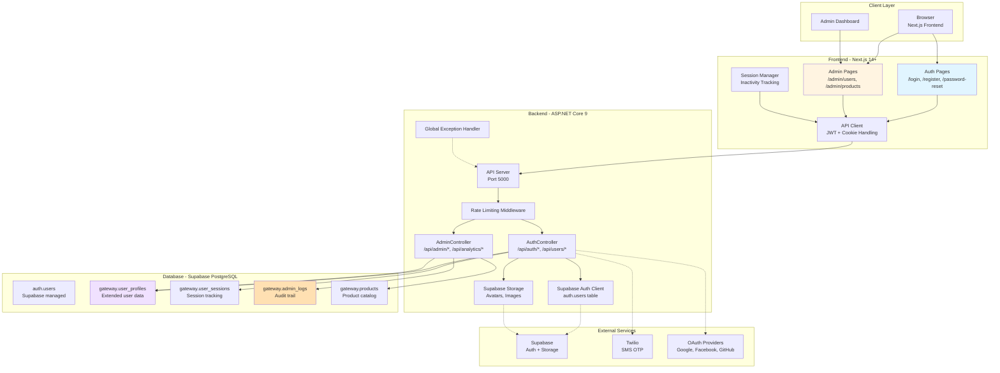
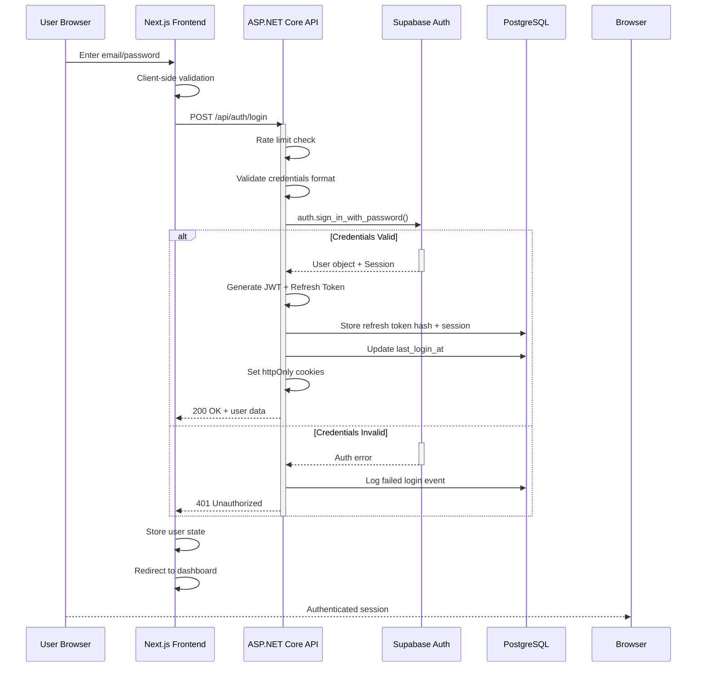

# Design Document - Authentication & User Management System

## Overview

The Authentication & User Management System (Auth_System) provides secure user authentication, authorization, and profile management for the ViTale demo system. Built on Supabase Auth and ASP.NET Core 9, it supports multiple authentication methods (email/password, OAuth, OTP) with role-based access control (RBAC), token rotation, and comprehensive session management.

### Design Goals

1. **Security First**: Implement authentication best practices (bcrypt, JWT rotation, httpOnly cookies, CSRF protection)
2. **Multi-Method Authentication**: Support email/password, OAuth (Google, Facebook, GitHub), OTP (email/SMS), and 2FA
3. **Scalable Session Management**: Track sessions per device with IP/fingerprint for security and multi-device support
4. **Admin Control**: Comprehensive admin dashboard for user management, product management, and system analytics
5. **User Privacy**: GDPR compliance with data export and account deletion capabilities
6. **Rate Limiting**: Protect against brute force and abuse attacks on sensitive endpoints

### Scope

**In Scope:**
- User registration, email verification, and profile management
- Email/password login with JWT token generation and refresh
- OAuth social login (Google, Facebook, GitHub)
- Passwordless login via OTP (email/SMS)
- Two-factor authentication (2FA) with TOTP
- Session management with token rotation and device tracking
- Role-based access control (Guest, Customer, Admin)
- Admin dashboard for user/product management and analytics
- Rate limiting and security logging
- GDPR-compliant data export and account deletion

**Out of Scope:**
- Payment processing
- Email service implementation (will use Supabase/SendGrid integration)
- SMS provider implementation (will use Twilio)
- Advanced biometric authentication
- Single sign-on (SSO) federation

## Architecture

### System Diagram



### Authentication Flow



## Components and Interfaces

### 1. Authentication Controller (`/api/auth`)

**Endpoints:**

| Endpoint | Method | Body | Response | Status Codes |
|----------|--------|------|----------|--------------|
| `/register` | POST | email, password, displayName | userId, email, message | 201, 400, 409, 429 |
| `/login` | POST | email, password | userId, email, role, displayName | 200, 401, 403, 429 |
| `/logout` | POST | - | message | 200 |
| `/logout-all` | POST | - | message | 200 |
| `/refresh` | POST | - (via cookie) | userId, email, role | 200, 401 |
| `/password-reset/request` | POST | email | message | 200, 429 |
| `/password-reset/confirm` | POST | token, newPassword | message | 200, 400 |
| `/otp/email/request` | POST | email | message | 200, 429 |
| `/otp/email/verify` | POST | email, otpCode | userId, email, role | 200, 401, 429 |
| `/otp/sms/request` | POST | phoneNumber | message | 200, 429 |
| `/otp/sms/verify` | POST | phoneNumber, otpCode | userId, email, role | 200, 401, 429 |
| `/2fa/setup` | POST | - (via JWT) | qrCodeDataUrl, secret, backupCodes | 200 |
| `/2fa/verify-setup` | POST | totpCode | message | 200, 401 |
| `/2fa/verify-login` | POST | totpCode | JWT, RefreshToken | 200, 401 |
| `/oauth/google` | GET | code, state | redirect | 302, 401 |
| `/oauth/facebook` | GET | code, state | redirect | 302, 401 |
| `/oauth/github` | GET | code, state | redirect | 302, 401 |
| `/resend-verification` | POST | email | message | 200, 429 |
| `/check-role` | GET | - (via JWT) | role | 200, 401 |

**Key Implementation Details:**
- All endpoints behind rate limiting middleware
- JWT validation on protected endpoints
- Password hashing using bcrypt with cost factor 12
- Refresh token rotation on every refresh
- Email verification required before login (except OAuth)
- Session tracking per device with IP and fingerprint


### 2. User Profile Controller (`/api/users`)

**Endpoints:**

| Endpoint | Method | Body | Response | Status Codes |
|----------|--------|------|----------|--------------|
| `/profile` | GET | - (via JWT) | User profile object | 200, 401 |
| `/profile` | PUT | displayName, dateOfBirth, address | Updated profile | 200, 400, 401 |
| `/profile/avatar` | POST | image file (multipart) | avatarUrl | 200, 400, 401 |
| `/sessions` | GET | - (via JWT) | Array of sessions | 200, 401 |
| `/sessions/{sessionId}` | DELETE | - (via JWT) | message | 200, 403, 401 |
| `/data-export` | GET | - (via JWT) | JSON export (download) | 200, 401 |
| `/account` | DELETE | password/2FA confirmation | message | 200, 400, 401 |

### 3. Admin Controller (`/api/admin`)

**User Management:**

| Endpoint | Method | Body | Response | Status Codes |
|----------|--------|------|----------|--------------|
| `/users` | GET | page, pageSize, search, role, status | Paginated users array | 200, 403 |
| `/users/{userId}/role` | PUT | role | Updated user | 200, 400, 403, 404 |
| `/users/{userId}/block` | POST | - | message | 200, 403, 404 |
| `/users/{userId}/unblock` | POST | - | message | 200, 403, 404 |
| `/users/{userId}` | DELETE | - | message | 200, 403, 404 |
| `/users/deleted` | GET | page, pageSize | Soft-deleted users | 200, 403 |
| `/users/{userId}/restore` | POST | - | message | 200, 403, 404 |

**Product Management:**

| Endpoint | Method | Body | Response | Status Codes |
|----------|--------|------|----------|--------------|
| `/products` | GET | page, pageSize | Paginated products | 200, 403 |
| `/products` | POST | name, description, price, imageUrl | Created product | 201, 400, 403 |
| `/products/{productId}` | PUT | fields to update | Updated product | 200, 400, 403, 404 |
| `/products/{productId}` | DELETE | - | message | 200, 403, 404 |
| `/products/images` | POST | image file (multipart) | imageUrl | 200, 400, 403 |

**Analytics & Logs:**

| Endpoint | Method | Body | Response | Status Codes |
|----------|--------|------|----------|--------------|
| `/analytics/users` | GET | - | User statistics | 200, 403 |
| `/analytics/chat-sessions` | GET | - | Chat statistics | 200, 403 |
| `/analytics/products` | GET | - | Product statistics | 200, 403 |
| `/logs` | GET | page, pageSize, logLevel, eventType, startDate, endDate | Paginated logs | 200, 403 |

## Data Models

### 1. User Profiles Table (`gateway.user_profiles`)

```sql
CREATE TABLE gateway.user_profiles (
    id uuid PRIMARY KEY,
    user_id uuid UNIQUE NOT NULL,
    display_name text,
    avatar_url text,
    date_of_birth date,
    address text,
    role enum('guest', 'customer', 'admin') DEFAULT 'guest',
    status enum('active', 'blocked', 'deleted', 'unverified') DEFAULT 'unverified',
    last_login_at timestamptz,
    deleted_at timestamptz,
    created_at timestamptz DEFAULT now(),
    updated_at timestamptz DEFAULT now(),
    FOREIGN KEY (user_id) REFERENCES auth.users(id) ON DELETE CASCADE
);

CREATE INDEX idx_user_profiles_user_id ON gateway.user_profiles(user_id);
CREATE INDEX idx_user_profiles_role ON gateway.user_profiles(role);
CREATE INDEX idx_user_profiles_status ON gateway.user_profiles(status);
```

**Fields:**
- `id`: UUID primary key
- `user_id`: Foreign key to auth.users.id with unique constraint (one profile per user)
- `display_name`: Optional user display name (max 100 chars)
- `avatar_url`: URL to user's avatar in Supabase Storage
- `date_of_birth`: Optional date of birth
- `address`: Optional user address
- `role`: One of guest, customer, admin (default: guest)
- `status`: Account status (active, blocked, deleted, unverified)
- `last_login_at`: Timestamp of last successful login
- `deleted_at`: Soft delete timestamp
- `created_at`, `updated_at`: Audit timestamps

### 2. User Sessions Table (`gateway.user_sessions`)

```sql
CREATE TABLE gateway.user_sessions (
    id uuid PRIMARY KEY,
    user_id uuid NOT NULL,
    refresh_token_hash text NOT NULL,
    ip_address inet,
    user_agent text,
    device_fingerprint text,
    expires_at timestamptz NOT NULL,
    created_at timestamptz DEFAULT now(),
    FOREIGN KEY (user_id) REFERENCES auth.users(id) ON DELETE CASCADE
);

CREATE INDEX idx_user_sessions_user_id ON gateway.user_sessions(user_id);
CREATE INDEX idx_user_sessions_refresh_token_hash ON gateway.user_sessions(refresh_token_hash);
CREATE INDEX idx_user_sessions_expires_at ON gateway.user_sessions(expires_at);
```

**Fields:**
- `id`: UUID session identifier
- `user_id`: Foreign key to authenticated user
- `refresh_token_hash`: Bcrypt hash of refresh token (never store plain token)
- `ip_address`: Client IP address for security tracking
- `user_agent`: Browser/device user agent string
- `device_fingerprint`: Hash of device characteristics
- `expires_at`: When this session expires
- `created_at`: Session creation timestamp

### 3. Admin Logs Table (`gateway.admin_logs`)

```sql
CREATE TABLE gateway.admin_logs (
    id uuid PRIMARY KEY,
    admin_user_id uuid NOT NULL,
    action text NOT NULL,
    target_resource text,
    details jsonb,
    ip_address inet,
    created_at timestamptz DEFAULT now(),
    FOREIGN KEY (admin_user_id) REFERENCES auth.users(id) ON DELETE SET NULL
);

CREATE INDEX idx_admin_logs_admin_user_id ON gateway.admin_logs(admin_user_id);
CREATE INDEX idx_admin_logs_created_at ON gateway.admin_logs(created_at);
CREATE INDEX idx_admin_logs_action ON gateway.admin_logs(action);
```

**Fields:**
- `id`: UUID log entry identifier
- `admin_user_id`: Admin who performed the action
- `action`: Type of admin action (create_user, update_role, delete_user, etc.)
- `target_resource`: Resource affected (user_id, product_id, etc.)
- `details`: JSON object with additional context
- `ip_address`: Admin's IP address
- `created_at`: When action was performed

### 4. DTO Models (C#)

```csharp
// Authentication
public class LoginRequest
{
    public string Email { get; set; }
    public string Password { get; set; }
}

public class RegisterRequest
{
    public string Email { get; set; }
    public string Password { get; set; }
    public string DisplayName { get; set; }
}

public class AuthResponse
{
    public string UserId { get; set; }
    public string Email { get; set; }
    public string Role { get; set; }
    public string DisplayName { get; set; }
}

public class RefreshTokenRequest
{
    public string RefreshToken { get; set; }
}

// User Profile
public class UserProfileResponse
{
    public string UserId { get; set; }
    public string Email { get; set; }
    public string DisplayName { get; set; }
    public string AvatarUrl { get; set; }
    public string PhoneNumber { get; set; }
    public DateTime? DateOfBirth { get; set; }
    public string Address { get; set; }
    public string Role { get; set; }
    public DateTime LastLoginAt { get; set; }
    public DateTime CreatedAt { get; set; }
}

public class UpdateProfileRequest
{
    public string DisplayName { get; set; }
    public DateTime? DateOfBirth { get; set; }
    public string Address { get; set; }
}

// Admin
public class AdminUserResponse
{
    public string UserId { get; set; }
    public string Email { get; set; }
    public string DisplayName { get; set; }
    public string Role { get; set; }
    public string Status { get; set; }
    public DateTime CreatedAt { get; set; }
    public DateTime LastLoginAt { get; set; }
}

public class AdminAnalyticsResponse
{
    public int TotalUsers { get; set; }
    public int CustomerCount { get; set; }
    public int AdminCount { get; set; }
    public int NewUsersLast7Days { get; set; }
    public int NewUsersLast30Days { get; set; }
}
```


## Security Architecture

### Token Management

**JWT Access Token:**
- Expiration: 15 minutes
- Stored in: httpOnly cookie with Secure, SameSite=Strict flags
- Contains: userId, email, role, iat, exp, iss
- Algorithm: HS256 with secret key from environment

**Refresh Token:**
- Expiration: 7 days
- Stored in: httpOnly cookie with Secure, SameSite=Strict flags
- Never stored in plain text; bcrypt hash stored in database
- Rotated on every refresh (old token invalidated)
- Supports token replay detection

### Password Security

- Hashing Algorithm: bcrypt with cost factor 12
- Validation: RFC 5322 email, 8+ chars, uppercase, lowercase, number, special char
- Breach Check: Tested against top 10,000 common passwords locally
- Timing-Safe Comparison: Used during verification to prevent timing attacks
- Never Logged: Passwords never appear in logs in any form

### Session Security

- IP Address Tracking: Logged for each session
- Device Fingerprinting: Hash of user agent + IP for device identification
- Concurrent Session Limit: Maximum 3 active sessions per user
- Session Invalidation: All sessions cleared when password changed or admin blocks user
- Inactivity Timeout: 30 minutes for regular users, 15 minutes for admin users

### Rate Limiting

**Protected Endpoints:**
- `/api/auth/login`: 5 requests per 15 minutes per IP
- `/api/auth/register`: 3 requests per hour per IP
- `/api/auth/password-reset/request`: 3 requests per hour per email
- `/api/auth/otp/email/request`: 5 requests per hour per email
- `/api/auth/otp/sms/request`: 5 requests per hour per phone

**Implementation:**
- Uses in-memory cache with automatic expiration
- Tracks by IP, email, or phone depending on endpoint
- Returns 429 Too Many Requests with Retry-After header
- Logs high-priority security event after 5+ violations in 1 hour

### Security Headers

**HTTP Headers Set:**
```
Strict-Transport-Security: max-age=31536000; includeSubDomains; preload
X-Content-Type-Options: nosniff
X-Frame-Options: DENY
X-XSS-Protection: 1; mode=block
Content-Security-Policy: [restrictive policy]
Referrer-Policy: strict-origin-when-cross-origin
Permissions-Policy: [disable unnecessary features]
```

## Error Handling Strategy

### Error Response Format

```json
{
    "error": "descriptive error message",
    "statusCode": 400,
    "timestamp": "2024-01-15T10:30:00Z",
    "details": {
        "field": "email",
        "reason": "must be valid email format"
    }
}
```

### Authentication Error Codes

- `401 Unauthorized`: Invalid credentials, expired token, missing token
- `403 Forbidden`: Insufficient permissions, account blocked/deleted
- `409 Conflict`: Email already exists
- `429 Too Many Requests`: Rate limit exceeded
- `400 Bad Request`: Validation failed, token expired, etc.

### Error Handling Rules

1. **Sensitive Information**: Never reveal whether email exists (prevent user enumeration)
2. **Validation Errors**: Return specific field errors for registration/profile update
3. **Security Events**: Log all authentication failures, rate limit violations, blocked logins
4. **User Feedback**: Generic messages for auth failures, detailed messages for profile updates
5. **Server Errors**: Log stack traces internally, return generic message to client

## Testing Strategy

### Property-Based Testing Applicability

The authentication system contains several pure functions and invariants suitable for PBT:

✅ **Suitable for PBT:**
- Token encoding/decoding round-trip
- Password hash verification
- Email validation
- Role-based access control decisions
- Rate limiting logic
- OTP single-use enforcement
- Session token rotation correctness

❌ **Not Suitable for PBT:**
- OAuth flow (external service)
- Email/SMS sending (side effects)
- Supabase Auth operations (external dependency)
- UI rendering and interaction
- File uploads (infrastructure)

### Unit Testing Approach

**Test Categories:**

1. **Authentication Tests**
   - Valid email/password login
   - Invalid credentials
   - Email verification required
   - Password validation rules
   - OTP generation and verification
   - Token generation and validation

2. **Authorization Tests**
   - RBAC enforcement (guest, customer, admin)
   - Permission checks for admin endpoints
   - Session ownership validation

3. **Security Tests**
   - Rate limiting (login, registration, password reset, OTP)
   - Refresh token rotation
   - Token expiration
   - Session cleanup
   - Password hashing

4. **Profile Management Tests**
   - Profile creation and retrieval
   - Profile updates with validation
   - Avatar upload and storage
   - Session listing and termination

5. **Admin Tests**
   - User search and filtering
   - Role changes with 2FA verification
   - User blocking/unblocking
   - Soft deletion and restoration
   - Product CRUD operations
   - Analytics queries

### Integration Testing

**Scenarios:**
- End-to-end registration, email verification, login flow
- OAuth login with automatic user creation
- Password reset with email validation
- 2FA setup and login flow
- Multi-device session management
- Admin user management workflows
- GDPR data export and account deletion

### Test Data Requirements

- Test users with different roles (guest, customer, admin)
- Test data in database for search and filtering
- Mock Supabase Auth for isolated testing
- Mock email/SMS services
- Mock OAuth providers

## Implementation Approach

### Backend Stack (ASP.NET Core 9)

**Dependencies:**
- `Supabase.Auth`: Supabase authentication client
- `Supabase.Storage`: Supabase file storage client
- `BCrypt.Net-Next`: Password hashing
- `System.IdentityModel.Tokens.Jwt`: JWT token generation
- `StackExchange.Redis`: Session caching and rate limiting
- `Npgsql`: PostgreSQL connection
- `MediatR`: CQRS pattern for commands/queries
- `FluentValidation`: Input validation
- `Serilog`: Structured logging

**Project Structure:**
```
Backend/
├── Controllers/
│   ├── AuthController.cs
│   ├── UsersController.cs
│   └── AdminController.cs
├── Services/
│   ├── AuthService.cs
│   ├── TokenService.cs
│   ├── SessionService.cs
│   ├── RateLimitService.cs
│   └── AdminService.cs
├── Middleware/
│   ├── AuthenticationMiddleware.cs
│   ├── RateLimitingMiddleware.cs
│   ├── ErrorHandlingMiddleware.cs
│   └── SecurityHeadersMiddleware.cs
├── Models/
│   ├── DTOs/
│   ├── Entities/
│   └── Responses/
├── Validators/
│   ├── RegisterRequestValidator.cs
│   └── UpdateProfileValidator.cs
└── Repositories/
    ├── UserRepository.cs
    ├── SessionRepository.cs
    └── AdminLogRepository.cs
```

### Frontend Stack (Next.js 14+)

**Dependencies:**
- `next-auth`: Session management (optional, for server-side coordination)
- `axios`: HTTP client with interceptors
- `react-hook-form`: Form state management
- `zod`: Client-side validation
- `react-hot-toast`: Toast notifications
- `shadcn/ui`: UI component library
- `tailwindcss`: Styling
- `next-intl`: Internationalization (English/Vietnamese)

**Pages Structure:**
```
app/
├── (auth)/
│   ├── login/page.tsx
│   ├── register/page.tsx
│   ├── password-reset/page.tsx
│   ├── verify-email/page.tsx
│   └── 2fa/page.tsx
├── (app)/
│   ├── profile/page.tsx
│   ├── sessions/page.tsx
│   └── dashboard/page.tsx
└── admin/
    ├── dashboard/page.tsx
    ├── users/page.tsx
    ├── products/page.tsx
    ├── logs/page.tsx
    └── layout.tsx
```

## Design Decisions and Rationale

1. **Supabase Auth Over Custom Implementation**
   - Rationale: Supabase Auth handles password hashing, email verification, and OAuth out-of-box. Custom implementation increases security risk and maintenance burden.

2. **Refresh Token Rotation**
   - Rationale: Mitigates token compromise by automatically invalidating old refresh tokens. Enables detection of token replay attacks.

3. **httpOnly Cookies for Token Storage**
   - Rationale: Protects against XSS attacks. JavaScript cannot access httpOnly cookies, preventing token theft via malicious scripts.

4. **Bcrypt with Cost Factor 12**
   - Rationale: Computationally expensive for attackers. Cost factor 12 provides ~100ms hashing time, making brute force impractical.

5. **Session Fingerprinting**
   - Rationale: Detects session hijacking from different devices/IPs. Enables alerting users of suspicious activity.

6. **Separate User Profiles Table**
   - Rationale: Supabase Auth manages authentication. Extended user data stored separately in gateway schema. Enables independent schema evolution.

7. **Admin Action Logging**
   - Rationale: Provides audit trail for compliance (GDPR, SOC2). Enables investigation of admin actions and accountability.

8. **Soft Delete Over Hard Delete**
   - Rationale: Preserves data for audit trails and GDPR "right to be forgotten" compliance while maintaining referential integrity.

9. **Rate Limiting in Middleware**
   - Rationale: Applied at HTTP layer before business logic. Reduces load on database during attacks.

10. **Redis for Session Caching**
    - Rationale: In-memory storage enables fast session lookups. Distributed cache allows horizontal scaling.


## Correctness Properties

*A property is a characteristic or behavior that should hold true across all valid executions of a system—essentially, a formal statement about what the system should do. Properties serve as the bridge between human-readable specifications and machine-verifiable correctness guarantees.*

The authentication system contains several pure functions, data validations, and invariants suitable for property-based testing. These properties verify core correctness guarantees without requiring interaction with external services.

### Property 1: Email Validation Consistency

**For any** email string, if it matches RFC 5322 format, the Auth_System SHALL accept it as valid; if it does not match RFC 5322 format, the Auth_System SHALL reject it as invalid. This property holds consistently regardless of the specific email content.

**Validates: Requirements 2.2, 30.1**

**Rationale:** Email validation is a pure function with clear input/output behavior. For ANY email input, validation result must be deterministic and consistent with RFC 5322 standard.

### Property 2: Password Validation Rules

**For any** password string, if it contains (1) at least 8 characters, (2) at least one uppercase letter, (3) at least one lowercase letter, (4) at least one number, and (5) at least one special character, the Auth_System SHALL accept it as valid; if any requirement is unmet, it SHALL be rejected with an error listing all failed requirements.

**Validates: Requirements 2.3, 2.4, 2.5, 29.1, 30.1**

**Rationale:** Password validation follows clear rules that should hold universally. For ANY password, result depends only on password content against these fixed criteria.

### Property 3: Email Verification Token Expiration

**For any** email verification token, if the current time is before the token expiration time (24 hours after generation), the token SHALL be valid; if the current time is after expiration, the token SHALL be invalid. This property holds regardless of token content or verification history.

**Validates: Requirements 3.1, 3.2, 3.3, 3.4**

**Rationale:** Token expiration is time-dependent but deterministic. For ANY token at ANY time T, validity is determined solely by T vs. expiration timestamp.

### Property 4: Authentication Token Round-Trip Preservation

**For any** valid JWT access token generated by Auth_System, decoding the token and extracting claims (userId, email, role) SHALL produce user data that matches the original user data used to generate the token. Encoding user data should be lossless.

**Validates: Requirements 4.3, 4.8, 8.4**

**Rationale:** Token encoding/decoding is a round-trip operation. For ANY user identity, the token must preserve all necessary claims for authentication without corruption or loss.

### Property 5: Password Hash Verification Invariant

**For any** password and its corresponding bcrypt hash stored in the system, verifying the password against its hash SHALL always return true; verifying any other password against that hash SHALL always return false. This invariant holds consistently and deterministically.

**Validates: Requirements 4.2, 29.1, 29.6**

**Rationale:** Password hashing must be cryptographically sound. Hash collisions or verification errors compromise authentication integrity. For ANY password-hash pair, verification result must be deterministic.

### Property 6: OTP Single-Use Enforcement

**For any** generated OTP code and email/phone number pair, once the OTP has been successfully verified (phone number + code match and expiration is valid), subsequent verification attempts with the same OTP SHALL fail with HTTP status code 401, regardless of whether expiration time has passed.

**Validates: Requirements 6.11, 7.11**

**Rationale:** OTP codes must be single-use to prevent replay attacks. For ANY OTP, after first successful verification, system must permanently invalidate it to prevent reuse.

### Property 7: Token Rotation Correctness

**For any** refresh token request from a valid session, when Auth_System issues new JWT_Access_Token and Refresh_Token via token rotation, the old Refresh_Token SHALL become invalid and new tokens SHALL be valid for authentication until their expiration. This property ensures exactly-once semantics for token rotation.

**Validates: Requirements 8.4, 8.5, 8.6, 8.8**

**Rationale:** Token rotation prevents replay attacks by invalidating old tokens. For ANY rotation operation, old tokens must be unusable immediately while new tokens work correctly.

### Property 8: Logout Idempotence

**For any** user and session, calling the logout endpoint once SHALL succeed (200 OK), and calling it again with the same session SHALL also succeed (200 OK) without returning errors. Logout operations are idempotent.

**Validates: Requirements 9.1, 9.5, 9.11**

**Rationale:** Logout should be idempotent for user experience. Whether logout is called once or multiple times, final state should be the same: cookies cleared, session deleted.

### Property 9: Password Reset Token Expiration

**For any** password reset token, if the current time is before token expiration (1 hour after generation), the token SHALL be valid for password reset; if the current time is after expiration, the token SHALL be invalid. Token expiration follows the same time-based logic as email verification tokens.

**Validates: Requirements 10.3, 10.8, 10.9, 10.13**

**Rationale:** Reset tokens must expire after fixed duration. For ANY token at ANY time T, validity is determined solely by comparison of T with expiration timestamp.

### Property 10: Role-Based Access Control Consistency

**For any** authenticated request to a protected endpoint, if the endpoint requires role R and the user's role is less privileged than R, the Auth_System SHALL return HTTP status code 403 Forbidden; if the user's role is R or more privileged, the Auth_System SHALL process the request normally. This property holds consistently regardless of request timing or concurrent requests.

**Validates: Requirements 13.1, 13.2, 13.3, 13.4**

**Rationale:** RBAC must be consistent and predictable. Authorization decisions must depend solely on user role, not on request timing or state. For ANY role comparison, the result must be deterministic.

### Property 11: Rate Limiting Determinism

**For any** rate-limited endpoint, if N requests are made by the same entity (IP address or email) within a time window where N ≤ limit, all N requests SHALL succeed with appropriate status codes; if N > limit, exactly the first limit requests SHALL succeed and the remaining (N - limit) requests SHALL fail with HTTP status code 429. Rate limiting behavior is deterministic and depends only on request count and time window.

**Validates: Requirements 23.1, 23.2, 23.3, 23.4, 23.5, 23.6**

**Rationale:** Rate limiting must be deterministic. For ANY sequence of requests, the decision to allow or block depends only on counter state and time window, making it suitable for property-based testing.

### Property 12: Concurrent Session Limit Enforcement

**For any** user, after creating the 4th concurrent session (beyond the limit of 3), the Auth_System SHALL automatically terminate the oldest session before establishing the new one. The invariant is maintained: active session count ≤ 3 for ANY user at ANY time.

**Validates: Requirements 14.4, 14.12**

**Rationale:** Session limits prevent session exhaustion attacks. For ANY user, the concurrent session count must never exceed 3. This is an invariant that must hold after every session creation.

### Property 13: User Profile Persistence Round-Trip

**For any** user profile update request with valid data, after the update succeeds, querying the user profile endpoint SHALL return the updated fields exactly as submitted. Profile updates are immediately persistent and readable.

**Validates: Requirements 12.5, 12.8, 12.9**

**Rationale:** Data persistence is fundamental. For ANY profile update, the new values must be immediately queryable without loss or corruption.

### Property 14: Data Export Completeness

**For any** authenticated user requesting data export, the exported JSON SHALL contain all user records from auth.users, gateway.user_profiles, gateway.user_sessions, and brain.chat_sessions tables. Parsing the exported JSON SHALL succeed and yield all records with all required fields present.

**Validates: Requirements 27.2, 27.3, 27.4, 27.5**

**Rationale:** GDPR compliance requires complete data export. For ANY user, all personal data must be captured in export and be valid JSON. This is a round-trip-like property for data integrity.

### Property 15: Admin Action Audit Logging Consistency

**For any** admin action (user role change, user block, product delete, etc.), after the action succeeds, querying the admin_logs table SHALL return a log entry with matching admin_user_id, action type, and target_resource. Audit logging is consistent with completed actions.

**Validates: Requirements 16.5, 17.5, 18.6, 19.7, 19.10, 19.13**

**Rationale:** Audit logging must be consistent with completed actions. For ANY admin action, a corresponding log entry must exist for compliance and investigation purposes.

## Implementation Notes for Property-Based Tests

### Testing Libraries

- **C# Backend**: NUnit + NUnit.QuickCheck or Xunit + FsCheck
- **Language Agnostic**: Hypothesis (Python for utilities), fast-check (if any Node utilities)

### Property Test Configuration

- Minimum iterations: 100 per property
- Seed management: Use fixed seed for reproducible failures
- Shrinking: Automatically find minimal failing example

### Mocking Strategy

For properties involving external dependencies:
- Mock Supabase Auth responses
- Mock email/SMS services
- Mock OAuth providers
- Use in-memory database for session/profile tests

### Example Property Test (C# pseudocode)

```csharp
[Property]
public void EmailValidation_AcceptsValidFormats(string email)
{
    // Generate valid RFC 5322 emails
    email = Arb.From(EmailGenerator.ValidEmails()).Generate();
    
    var result = _authService.ValidateEmail(email);
    
    Assert.That(result.IsValid, Is.True);
    Assert.That(result.Errors, Is.Empty);
}

[Property]
public void PasswordValidation_RejectsInvalidPasswords(string password)
{
    // Generate invalid passwords
    password = Arb.From(PasswordGenerator.InvalidPasswords()).Generate();
    
    var result = _authService.ValidatePassword(password);
    
    Assert.That(result.IsValid, Is.False);
    Assert.That(result.Errors, Is.Not.Empty);
}

[Property]
public void TokenRotation_InvaliatesOldToken(
    string userId, string email, string role)
{
    // Setup
    var originalRefreshToken = _tokenService.GenerateRefreshToken(userId);
    
    // Action: Rotate tokens
    var (newAccessToken, newRefreshToken) = 
        _authService.RefreshToken(originalRefreshToken);
    
    // Assertions
    Assert.That(newAccessToken, Is.Not.Null);
    Assert.That(newRefreshToken, Is.Not.Null);
    Assert.That(newRefreshToken, Is.Not.EqualTo(originalRefreshToken));
    
    // Old token should be invalidated
    Assert.Throws<InvalidTokenException>(
        () => _authService.RefreshToken(originalRefreshToken));
}

[Property]
public void RateLimiting_BlocksExcessRequests(
    int requestCount)
{
    requestCount = Gen.Choose(1, 100).Generate();
    string ip = "192.168.1.1";
    const int limit = 5;
    
    var results = new List<int>();
    for (int i = 0; i < requestCount; i++)
    {
        var status = _rateLimiter.CheckLimit(ip, "login", limit);
        results.Add(status);
    }
    
    // First 'limit' should succeed (200), rest should be 429
    Assert.That(results.Take(limit).All(s => s != 429), Is.True);
    if (requestCount > limit)
    {
        Assert.That(results.Skip(limit).All(s => s == 429), Is.True);
    }
}
```


## Frontend Authentication UI Design

### Component Architecture

**Pages & Routes:**

1. **Authentication Pages** (`/app/(auth)/`)
   - `/login` - Email/password login with OAuth buttons
   - `/register` - Registration form with password strength indicator
   - `/password-reset` - Password reset request and confirmation
   - `/verify-email` - Email verification with resend option
   - `/2fa` - 2FA setup and login verification

2. **User Pages** (`/app/(app)/`)
   - `/profile` - User profile view/edit with avatar upload
   - `/sessions` - Active sessions management
   - `/dashboard` - User dashboard with personalized content

3. **Admin Pages** (`/app/admin/`)
   - `/dashboard` - Analytics dashboard with charts
   - `/users` - User management with search/filter
   - `/products` - Product CRUD management
   - `/logs` - System logs viewer with filters

### Key UI Components (shadcn/ui)

**Authentication:**
- `Input` with email, password validation
- `Button` with loading states
- `Card` for form containers
- `Toast` for success/error messages
- `Checkbox` for "Remember me"
- `Tabs` for login/register/password reset

**Admin Dashboard:**
- `Table` with pagination for users/products
- `SearchInput` with debouncing (300ms)
- `Dropdown` for role/status filters
- `Dialog` for action confirmations
- `LineChart` and `BarChart` for analytics

**Session Management:**
- `Table` showing active sessions with device info
- `Button` for session termination
- `Badge` for "current session" indicator

### Form Validation Strategy

**Client-Side (Real-time):**
- Email format validation (regex)
- Password complexity checking
- Display validation errors below fields
- Disable submit button until valid
- Show password strength meter

**Server-Side (on submit):**
- Re-validate all inputs
- Check email uniqueness
- Verify password against breach database
- Return detailed error messages

### Internationalization (i18n)

**Language Support:**
- English (en)
- Vietnamese (vi)

**Implementation:**
- Use `next-intl` for routing and translation
- URL structure: `/en/login`, `/vi/login`
- Persist language in localStorage
- Date/time formatting per locale
- Currency formatting per locale

**Key Translation Keys:**
```json
{
  "auth.email": "Email",
  "auth.password": "Password",
  "auth.login": "Login",
  "auth.register": "Register",
  "auth.passwordStrength": "Password Strength",
  "auth.requirements": "Requirements",
  "error.invalidEmail": "Invalid email format",
  "error.weakPassword": "Password does not meet requirements",
  "admin.users": "User Management",
  "admin.products": "Product Management"
}
```

### Session Inactivity Tracking

**Frontend Implementation:**

```typescript
// Activity tracker - reset on user interaction
const activityTimeout = 30 * 60 * 1000; // 30 minutes
let inactivityTimer: NodeJS.Timeout;
let warningShown = false;

const activities = ['mousedown', 'keydown', 'scroll', 'touchstart'];

activities.forEach(activity => {
  document.addEventListener(activity, () => {
    clearTimeout(inactivityTimer);
    warningShown = false;
    resetInactivityTimer();
  });
});

function resetInactivityTimer() {
  inactivityTimer = setTimeout(() => {
    // 2 minutes before logout, show warning
    if (!warningShown) {
      showWarningNotification('You will be logged out in 2 minutes');
      warningShown = true;
      
      // Auto logout after 30 minutes total
      setTimeout(() => {
        logout(); // Calls /api/auth/logout
        redirectToLogin('Session expired due to inactivity');
      }, 28 * 60 * 1000); // 28 more minutes = 30 total
    }
  }, 28 * 60 * 1000); // Show warning at 28 minutes
}

// Admin routes: 15-minute timeout
if (isAdminPage()) {
  activityTimeout = 15 * 60 * 1000;
}
```

### Error Recovery Strategies

**Authentication Errors:**
- `401 Unauthorized` → Redirect to login
- `403 Forbidden` → Show "Access Denied" message
- `429 Too Many Requests` → Show "Too many attempts. Try again later with countdown"
- Network errors → Retry with exponential backoff

**User Experience:**
- Clear, friendly error messages
- Specific field-level validation errors
- "Try again" or "Go back" options
- Recovery links (forgot password, resend email)

### Responsive Design

**Breakpoints:**
- Mobile: 320px - 640px
- Tablet: 641px - 1024px
- Desktop: 1025px+

**Mobile Considerations:**
- Single-column layout
- Large touch targets (min 44px)
- Simplified navigation
- Full-width forms
- Collapsible admin tables

## Deployment and Configuration

### Environment Variables (Backend)

```
SUPABASE_URL=https://[project-id].supabase.co
SUPABASE_KEY=[anon-public-key]
SUPABASE_SERVICE_ROLE_KEY=[service-role-key]
JWT_SECRET=[jwt-secret-key]
REFRESH_TOKEN_SECRET=[refresh-token-secret]
REDIS_CONNECTION_STRING=localhost:6379
BCRYPT_COST_FACTOR=12
EMAIL_FROM=noreply@vitale.app
TWILIO_ACCOUNT_SID=[account-sid]
TWILIO_AUTH_TOKEN=[auth-token]
CORS_ALLOWED_ORIGINS=http://localhost:3000,https://vitale.app
RATE_LIMIT_ENABLED=true
LOGGING_LEVEL=Information
```

### Environment Variables (Frontend)

```
NEXT_PUBLIC_API_BASE_URL=http://localhost:5000
NEXT_PUBLIC_SUPABASE_URL=https://[project-id].supabase.co
NEXT_PUBLIC_OAUTH_REDIRECT_URI=http://localhost:3000/auth/oauth/callback
NEXT_INTL_DEFAULT_LOCALE=en
```

### Docker Deployment

**Backend Dockerfile:**
```dockerfile
FROM mcr.microsoft.com/dotnet/sdk:9.0 as build
WORKDIR /app
COPY . .
RUN dotnet publish -c Release -o out

FROM mcr.microsoft.com/dotnet/aspnet:9.0
WORKDIR /app
COPY --from=build /app/out .
EXPOSE 5000
CMD ["dotnet", "backend.dll"]
```

**Frontend Dockerfile:**
```dockerfile
FROM node:20-alpine as build
WORKDIR /app
COPY . .
RUN npm ci && npm run build

FROM node:20-alpine
WORKDIR /app
COPY --from=build /app/.next ./.next
COPY package*.json ./
RUN npm ci --production
EXPOSE 3000
CMD ["npm", "start"]
```

## Monitoring and Observability

### Logging Strategy

**Security Events:**
- Successful login/logout
- Failed login attempts
- Rate limit violations
- Password reset requests
- 2FA setup/enable
- Admin actions
- GDPR requests

**Error Logging:**
- Authentication failures with reason
- Database errors (credentials redacted)
- External service failures
- Validation failures (field name only, not values)

**Metrics:**
- Active user count
- Authentication success/failure rates
- Average login time
- Rate limit hit count
- Session duration
- Token refresh frequency

### Example Logging Implementation

```csharp
public class AuthenticationService
{
    private readonly ILogger<AuthenticationService> _logger;
    
    public async Task<LoginResult> LoginAsync(string email, string password, string ipAddress)
    {
        try
        {
            // Validate and attempt login
            var result = await _supabaseAuth.SignInWithPasswordAsync(email, password);
            
            if (result.Success)
            {
                _logger.LogInformation(
                    "Login successful for user {UserId} from {IpAddress}",
                    result.User.Id, ipAddress);
                    
                return new LoginResult { Success = true, User = result.User };
            }
            else
            {
                _logger.LogWarning(
                    "Failed login attempt for email {Email} from {IpAddress}. Reason: {Reason}",
                    email, ipAddress, result.Error);
                    
                return new LoginResult { Success = false, Error = "Invalid credentials" };
            }
        }
        catch (Exception ex)
        {
            _logger.LogError(ex, "Login exception for email {Email}", email);
            throw;
        }
    }
}
```

## Summary

This design document provides a comprehensive, secure authentication and user management system built on Supabase Auth and ASP.NET Core. Key aspects include:

- **Multi-method authentication**: Email/password, OAuth, OTP, 2FA
- **Secure token management**: JWT with rotation, httpOnly cookies, replay detection
- **Role-based access control**: Guest, Customer, Admin roles with enforcement
- **Session management**: Device tracking, concurrent limits, inactivity timeout
- **Admin capabilities**: User/product management, analytics, audit logging
- **GDPR compliance**: Data export, account deletion, soft deletion
- **Security hardening**: Rate limiting, input validation, security headers, password hashing
- **Property-based testing**: 15 testable properties for correctness verification
- **User experience**: Multi-language support, responsive design, clear error messaging

The design is scalable, maintainable, and follows authentication best practices for production systems.

