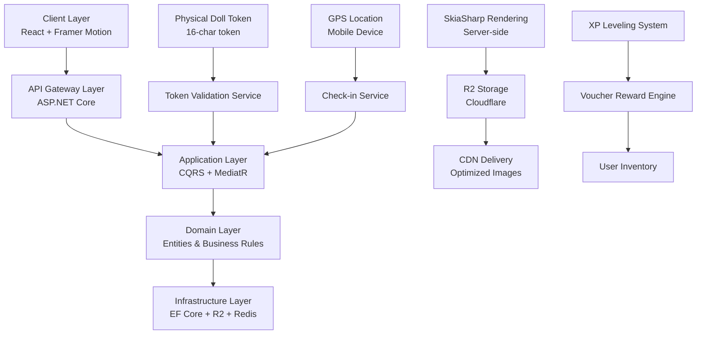
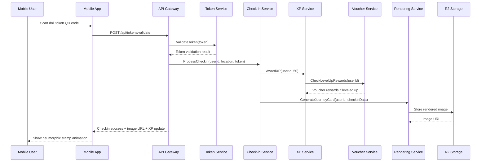
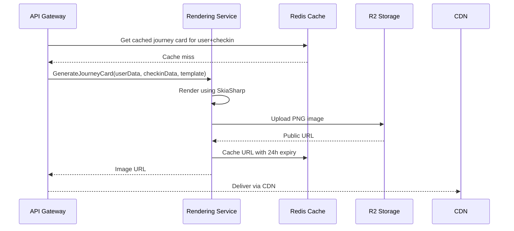

# Design Document: Digital Passport Gamification Enhancement (ViTale)

## Overview

This design document outlines the comprehensive architecture and implementation details for enhancing the existing ViTale digital passport system with advanced gamification features. The enhancement includes four major components: 1) Token Engine & Inventory System for physical doll authentication, 2) Simplified GPS Check-in & Gamification Engine, 3) Neumorphic UI Design for premium passport experience, and 4) Server-Side Journey Card Rendering with R2 storage.

The system builds upon the existing ViTale platform which already includes authentication, chat, checkins, checkpoints, passport, products, and voucher systems. The goal is to create a seamless, engaging user experience that blends physical doll interactions with digital gamification while maintaining high performance and scalability.

## Architecture

The enhanced passport system follows a layered architecture with clear separation of concerns:



## Sequence Diagrams

### Main Workflow: Doll Authentication & Check-in



### Journey Card Generation Flow



## Components and Interfaces

### Component 1: Token Engine Service

**Purpose**: Manages physical doll authentication tokens with race condition protection

**Interface**:
```csharp
public interface ITokenService
{
    Task<TokenValidationResult> ValidateTokenAsync(string token, Guid userId);
    Task<TokenGenerationResult> GenerateTokenForDollAsync(Guid dollId);
    Task<TokenInventory> GetUserTokenInventoryAsync(Guid userId);
    Task<bool> RevokeTokenAsync(string token, Guid userId);
}

public record TokenValidationResult
{
    public bool IsValid { get; init; }
    public Guid? DollId { get; init; }
    public string DollName { get; init; }
    public DateTime? TokenExpiry { get; init; }
    public string ErrorMessage { get; init; }
}

public record TokenGenerationResult
{
    public string Token { get; init; } // 16-character random token
    public DateTime GeneratedAt { get; init; }
    public DateTime ExpiresAt { get; init; }
}
```

**Responsibilities**:
- Generate cryptographically secure 16-character tokens for physical dolls
- Validate tokens with optimistic concurrency control to prevent race conditions
- Manage token lifecycle (creation, validation, revocation)
- Track token usage statistics

### Component 2: Gamification Engine Service

**Purpose**: Manages XP leveling, digital stamps, and reward systems

**Interface**:
```csharp
public interface IGamificationService
{
    Task<XpAwardResult> AwardXpAsync(Guid userId, int xpAmount, XpSource source);
    Task<LevelUpResult> CheckAndProcessLevelUpAsync(Guid userId);
    Task<StampUnlockResult> UnlockDigitalStampAsync(Guid userId, Guid checkpointId);
    Task<GamificationStatus> GetUserGamificationStatusAsync(Guid userId);
}

public record XpAwardResult
{
    public int PreviousXp { get; init; }
    public int NewXp { get; init; }
    public int PreviousLevel { get; init; }
    public int NewLevel { get; init; }
    public List<VoucherReward> UnlockedVouchers { get; init; }
}

public record LevelUpResult
{
    public bool LeveledUp { get; init; }
    public int OldLevel { get; init; }
    public int NewLevel { get; init; }
    public List<VoucherReward> Rewards { get; init; }
}
```

### Component 3: Check-in Service with Simplified GPS

**Purpose**: Handles location-based check-ins with distance validation

**Interface**:
```csharp
public interface ICheckinService
{
    Task<CheckinResult> ProcessCheckinAsync(Guid userId, GeoLocation location, string token = null);
    Task<List<NearbyCheckpoint>> GetNearbyCheckpointsAsync(GeoLocation location, double radiusMeters);
    Task<CheckinHistory> GetUserCheckinHistoryAsync(Guid userId, DateTime? startDate, DateTime? endDate);
}

public record GeoLocation
{
    public double Latitude { get; init; }
    public double Longitude { get; init; }
    public double? Accuracy { get; init; } // In meters
}

public record CheckinResult
{
    public bool Success { get; init; }
    public Guid CheckpointId { get; init; }
    public string CheckpointName { get; init; }
    public int XpAwarded { get; init; }
    public string JourneyCardUrl { get; init; }
    public List<StampUnlockResult> NewStamps { get; init; }
    public string ErrorMessage { get; init; }
}
```

### Component 4: Journey Card Rendering Service

**Purpose**: Server-side generation of visual journey cards using SkiaSharp

**Interface**:
```csharp
public interface IJourneyCardRenderer
{
    Task<string> GenerateJourneyCardAsync(JourneyCardData data);
    Task<string> GetCachedJourneyCardUrlAsync(Guid userId, Guid checkinId);
    Task InvalidateJourneyCardCacheAsync(Guid userId, Guid checkinId);
}

public record JourneyCardData
{
    public Guid UserId { get; init; }
    public string UserName { get; init; }
    public Guid CheckpointId { get; init; }
    public string CheckpointName { get; init; }
    public GeoLocation Location { get; init; }
    public DateTime CheckinTime { get; init; }
    public int XpAwarded { get; init; }
    public int CurrentLevel { get; init; }
    public int TotalXp { get; init; }
    public string DollName { get; init; } // If token was used
    public string TemplateName { get; init; } // "neumorphic", "minimal", "premium"
}
```

## Data Models

### Model 1: Doll Token Entity

```csharp
public class DollToken
{
    public Guid Id { get; private set; }
    public string Token { get; private set; } // 16-character random string
    public Guid DollId { get; private set; }
    public Guid? UserId { get; private set; } // Null until claimed
    public DateTime GeneratedAt { get; private set; }
    public DateTime? ClaimedAt { get; private set; }
    public DateTime? ExpiresAt { get; private set; }
    public bool IsUsed { get; private set; }
    public DateTime? UsedAt { get; private set; }
    public byte[] RowVersion { get; private set; } // For optimistic concurrency
    
    // Constructor
    private DollToken() { } // EF Core
    
    public DollToken(Guid dollId, string token, DateTime expiresAt)
    {
        Id = Guid.NewGuid();
        DollId = dollId;
        Token = token;
        GeneratedAt = DateTime.UtcNow;
        ExpiresAt = expiresAt;
        IsUsed = false;
    }
    
    public void Claim(Guid userId)
    {
        if (UserId.HasValue)
            throw new InvalidOperationException("Token already claimed");
            
        UserId = userId;
        ClaimedAt = DateTime.UtcNow;
    }
    
    public void MarkAsUsed()
    {
        if (IsUsed)
            throw new InvalidOperationException("Token already used");
            
        IsUsed = true;
        UsedAt = DateTime.UtcNow;
    }
}
```

**Validation Rules**:
- Token must be exactly 16 alphanumeric characters
- Token must be unique across all dolls
- Token cannot be used after expiry date
- Token can only be claimed once
- Token can only be used once

### Model 2: User Gamification Profile

```csharp
public class UserGamificationProfile
{
    public Guid Id { get; private set; }
    public Guid UserId { get; private set; }
    public int TotalXp { get; private set; }
    public int CurrentLevel { get; private set; }
    public int CheckinsCount { get; private set; }
    public int StampsUnlocked { get; private set; }
    public int BadgesEarned { get; private set; }
    public DateTime CreatedAt { get; private set; }
    public DateTime LastUpdatedAt { get; private set; }
    public byte[] RowVersion { get; private set; }
    
    // Navigation properties
    public virtual ICollection<UserStamp> Stamps { get; private set; }
    public virtual ICollection<UserBadge> Badges { get; private set; }
    public virtual ICollection<XpTransaction> XpTransactions { get; private set; }
    
    // Methods
    public void AddXp(int xpAmount, XpSource source)
    {
        TotalXp += xpAmount;
        LastUpdatedAt = DateTime.UtcNow;
        
        // Add transaction record
        XpTransactions.Add(new XpTransaction(xpAmount, source));
    }
    
    public LevelUpResult CheckLevelUp()
    {
        var nextLevelXp = CalculateXpForLevel(CurrentLevel + 1);
        
        if (TotalXp >= nextLevelXp)
        {
            var oldLevel = CurrentLevel;
            CurrentLevel++;
            LastUpdatedAt = DateTime.UtcNow;
            
            return new LevelUpResult(true, oldLevel, CurrentLevel, GetLevelUpRewards(CurrentLevel));
        }
        
        return new LevelUpResult(false, CurrentLevel, CurrentLevel, new List<VoucherReward>());
    }
    
    private static int CalculateXpForLevel(int level)
    {
        // Exponential leveling curve: 100 * level^2
        return 100 * level * level;
    }
}
```

### Model 3: Check-in Record

```csharp
public class CheckinRecord
{
    public Guid Id { get; private set; }
    public Guid UserId { get; private set; }
    public Guid CheckpointId { get; private set; }
    public double Latitude { get; private set; }
    public double Longitude { get; private set; }
    public double? Accuracy { get; private set; }
    public DateTime CheckinTime { get; private set; }
    public string JourneyCardUrl { get; private set; }
    public Guid? DollTokenId { get; private set; } // Null if no token used
    public int XpAwarded { get; private set; }
    
    // Computed properties
    public bool IsTokenCheckin => DollTokenId.HasValue;
    
    // Constructor
    private CheckinRecord() { }
    
    public CheckinRecord(Guid userId, Guid checkpointId, GeoLocation location, int xpAwarded, Guid? dollTokenId = null)
    {
        Id = Guid.NewGuid();
        UserId = userId;
        CheckpointId = checkpointId;
        Latitude = location.Latitude;
        Longitude = location.Longitude;
        Accuracy = location.Accuracy;
        CheckinTime = DateTime.UtcNow;
        XpAwarded = xpAwarded;
        DollTokenId = dollTokenId;
    }
    
    public void SetJourneyCardUrl(string url)
    {
        JourneyCardUrl = url;
    }
}
```

## Algorithmic Pseudocode with Formal Specifications

### Algorithm 1: Token Validation with Race Condition Protection

```pascal
ALGORITHM ValidateTokenWithConcurrencyControl
INPUT: token (string), userId (UUID)
OUTPUT: TokenValidationResult
PRECONDITION: token ≠ null ∧ token.length = 16 ∧ userId ≠ null
POSTCONDITION: result.IsValid = true ⟹ token exists ∧ not expired ∧ not used ∧ successfully claimed

BEGIN
  // Step 1: Retrieve token with optimistic locking
  tokenEntity ← database.DollTokens
    .FirstOrDefault(t ⇒ t.Token = token ∧ t.ExpiresAt > NOW())
    
  IF tokenEntity = null THEN
    RETURN TokenValidationResult { IsValid = false, ErrorMessage = "Token not found or expired" }
  END IF
  
  // Step 2: Check if already used
  IF tokenEntity.IsUsed = true THEN
    RETURN TokenValidationResult { IsValid = false, ErrorMessage = "Token already used" }
  END IF
  
  // Step 3: Attempt to claim token with optimistic concurrency
  TRY
    // This operation uses EF Core's row version for optimistic concurrency
    tokenEntity.Claim(userId)
    database.SaveChanges()  // Will throw DbUpdateConcurrencyException if conflicted
    
    RETURN TokenValidationResult { 
      IsValid = true, 
      DollId = tokenEntity.DollId,
      DollName = GetDollName(tokenEntity.DollId)
    }
    
  CATCH DbUpdateConcurrencyException
    // Race condition occurred - another request claimed the token
    RETURN TokenValidationResult { IsValid = false, ErrorMessage = "Token already claimed by another user" }
  END TRY
END
```

**Loop Invariants**: N/A (no loops in this algorithm)

### Algorithm 2: GPS Check-in with Distance Validation

```pascal
ALGORITHM ProcessCheckinWithSimplifiedGPS
INPUT: userId (UUID), userLocation (GeoLocation), token (optional string)
OUTPUT: CheckinResult
PRECONDITION: userId ≠ null ∧ userLocation.Latitude ∈ [-90, 90] ∧ userLocation.Longitude ∈ [-180, 180]
POSTCONDITION: result.Success = true ⟹ user within 50m of checkpoint ∧ checkpoint exists ∧ XP awarded

BEGIN
  // Step 1: Find nearby checkpoints
  nearbyCheckpoints ← database.Checkpoints
    .Where(c ⇒ CalculateDistance(userLocation, c.Location) ≤ 50.0)  // 50 meter radius
    .ToList()
    
  IF nearbyCheckpoints.Count = 0 THEN
    RETURN CheckinResult { Success = false, ErrorMessage = "No checkpoints within 50 meters" }
  END IF
  
  // Step 2: Select closest checkpoint (simplified - no anti-spoofing)
  closestCheckpoint ← nearbyCheckpoints
    .OrderBy(c ⇒ CalculateDistance(userLocation, c.Location))
    .First()
    
  // Step 3: Validate token if provided
  IF token ≠ null THEN
    tokenResult ← ValidateTokenWithConcurrencyControl(token, userId)
    IF tokenResult.IsValid = false THEN
      RETURN CheckinResult { Success = false, ErrorMessage = "Invalid token: " + tokenResult.ErrorMessage }
    END IF
  END IF
  
  // Step 4: Award XP (more for token check-ins)
  xpAmount ← 50  // Base XP
  IF token ≠ null THEN
    xpAmount ← xpAmount + 100  // Bonus for token check-in
  END IF
  
  // Step 5: Update gamification profile
  gamificationService.AwardXpAsync(userId, xpAmount, XpSource.Checkin)
  levelUpResult ← gamificationService.CheckAndProcessLevelUpAsync(userId)
  
  // Step 6: Unlock digital stamp
  stampResult ← gamificationService.UnlockDigitalStampAsync(userId, closestCheckpoint.Id)
  
  // Step 7: Generate journey card
  journeyCardData ← new JourneyCardData {
    UserId = userId,
    CheckpointId = closestCheckpoint.Id,
    Location = userLocation,
    XpAwarded = xpAmount,
    DollName = token ≠ null ? GetDollName(tokenResult.DollId) : null
  }
  
  cardUrl ← journeyCardRenderer.GenerateJourneyCardAsync(journeyCardData)
  
  // Step 8: Create checkin record
  checkinRecord ← new CheckinRecord(userId, closestCheckpoint.Id, userLocation, xpAmount, 
                      token ≠ null ? tokenResult.DollId : null)
  checkinRecord.SetJourneyCardUrl(cardUrl)
  
  database.CheckinRecords.Add(checkinRecord)
  database.SaveChanges()
  
  RETURN CheckinResult {
    Success = true,
    CheckpointId = closestCheckpoint.Id,
    CheckpointName = closestCheckpoint.Name,
    XpAwarded = xpAmount,
    JourneyCardUrl = cardUrl,
    NewStamps = stampResult.UnlockedStamps
  }
END
```

**Helper Function CalculateDistance**:
```pascal
FUNCTION CalculateDistance(loc1, loc2: GeoLocation): double
  // Haversine formula simplified for short distances
  RETURN 6371000 * ACOS(SIN(loc1.LatRad) * SIN(loc2.LatRad) + 
                        COS(loc1.LatRad) * COS(loc2.LatRad) * COS(loc2.LonRad - loc1.LonRad))
```

### Algorithm 3: Journey Card Rendering with SkiaSharp

```pascal
ALGORITHM RenderJourneyCard
INPUT: journeyCardData (JourneyCardData)
OUTPUT: imageUrl (string)
PRECONDITION: journeyCardData ≠ null ∧ journeyCardData.UserId ≠ null
POSTCONDITION: imageUrl ≠ null ∧ points to valid R2 storage location

BEGIN
  // Step 1: Check cache first
  cacheKey ← $"journey-card:{journeyCardData.UserId}:{journeyCardData.CheckinTime.Ticks}"
  cachedUrl ← redis.GetString(cacheKey)
  
  IF cachedUrl ≠ null THEN
    RETURN cachedUrl
  END IF
  
  // Step 2: Create SkiaSharp canvas
  imageInfo ← new SKImageInfo(1080, 1920)  // Instagram story size
  surface ← SKSurface.Create(imageInfo)
  canvas ← surface.Canvas
  
  // Step 3: Render neumorphic background
  RenderNeumorphicBackground(canvas, journeyCardData.TemplateName)
  
  // Step 4: Render user and checkpoint info
  RenderHeaderSection(canvas, journeyCardData.UserName, journeyCardData.CheckpointName)
  
  // Step 5: Render location map snippet
  RenderLocationMap(canvas, journeyCardData.Location, journeyCardData.CheckpointName)
  
  // Step 6: Render XP and level progress
  RenderXpProgress(canvas, journeyCardData.CurrentLevel, journeyCardData.TotalXp, journeyCardData.XpAwarded)
  
  // Step 7: Render doll info if present
  IF journeyCardData.DollName ≠ null THEN
    RenderDollBadge(canvas, journeyCardData.DollName)
  END IF
  
  // Step 8: Render timestamp and QR code
  RenderFooter(canvas, journeyCardData.CheckinTime)
  
  // Step 9: Encode and save to R2
  image ← surface.Snapshot()
  data ← image.Encode(SKEncodedImageFormat.Png, 90)
  
  fileName ← $"journey-cards/{journeyCardData.UserId}/{Guid.NewGuid()}.png"
  r2Url ← r2Storage.Upload(fileName, data.ToArray(), "image/png")
  
  // Step 10: Cache the URL
  redis.SetString(cacheKey, r2Url, TimeSpan.FromHours(24))
  
  RETURN r2Url
END
```

## Key Functions with Formal Specifications

### Function 1: GenerateSecureToken()

```csharp
public static string GenerateSecureToken()
```
**Preconditions**:
- Cryptographic random number generator must be available
- No external dependencies required

**Postconditions**:
- Returns exactly 16 characters
- Characters are alphanumeric (A-Z, a-z, 0-9)
- Token is cryptographically random (not predictable)
- Token meets minimum entropy requirements (>80 bits)

**Implementation**:
```csharp
public static string GenerateSecureToken()
{
    const string chars = "ABCDEFGHIJKLMNOPQRSTUVWXYZabcdefghijklmnopqrstuvwxyz0123456789";
    const int tokenLength = 16;
    
    using var rng = RandomNumberGenerator.Create();
    var data = new byte[tokenLength];
    rng.GetBytes(data);
    
    var result = new StringBuilder(tokenLength);
    foreach (var b in data)
    {
        result.Append(chars[b % chars.Length]);
    }
    
    return result.ToString();
}
```

### Function 2: CalculateXpForNextLevel()

```csharp
public static int CalculateXpForNextLevel(int currentLevel)
```
**Preconditions**:
- currentLevel ≥ 0
- currentLevel < MaxLevel (configurable, default 100)

**Postconditions**:
- Returns positive integer > 0
- Result > CalculateXpForLevel(currentLevel) if currentLevel < MaxLevel
- Function is pure (no side effects, deterministic)

**Implementation**:
```csharp
public static int CalculateXpForNextLevel(int currentLevel)
{
    if (currentLevel < 0) throw new ArgumentException("Level cannot be negative");
    if (currentLevel >= MaxLevel) return int.MaxValue; // Max level reached
    
    // Exponential leveling curve with smoothing
    var baseXp = 100;
    var levelFactor = 1.5;
    
    var nextLevel = currentLevel + 1;
    return (int)(baseXp * Math.Pow(nextLevel, levelFactor));
}
```

### Function 3: IsLocationWithinRange()

```csharp
public static bool IsLocationWithinRange(GeoLocation point1, GeoLocation point2, double maxDistanceMeters)
```
**Preconditions**:
- point1 ≠ null ∧ point2 ≠ null
- point1.Latitude ∈ [-90, 90] ∧ point1.Longitude ∈ [-180, 180]
- point2.Latitude ∈ [-90, 90] ∧ point2.Longitude ∈ [-180, 180]
- maxDistanceMeters > 0

**Postconditions**:
- Returns true if Haversine distance ≤ maxDistanceMeters
- Returns false otherwise
- Function is pure and deterministic

**Implementation**:
```csharp
public static bool IsLocationWithinRange(GeoLocation point1, GeoLocation point2, double maxDistanceMeters)
{
    var distance = CalculateHaversineDistance(point1, point2);
    return distance <= maxDistanceMeters;
}
```

## Example Usage

### Example 1: Complete Check-in Flow

```csharp
// Mobile app check-in flow
public async Task<CheckinResult> PerformCheckin(Guid userId, GeoLocation location, string dollToken = null)
{
    try
    {
        // Validate token if provided
        if (!string.IsNullOrEmpty(dollToken))
        {
            var tokenResult = await _tokenService.ValidateTokenAsync(dollToken, userId);
            if (!tokenResult.IsValid)
            {
                return CheckinResult.Failure($"Invalid token: {tokenResult.ErrorMessage}");
            }
        }
        
        // Process check-in
        var checkinResult = await _checkinService.ProcessCheckinAsync(userId, location, dollToken);
        
        if (checkinResult.Success)
        {
            // Update UI with neumorphic animation
            await _uiService.ShowStampUnlockAnimation(checkinResult.NewStamps);
            await _uiService.UpdateXpDisplay(checkinResult.XpAwarded);
            
            // Show journey card
            await _uiService.DisplayJourneyCard(checkinResult.JourneyCardUrl);
        }
        
        return checkinResult;
    }
    catch (ConcurrencyException ex)
    {
        // Handle race condition - token already claimed
        return CheckinResult.Failure("This doll token was just claimed by another user. Please try again.");
    }
}
```

### Example 2: Server-Side Journey Card Generation

```csharp
// API controller endpoint
[HttpPost("checkin")]
public async Task<IActionResult> Checkin([FromBody] CheckinRequest request)
{
    var validationResult = await ValidateCheckinRequest(request);
    if (!validationResult.IsValid)
    {
        return BadRequest(validationResult.Error);
    }
    
    // Process check-in
    var result = await _checkinService.ProcessCheckinAsync(
        request.UserId, 
        request.Location, 
        request.DollToken);
    
    if (!result.Success)
    {
        return BadRequest(new { error = result.ErrorMessage });
    }
    
    // Return comprehensive response
    return Ok(new CheckinResponse
    {
        Success = true,
        CheckpointId = result.CheckpointId,
        CheckpointName = result.CheckpointName,
        XpAwarded = result.XpAwarded,
        CurrentLevel = await _gamificationService.GetCurrentLevelAsync(request.UserId),
        TotalXp = await _gamificationService.GetTotalXpAsync(request.UserId),
        JourneyCardUrl = result.JourneyCardUrl,
        NewStamps = result.NewStamps,
        VoucherRewards = await _voucherService.GetPendingRewardsAsync(request.UserId)
    });
}
```

### Example 3: Neumorphic UI Component (React + Framer Motion)

```typescript
// React component for neumorphic stamp
const NeumorphicStamp: React.FC<StampProps> = ({ stamp, isNew, onTap }) => {
  const [isPressed, setIsPressed] = useState(false);
  
  return (
    <motion.div
      className={`neumorphic-stamp ${isNew ? 'new-stamp' : ''} ${isPressed ? 'pressed' : ''}`}
      style={{
        // Neumorphic design: soft shadows for 3D effect
        boxShadow: `
          ${isPressed ? 'inset' : ''} 6px 6px 12px rgba(0, 0, 0, 0.1),
          ${isPressed ? 'inset' : ''} -6px -6px 12px rgba(255, 255, 255, 0.7)
        `,
        // No animation on box-shadow for performance
        transition: 'transform 0.3s ease, background-color 0.3s ease'
      }}
      whileHover={{ scale: 1.05 }}
      whileTap={{ scale: 0.95 }}
      onTapStart={() => setIsPressed(true)}
      onTap={() => {
        setIsPressed(false);
        onTap(stamp);
      }}
      onTapCancel={() => setIsPressed(false)}
    >
      
      {isNew && (
        <motion.div 
          className="new-badge"
          initial={{ scale: 0 }}
          animate={{ scale: 1 }}
          transition={{ type: 'spring', stiffness: 200 }}
        >
          NEW!
        </motion.div>
      )}
    </motion.div>
  );
};
```

## Correctness Properties

*A property is a characteristic or behavior that should hold true across all valid executions of a system — essentially, a formal statement about what the system should do. Properties serve as the bridge between human-readable specifications and machine-verifiable correctness guarantees.*

### Property 1: Token Uniqueness

*For any* two distinct doll token entities in the system, their 16-character token strings must differ — no two tokens may share the same value.

**Validates: Requirements 1.2**

### Property 2: XP Monotonicity

*For any* traveler and any two points in time t₁ < t₂, the traveler's total XP at t₂ must be greater than or equal to their total XP at t₁ — XP can never decrease.

**Validates: Requirements 4.3, 4.4**

### Property 3: Single-Use Token Invariant

*For any* doll token that is marked as used, there exists exactly one check-in record in the system whose DollTokenId matches that token's ID — each token is associated with at most one check-in.

**Validates: Requirements 2.4, 2.5**

### Property 4: Location Validation Consistency

*For any* check-in record persisted in the database, the Haversine distance between the check-in's recorded GPS coordinates and the coordinates of its associated checkpoint must be less than or equal to 50 meters.

**Validates: Requirements 3.2, 3.5**

### Property 5: Level Progression Invariant

*For any* traveler, the traveler's current level equals the maximum level L such that their total XP is greater than or equal to 100 × L^1.5 — the level always reflects the highest threshold the traveler's XP satisfies.

**Validates: Requirements 4.5, 4.6**

### Property 6: XP Award Correctness

*For any* successful check-in, the XP awarded equals exactly 50 when no doll token is used, and exactly 150 when a valid doll token is used — the XP amount is deterministically determined by check-in type.

**Validates: Requirements 4.1, 4.2**

### Property 7: Journey Card Content Completeness

*For any* valid JourneyCardData input, the rendered journey card must contain the traveler's name, checkpoint name, XP awarded, current level, total XP, and check-in timestamp — no required field may be absent from the output.

**Validates: Requirements 8.1, 8.2, 8.4, 8.5, 8.6, 8.8**

### Property 8: Journey Card Dimensions Invariant

*For any* generated journey card image, its dimensions must be exactly 1080 pixels wide by 1920 pixels tall — regardless of the input data or template used.

**Validates: Requirements 7.2**

### Property 9: Cache Idempotence

*For any* journey card URL cached in Redis_Cache, retrieving the URL for the same user and check-in timestamp must return the same URL — the cache is consistent and idempotent across repeated reads.

**Validates: Requirements 9.4, 9.6, 9.7**

### Property 10: Stamp Deduplication Invariant

*For any* traveler and any checkpoint, the traveler's stamp collection contains at most one stamp associated with that checkpoint — repeated check-ins to the same checkpoint do not produce duplicate stamps.

**Validates: Requirements 5.2, 5.3**

## Error Handling

### Error Scenario 1: Token Race Condition

**Condition**: Two users simultaneously attempt to claim the same doll token
**Response**: First request succeeds, subsequent requests receive concurrency error
**Recovery**: Show user-friendly message suggesting token may have been claimed by someone else

### Error Scenario 2: GPS Spoofing Attempt

**Condition**: User location appears to jump unrealistic distances between check-ins
**Response**: Flag suspicious activity but allow check-in (simplified system)
**Recovery**: Log event for manual review, no immediate blocking

### Error Scenario 3: R2 Storage Failure

**Condition**: Cloudflare R2 is unavailable for journey card storage
**Response**: Fall back to local filesystem storage with CDN bypass
**Recovery**: Queue retry to R2, use local URL temporarily

### Error Scenario 4: SkiaSharp Rendering Failure

**Condition**: Graphics rendering fails due to memory or dependency issues
**Response**: Use pre-rendered template with text overlay
**Recovery**: Log error, use degraded visual quality

## Testing Strategy

### Unit Testing Approach

**Core Test Areas**:
1. Token generation and validation logic
2. GPS distance calculations
3. XP leveling algorithms
4. Concurrent token claim scenarios
5. Journey card rendering components

**Mocking Strategy**:
- Use in-memory database for repository tests
- Mock external services (R2, Redis)
- Simulate GPS coordinates for location tests

### Property-Based Testing Approach

**Property Test Library**: FsCheck for C# property-based testing

**Key Property Tests**:
1. Token uniqueness property with random generation
2. XP monotonicity under concurrent updates
3. Location validation consistency with random coordinates
4. Level progression invariant with random XP amounts

**Test Configuration**:
```csharp
[Property]
public Property Token_Uniqueness_Property()
{
    return Prop.ForAll(
        Arb.Generate<string>(),
        token => 
        {
            var result = _tokenService.ValidateToken(token);
            // Test that validation follows specified rules
            return (result.IsValid && token.Length == 16) ==>
                   _tokenRepository.IsTokenUnique(token);
        });
}
```

### Integration Testing Approach

**Test Scenarios**:
1. Complete check-in flow from mobile app to journey card display
2. Concurrent token claims with race condition simulation
3. End-to-end GPS check-in with mock location services
4. R2 storage integration with upload/retrieval cycles

**Performance Testing**:
- Journey card rendering time (< 500ms)
- Concurrent token validation throughput (> 1000 req/sec)
- GPS distance calculation performance

## Performance Considerations

### Optimizations Implemented:

1. **Journey Card Caching**: 24-hour Redis cache with CDN delivery
2. **Neumorphic UI Performance**: Avoid box-shadow animations, use transform animations instead
3. **Token Validation**: Optimistic concurrency with row versioning minimizes database locks
4. **GPS Calculations**: Pre-computed checkpoint locations with spatial indexing
5. **Image Delivery**: R2 + Cloudflare CDN for global low-latency access

### Scalability Design:

1. **Horizontal Scaling**: Stateless API services enable easy scaling
2. **Database Partitioning**: User data sharded by user ID ranges
3. **Cache Distribution**: Redis cluster for distributed caching
4. **Async Processing**: Journey card generation as background task

### Memory Management:

1. **SkiaSharp Resources**: Proper disposal of graphics resources
2. **Image Streaming**: Stream journey cards directly to R2 without full memory buffering
3. **Connection Pooling**: Database and HTTP connection reuse

## Security Considerations

### Data Protection:

1. **Token Security**: 16-character cryptographically random tokens
2. **Location Privacy**: GPS coordinates stored with reduced precision (3 decimal places)
3. **User Data**: PII encrypted at rest, anonymized in logs

### API Security:

1. **Rate Limiting**: Token validation and check-in endpoints rate-limited
2. **Input Validation**: Comprehensive validation of all user inputs
3. **SQL Injection Protection**: Entity Framework with parameterized queries

### Physical-Digital Bridge Security:

1. **Token Anti-Fraud**: Single-use tokens prevent replay attacks
2. **Claim Verification**: Email confirmation for token claims
3. **Usage Auditing**: Complete audit trail of token lifecycle

## Dependencies

### External Services:
1. **Cloudflare R2**: Journey card image storage
2. **Redis**: Caching layer for performance
3. **PostgreSQL/MySQL**: Primary data store with spatial extensions

### Libraries and Frameworks:
1. **ASP.NET Core 8**: Web API framework
2. **Entity Framework Core**: Database ORM
3. **SkiaSharp**: 2D graphics rendering
4. **Framer Motion**: React animation library
5. **FsCheck**: Property-based testing
6. **xUnit**: Unit testing framework
7. **MediatR**: CQRS pattern implementation
8. **FluentValidation**: Input validation

### Development Tools:
1. **Docker**: Containerization for consistent environments
2. **GitHub Actions**: CI/CD pipeline
3. **SonarCloud**: Code quality and security scanning
4. **EF Core Power Tools**: Database design utilities