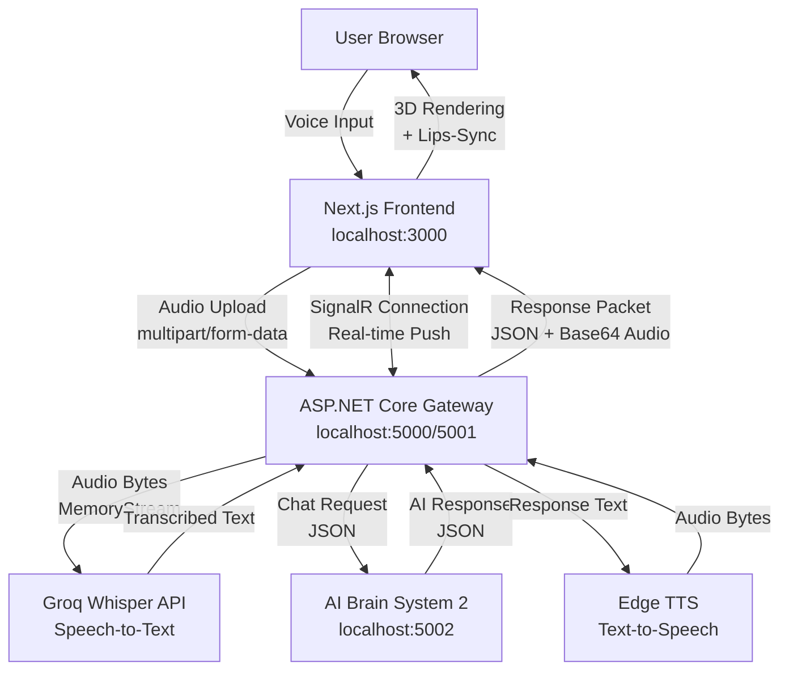
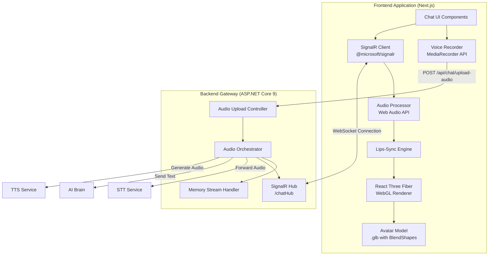
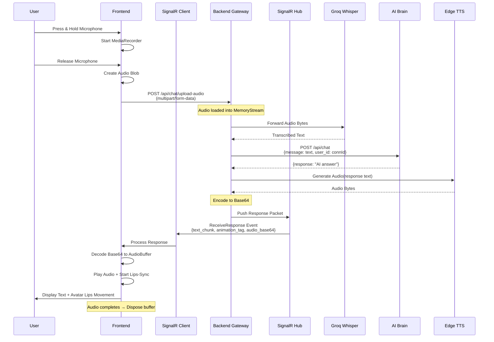

# Design Document - 3D AI Chatbot with Multimedia Orchestration

## Overview

The 3D AI Chatbot with Multimedia Orchestration is a real-time voice interaction system that enables users to communicate with an AI-powered 3D avatar through voice input. The system processes voice-to-text conversion, routes queries to an AI Brain (System 2), and returns responses with synchronized audio playback and realistic lip movements on a 3D avatar.

### Architecture Summary

The system follows a client-server architecture with real-time bidirectional communication:

- **Frontend (Next.js)**: Hosts the 3D avatar using React Three Fiber, captures voice input via MediaRecorder API, and synchronizes lip movements with audio playback using Web Audio API
- **Backend (ASP.NET Core 9)**: Acts as an orchestration gateway that receives audio uploads, coordinates external services (STT, AI Brain, TTS), and pushes responses via SignalR
- **External Services**: Groq Whisper for speech-to-text, AI Brain (localhost:5002) for natural language processing, and Edge TTS for text-to-speech

### Key Design Principles

1. **Zero-Disk I/O**: All audio processing happens in RAM using MemoryStream to ensure low latency
2. **Real-time Push**: SignalR enables server-initiated responses without client polling
3. **Single-Play Audio**: Audio responses play once and are immediately disposed to maintain conversation flow
4. **Stateless Backend**: Each request is independent with connection-scoped state only
5. **Performance-First**: Designed for 3-5 concurrent users in a localhost demo environment

## Architecture

### System Context Diagram



### Component Architecture



### Sequence Diagram: Voice Interaction Flow



## Components and Interfaces

### Frontend Components

#### 1. Voice Recorder Component

**Purpose**: Capture user voice input using browser MediaRecorder API

**Interface**:
```typescript
interface VoiceRecorderProps {
  onRecordingComplete: (audioBlob: Blob) => void;
  onError: (error: Error) => void;
}

interface VoiceRecorderState {
  isRecording: boolean;
  mediaRecorder: MediaRecorder | null;
  audioChunks: Blob[];
}

// Configuration
const AUDIO_CONFIG = {
  mimeType: 'audio/webm',
  audioBitsPerSecond: 128000,
  channelCount: 1,
  sampleRate: 16000
};
```

**Responsibilities**:
- Initialize MediaRecorder with WebM/Mono/16kHz configuration
- Handle microphone permissions and browser compatibility
- Capture audio chunks on button press-and-hold
- Package chunks into Audio Blob on release
- Display visual recording indicator (pulse animation)

**Dependencies**: Browser MediaRecorder API, navigator.mediaDevices

---

#### 2. SignalR Client Manager

**Purpose**: Manage real-time WebSocket connection to backend SignalR Hub

**Interface**:
```typescript
import * as signalR from '@microsoft/signalr';

interface SignalRClientConfig {
  hubUrl: string; // '/chatHub'
  automaticReconnect: boolean;
  onReceiveResponse: (packet: ResponsePacket) => void;
  onConnectionChange: (state: 'connected' | 'disconnected' | 'reconnecting') => void;
}

interface ResponsePacket {
  text_chunk: string;
  animation_tag: 'talking' | 'idle';
  audio_base64: string | null;
}

class SignalRClientManager {
  private connection: signalR.HubConnection;
  
  async connect(): Promise<void>;
  getConnectionId(): string | null;
  async disconnect(): Promise<void>;
  onReceive(handler: (packet: ResponsePacket) => void): void;
}
```

**Responsibilities**:
- Establish connection on page load with automatic reconnect
- Store connection ID for inclusion in upload requests
- Listen for "ReceiveResponse" events from server
- Handle connection state changes and display appropriate UI feedback
- Clean up connection when user leaves /chat page

**Dependencies**: @microsoft/signalr package

---

#### 3. Audio Processor

**Purpose**: Decode Base64 audio and manage playback with analysis capabilities

**Interface**:
```typescript
interface AudioProcessorConfig {
  audioContext: AudioContext;
  onPlaybackStart: () => void;
  onPlaybackEnd: () => void;
  onError: (error: Error) => void;
}

class AudioProcessor {
  private audioContext: AudioContext;
  private analyserNode: AnalyserNode;
  private currentSource: AudioBufferSourceNode | null;
  
  async decodeAndPlay(base64Audio: string): Promise<void>;
  stopCurrentPlayback(): void;
  getAnalyserNode(): AnalyserNode;
  dispose(): void;
}
```

**Responsibilities**:
- Decode Base64 string to byte array
- Convert bytes to AudioBuffer using AudioContext.decodeAudioData()
- Create AudioBufferSourceNode and connect to AnalyserNode
- Start playback immediately upon decode completion
- Stop and dispose previous audio if new audio arrives
- Release memory after playback completes

**Dependencies**: Web Audio API (AudioContext, AudioBuffer, AnalyserNode)

---

#### 4. Lips-Sync Engine

**Purpose**: Synchronize avatar mouth movements with audio amplitude

**Interface**:
```typescript
interface LipsSyncConfig {
  analyserNode: AnalyserNode;
  avatarModel: THREE.Object3D;
  blendShapeNames: {
    mouthOpen: string;
    jawOpen: string;
  };
}

class LipsSyncEngine {
  private analyserNode: AnalyserNode;
  private frequencyData: Uint8Array;
  private isActive: boolean;
  private smoothingFactor: number = 0.7;
  
  start(): void;
  stop(): void;
  private updateFrame(): void; // Called at 60 FPS
  private getAmplitude(): number; // 0-1 range
  private updateBlendShapes(amplitude: number): void;
}
```

**Responsibilities**:
- Query AnalyserNode.getByteFrequencyData() every animation frame
- Extract volume amplitude from frequency data (0-255 range)
- Normalize amplitude to 0-1 range
- Map amplitude to BlendShapes (mouthOpen, jawOpen) with smoothing
- Reset BlendShapes to neutral position when audio ends
- Apply exponential smoothing to prevent jittery movements

**Key Algorithm**:
```typescript
// Smoothing filter to reduce jitter
smoothedAmplitude = (currentAmplitude * (1 - smoothingFactor)) + 
                   (previousAmplitude * smoothingFactor);

// Map to blendshapes with non-linear scaling
mouthOpenValue = Math.pow(smoothedAmplitude, 1.5); // Emphasize peaks
jawOpenValue = smoothedAmplitude * 0.7; // Subtle jaw movement
```

**Dependencies**: Web Audio API AnalyserNode, THREE.js Object3D with morph targets

---

#### 5. 3D Avatar Renderer

**Purpose**: Render 3D avatar model with animations using React Three Fiber

**Interface**:
```typescript
interface AvatarRendererProps {
  modelUrl: string; // Path to .glb file
  lipsSyncEngine: LipsSyncEngine;
  animationTag: 'idle' | 'talking';
}

interface AvatarModel {
  scene: THREE.Object3D;
  animations: THREE.AnimationClip[];
  morphTargetDictionary: { [name: string]: number };
}
```

**Responsibilities**:
- Load .glb model file using @react-three/drei's useGLTF hook
- Configure WebGL scene with lighting (ambient + directional) and shadows
- Play idle animations (breathing, blinking) when not speaking
- Blend talking animation with lips-sync when audio is playing
- Support orbit controls for camera manipulation
- Render at 60 FPS on desktop, gracefully degrade to 30 FPS if needed

**Dependencies**: React Three Fiber, @react-three/drei, THREE.js

---

### Backend Components

#### 6. Audio Upload Controller

**Purpose**: Receive multipart audio uploads and orchestrate processing pipeline

**Interface**:
```csharp
[ApiController]
[Route("api/chat")]
public class ChatController : ControllerBase
{
    [HttpPost("upload-audio")]
    [RequestSizeLimit(10 * 1024 * 1024)] // 10MB max
    public async Task<IActionResult> UploadAudio(
        [FromForm] IFormFile audioFile,
        [FromHeader(Name = "X-SignalR-ConnectionId")] string connectionId)
    {
        // Returns 200 OK immediately, response sent via SignalR
    }
}
```

**Request Validation**:
- Verify MIME type is "audio/webm" or "audio/wav"
- Reject files > 10MB with HTTP 413
- Validate connectionId format (GUID)
- Apply rate limiting: 10 requests/minute per IP

**Responsibilities**:
- Read uploaded audio into MemoryStream (never write to disk)
- Pass MemoryStream to Audio Orchestrator
- Return HTTP 200 immediately (actual response via SignalR)
- Log request metadata (timestamp, connectionId, file size)

---

#### 7. Audio Orchestrator Service

**Purpose**: Coordinate STT, AI Brain, and TTS services with error handling

**Interface**:
```csharp
public interface IAudioOrchestrator
{
    Task<ResponsePacket> ProcessAudioAsync(
        MemoryStream audioStream,
        string connectionId,
        CancellationToken cancellationToken);
}

public class ResponsePacket
{
    public string TextChunk { get; set; }
    public string AnimationTag { get; set; } = "talking";
    public string? AudioBase64 { get; set; }
}
```

**Processing Pipeline**:
1. Forward MemoryStream to STT Service (Groq Whisper)
2. Extract transcribed text from STT response
3. Send text to AI Brain via HTTP POST
4. Receive AI response text
5. Generate audio using TTS Service (Edge TTS)
6. Encode audio bytes to Base64
7. Package into ResponsePacket
8. Push via SignalR Hub to specific connectionId

**Error Handling**:
- STT timeout (15s) → Return error response
- AI Brain timeout (20s) → Return fallback message
- TTS failure → Send text-only response (no audio)
- Log all errors with full context

**Dependencies**: HttpClient, ILogger, IHubContext<ChatHub>

---

#### 8. SignalR Hub

**Purpose**: Enable real-time server-to-client push communication

**Interface**:
```csharp
public class ChatHub : Hub
{
    public override async Task OnConnectedAsync()
    {
        var connectionId = Context.ConnectionId;
        // Log connection
    }
    
    public override async Task OnDisconnectedAsync(Exception? exception)
    {
        // Log disconnection
    }
    
    // Server calls this to push responses
    public async Task SendResponseToClient(string connectionId, ResponsePacket packet)
    {
        await Clients.Client(connectionId).SendAsync("ReceiveResponse", packet);
    }
}
```

**Configuration**:
```csharp
builder.Services.AddSignalR();
app.MapHub<ChatHub>("/chatHub");

// CORS for SignalR
builder.Services.AddCors(options =>
{
    options.AddPolicy("AllowFrontend", policy =>
    {
        policy.WithOrigins("http://localhost:3000")
              .AllowAnyHeader()
              .AllowAnyMethod()
              .AllowCredentials();
    });
});
```

**Responsibilities**:
- Accept WebSocket connections from frontend
- Generate and track connection IDs
- Push ResponsePacket to specific client using Clients.Client(id).SendAsync()
- Handle disconnections gracefully
- Log all connection lifecycle events

---

#### 9. Memory Stream Handler

**Purpose**: Manage audio data in RAM without disk I/O

**Interface**:
```csharp
public interface IMemoryStreamHandler
{
    Task<MemoryStream> ReadFormFileAsync(IFormFile file, int maxSizeBytes);
    MultipartFormDataContent CreateMultipartContent(MemoryStream stream, string fileName);
    void Dispose(MemoryStream stream);
}
```

**Responsibilities**:
- Read IFormFile.OpenReadStream() into MemoryStream
- Enforce 10MB maximum size limit
- Wrap MemoryStream in MultipartFormDataContent for external API calls
- Dispose streams immediately after use to release RAM
- Track memory usage for monitoring

**Critical Constraint**: NEVER use File.WriteAllBytes() or any disk I/O operations

---

### External Service Interfaces

#### 10. STT Service Client (Groq Whisper)

**Interface**:
```csharp
public interface ISttService
{
    Task<string> TranscribeAsync(
        MemoryStream audioStream,
        string fileName,
        CancellationToken cancellationToken);
}

// HTTP Request Format
POST https://api.groq.com/openai/v1/audio/transcriptions
Headers:
  Authorization: Bearer {API_KEY}
Content-Type: multipart/form-data
Body:
  file: <audio bytes>
  model: "whisper-large-v3"
  response_format: "json"
```

**Response Format**:
```json
{
  "text": "transcribed text from audio"
}
```

**Timeout**: 15 seconds

---

#### 11. AI Brain Client

**Interface**:
```csharp
public interface IAiBrainClient
{
    Task<string> SendChatMessageAsync(
        string message,
        string userId,
        CancellationToken cancellationToken);
}

// HTTP Request Format
POST http://localhost:5002/api/chat
Content-Type: application/json
Body:
{
  "message": "transcribed user question",
  "user_id": "signalr-connection-id"
}
```

**Response Format**:
```json
{
  "response": "AI generated answer"
}
```

**Timeout**: 20 seconds

---

#### 12. TTS Service Client (Edge TTS)

**Interface**:
```csharp
public interface ITtsService
{
    Task<byte[]> GenerateAudioAsync(
        string text,
        string voice,
        string rate,
        CancellationToken cancellationToken);
}

// Edge TTS Configuration
Voice: "vi-VN-HoaiMyNeural"
Rate: "+0%" (normal speed)
Output Format: audio/mpeg
```

**Implementation Note**: Use [edge-tts-csharp](https://github.com/waf/edge-tts-csharp) library or equivalent

**Fallback Strategy**: If TTS fails, return text-only response (audio_base64 = null)

---

## Data Models

### Frontend Data Models

```typescript
// Audio Blob captured from MediaRecorder
interface RecordedAudio {
  blob: Blob;
  mimeType: string;
  duration: number; // milliseconds
  size: number; // bytes
}

// Response packet received via SignalR
interface ResponsePacket {
  text_chunk: string;
  animation_tag: 'talking' | 'idle';
  audio_base64: string | null;
}

// Audio playback state
interface AudioPlaybackState {
  isPlaying: boolean;
  currentBuffer: AudioBuffer | null;
  source: AudioBufferSourceNode | null;
  startTime: number;
}

// SignalR connection state
interface ConnectionState {
  status: 'disconnected' | 'connecting' | 'connected' | 'reconnecting';
  connectionId: string | null;
  lastError: Error | null;
  reconnectAttempts: number;
}

// Avatar animation state
interface AvatarState {
  currentAnimation: 'idle' | 'talking';
  blendShapes: {
    mouthOpen: number; // 0-1
    jawOpen: number; // 0-1
  };
  isLipsSyncing: boolean;
}
```

### Backend Data Models

```csharp
// Audio upload request
public class AudioUploadRequest
{
    public IFormFile AudioFile { get; set; }
    public string ConnectionId { get; set; }
    public DateTime ReceivedAt { get; set; }
}

// Response packet pushed via SignalR
public class ResponsePacket
{
    [JsonPropertyName("text_chunk")]
    public string TextChunk { get; set; }
    
    [JsonPropertyName("animation_tag")]
    public string AnimationTag { get; set; } = "talking";
    
    [JsonPropertyName("audio_base64")]
    public string? AudioBase64 { get; set; }
}

// STT Service Response
public class SttResponse
{
    [JsonPropertyName("text")]
    public string Text { get; set; }
}

// AI Brain Request
public class AiBrainRequest
{
    [JsonPropertyName("message")]
    public string Message { get; set; }
    
    [JsonPropertyName("user_id")]
    public string UserId { get; set; }
}

// AI Brain Response
public class AiBrainResponse
{
    [JsonPropertyName("response")]
    public string Response { get; set; }
}

// Error Response
public class ErrorResponse
{
    public string Error { get; set; }
    public string Code { get; set; }
    public string? Details { get; set; }
}

// Request Log Entry
public class RequestLogEntry
{
    public string RequestId { get; set; }
    public string ConnectionId { get; set; }
    public DateTime Timestamp { get; set; }
    public long AudioSizeBytes { get; set; }
    public Dictionary<string, long> ServiceLatencies { get; set; } // STT, AI, TTS
    public string? ErrorMessage { get; set; }
}
```

### Configuration Models

```csharp
// Backend Configuration (appsettings.json)
public class ChatConfiguration
{
    public GroqConfig Groq { get; set; }
    public AiBrainConfig AiBrain { get; set; }
    public TtsConfig Tts { get; set; }
    public CorsConfig Cors { get; set; }
}

public class GroqConfig
{
    public string ApiKey { get; set; }
    public string Model { get; set; } = "whisper-large-v3";
    public int TimeoutSeconds { get; set; } = 15;
}

public class AiBrainConfig
{
    public string BaseUrl { get; set; } = "http://localhost:5002";
    public string ChatEndpoint { get; set; } = "/api/chat";
    public int TimeoutSeconds { get; set; } = 20;
}

public class TtsConfig
{
    public string Voice { get; set; } = "vi-VN-HoaiMyNeural";
    public string Rate { get; set; } = "+0%";
}

public class CorsConfig
{
    public string[] AllowedOrigins { get; set; } = { "http://localhost:3000" };
}
```

```typescript
// Frontend Configuration (.env.local)
interface FrontendConfig {
  NEXT_PUBLIC_BACKEND_URL: string; // http://localhost:5000
  NEXT_PUBLIC_SIGNALR_HUB_URL: string; // http://localhost:5000/chatHub
  NEXT_PUBLIC_AVATAR_MODEL_URL: string; // /models/avatar.glb
}
```

## Correctness Properties

*A property is a characteristic or behavior that should hold true across all valid executions of a system—essentially, a formal statement about what the system should do. Properties serve as the bridge between human-readable specifications and machine-verifiable correctness guarantees.*

### Property 1: Amplitude Normalization Produces Valid Range

*For any* byte value in the range [0, 255] extracted from AnalyserNode frequency data, normalizing the amplitude SHALL produce a floating-point value in the range [0.0, 1.0].

**Validates: Requirements 12.3**

**Rationale**: The lips-sync engine depends on amplitude values being correctly normalized from the raw byte range (0-255) provided by Web Audio API to the normalized range (0-1) expected by the blend shape system. This property ensures the mathematical transformation is correct for all possible input values.

---

### Property 2: Amplitude-to-BlendShape Mapping is Monotonic

*For any* two normalized amplitude values `a1` and `a2` where `0 ≤ a1 < a2 ≤ 1`, the blend shape values produced by the lips-sync mapping function SHALL satisfy `blendShape(a1) ≤ blendShape(a2)`.

**Validates: Requirements 12.5**

**Rationale**: The lips-sync system must maintain a monotonic (non-decreasing) relationship between audio amplitude and mouth opening. Higher audio volume should never result in less mouth movement, as this would create visually jarring and unnatural animations. This property ensures the proportional relationship holds universally.

---

### Property 3: Response Packet Serialization Round-Trip Preserves Equivalence

*For any* valid ResponsePacket object containing `text_chunk` (string), `animation_tag` (string), and `audio_base64` (string or null), parsing the JSON representation, then formatting it back to JSON, then parsing again SHALL produce an object equivalent to the result of the first parse.

Formally: `parse(format(parse(json))) ≡ parse(json)`

**Validates: Requirements 25.5**

**Rationale**: The SignalR communication channel relies on correct serialization and deserialization of response packets. Any data loss or corruption during the round-trip process would result in incorrect text display, wrong animation states, or corrupted audio. This property validates the serialization pipeline maintains data integrity across all possible packet contents, including edge cases like empty strings, special characters, null audio, and maximum-length Base64 data.


## Error Handling

### Error Categories and Strategies

#### 1. User Input Errors

**Microphone Permission Denied**
- **Detection**: `navigator.mediaDevices.getUserMedia()` throws `NotAllowedError`
- **Handling**: Display clear permission request UI with browser-specific instructions
- **Recovery**: Provide "Request Permission" button to retry
- **Logging**: Log permission denial with browser user agent

**Unsupported Browser/API**
- **Detection**: Feature detection for MediaRecorder, WebGL, Web Audio API
- **Handling**: Display compatibility warning with list of supported browsers
- **Fallback**: No graceful degradation available (core features required)
- **Logging**: Log browser capability check results

**Invalid Audio Input**
- **Detection**: MediaRecorder produces empty blob or zero-duration audio
- **Handling**: Show "Please try recording again" message
- **Recovery**: Allow immediate retry without page refresh
- **Logging**: Log empty recording attempts

---

#### 2. Network and Communication Errors

**Upload Timeout (30s)**
- **Detection**: Fetch timeout fires before response received
- **Handling**: Display "Upload timed out" with retry button
- **Recovery**: Retry with exponential backoff (2s, 4s, 8s)
- **Logging**: Log timeout with file size and network conditions

**SignalR Connection Loss**
- **Detection**: SignalR `onclose` event or heartbeat failure
- **Handling**: Display "Reconnecting..." indicator
- **Recovery**: Automatic reconnection with exponential backoff (built-in)
- **Fallback**: After 5 failed attempts, show manual refresh option
- **Logging**: Log disconnection reason and reconnection attempts

**HTTP 4xx/5xx Errors**
- **Detection**: HTTP response status codes
- **Handling**: Map status codes to user-friendly messages
  - 413: "Audio file too large (max 10MB)"
  - 429: "Too many requests, please wait"
  - 500: "Server error, please try again"
  - 502/503: "Service temporarily unavailable"
- **Recovery**: Provide retry button (except 413)
- **Logging**: Log full error response with context

---

#### 3. External Service Errors

**STT Service Failure (Groq Whisper)**
- **Detection**: HTTP error, timeout (15s), or invalid response
- **Handling**: Log detailed error, return HTTP 502 to client
- **Fallback**: Display "Speech recognition unavailable" message
- **Recovery**: Client can retry entire flow
- **Circuit Breaker**: After 3 consecutive failures, return cached error response for 60s
- **Logging**: Log API response time, status, error message

**AI Brain Timeout/Error (localhost:5002)**
- **Detection**: No response within 20s or HTTP error status
- **Handling**: Return fallback response: "Xin lỗi, tôi đang gặp sự cố kỹ thuật. Vui lòng thử lại."
- **Fallback**: Text-only response (no TTS generation)
- **Recovery**: User can send new message
- **Logging**: Log timeout/error with request payload

**TTS Service Failure (Edge TTS)**
- **Detection**: TTS generation throws exception or returns error
- **Handling**: Send text-only response (audio_base64 = null)
- **Fallback**: Display text without audio playback or lips-sync
- **Recovery**: Next response will attempt TTS again
- **Logging**: Log TTS error with input text length

---

#### 4. Audio Processing Errors

**Base64 Decode Failure**
- **Detection**: Invalid Base64 string throws exception
- **Handling**: Log error, display text-only response
- **Fallback**: Show text_chunk without audio
- **Recovery**: Continue conversation (isolated error)
- **Logging**: Log Base64 string length and first 50 chars

**AudioContext Decode Failure**
- **Detection**: `decodeAudioData()` rejects promise
- **Handling**: Log error with audio metadata, display text-only
- **Fallback**: Show text without playback
- **Recovery**: Continue conversation
- **Logging**: Log error message and byte array size

**Autoplay Blocked**
- **Detection**: AudioContext state remains "suspended" after resume attempt
- **Handling**: Display "Click anywhere to enable audio" prompt
- **Recovery**: Resume AudioContext on next user gesture
- **Logging**: Log autoplay block with browser info

---

#### 5. Resource Management Errors

**Memory Limit Exceeded (Backend)**
- **Detection**: MemoryStream allocation fails or exceeds 10MB
- **Handling**: Return HTTP 413 with clear message
- **Prevention**: Validate file size before loading into memory
- **Logging**: Log memory usage and file size

**Memory Leak (Frontend Audio Buffers)**
- **Detection**: Increasing memory usage over multiple interactions
- **Prevention**: Dispose AudioBuffer immediately after playback completes
- **Monitoring**: Log buffer creation and disposal
- **Recovery**: Page refresh clears all buffers

**WebGL Context Loss**
- **Detection**: `webglcontextlost` event fires
- **Handling**: Display "3D rendering paused" message
- **Recovery**: Attempt context restore on `webglcontextrestored` event
- **Fallback**: Prompt user to refresh page if restore fails
- **Logging**: Log context loss event with browser info

---

#### 6. Concurrent Request Handling

**Rapid Sequential Uploads**
- **Detection**: New audio upload while previous request in-flight
- **Handling**: Cancel previous request using AbortController
- **Recovery**: Process only the newest request
- **Logging**: Log cancelled request with timestamp

**Multiple SignalR Responses**
- **Detection**: New ResponsePacket arrives while audio playing
- **Handling**: Stop current audio playback immediately, dispose buffer
- **Recovery**: Start playing new audio without gap
- **Logging**: Log audio interruption event

**Rate Limit Exceeded**
- **Detection**: Backend rejects request with HTTP 429
- **Handling**: Display "Please wait before sending another message"
- **Recovery**: Disable microphone button for retry-after duration
- **Logging**: Log rate limit hit with user identifier

---

### Error Logging Strategy

**Frontend Logging** (Browser Console + Optional Remote):
```typescript
interface ErrorLog {
  timestamp: string;
  errorType: 'network' | 'audio' | 'signalr' | 'rendering' | 'permission';
  message: string;
  context: {
    connectionId?: string;
    audioSize?: number;
    browserInfo?: string;
    stackTrace?: string;
  };
}
```

**Backend Logging** (Structured Logging):
```csharp
_logger.LogError(
    "Audio processing failed for connection {ConnectionId}. " +
    "Stage: {Stage}, Error: {ErrorMessage}",
    connectionId,
    stage, // "STT" | "AI_Brain" | "TTS"
    errorMessage
);
```

**Metrics to Track**:
- Error rate by category (network, STT, AI, TTS, audio)
- Average retry count per request
- SignalR disconnection frequency
- Audio decode failure rate
- Autoplay block rate by browser

---

### Graceful Degradation Hierarchy

1. **Full Experience**: Voice → Text → AI → TTS → Audio + Lips-Sync
2. **No TTS**: Voice → Text → AI → Text Display (no audio/lips-sync)
3. **No AI Brain**: Voice → Text → Fallback Message
4. **No STT**: Display "Speech recognition unavailable" (conversation blocked)
5. **No SignalR**: Display "Real-time communication unavailable" (conversation blocked)

The system requires STT and SignalR as minimum viable components. TTS and AI Brain failures result in degraded but functional experience.

## Testing Strategy

### Testing Approach Overview

The testing strategy employs a **dual approach** combining property-based testing for mathematical transformations and serialization logic, with comprehensive example-based unit and integration tests for the majority of the system's behavior.

**Why This Split?**

This system is primarily composed of:
- **External service integration** (STT, TTS, AI Brain, SignalR) → Integration tests
- **UI rendering and interaction** (3D avatar, WebGL, React components) → Component tests with mocks
- **Browser API usage** (MediaRecorder, Web Audio, WebGL) → Integration tests or mocks
- **Pure mathematical functions** (amplitude normalization, blend shape mapping) → **Property-based tests**
- **Serialization logic** (Response packet parsing) → **Property-based tests**

Property-based testing provides maximum value for the pure functions where input space is large and edge cases are difficult to enumerate. The rest of the system requires example-based tests to verify specific integration scenarios and UI behaviors.

---

### Property-Based Testing

**Library**: [fast-check](https://github.com/dubzzz/fast-check) for TypeScript/JavaScript components

**Minimum Iterations**: 100 runs per property test (due to randomization)

**Tagging Convention**: Each property test must include a comment referencing the design property:
```typescript
// Feature: system1-3d-chat-multimedia, Property 1: Amplitude Normalization Produces Valid Range
it('should normalize any byte amplitude to [0, 1] range', () => {
  fc.assert(
    fc.property(fc.integer({ min: 0, max: 255 }), (rawAmplitude) => {
      const normalized = normalizeAmplitude(rawAmplitude);
      expect(normalized).toBeGreaterThanOrEqual(0);
      expect(normalized).toBeLessThanOrEqual(1);
    }),
    { numRuns: 100 }
  );
});
```

#### Property Test 1: Amplitude Normalization (Requirements 12.3)

**Generator**:
```typescript
fc.integer({ min: 0, max: 255 }) // Raw byte values from AnalyserNode
```

**Test Logic**:
```typescript
const normalized = normalizeAmplitude(rawByte);
expect(normalized).toBeGreaterThanOrEqual(0);
expect(normalized).toBeLessThanOrEqual(1);
expect(normalized).toBe(rawByte / 255); // Verify formula
```

**Edge Cases Covered by Generator**:
- Minimum (0) → Should normalize to 0.0
- Maximum (255) → Should normalize to 1.0
- Middle values (e.g., 127, 128) → Should normalize to ~0.5

---

#### Property Test 2: Monotonic Amplitude-to-BlendShape Mapping (Requirements 12.5)

**Generator**:
```typescript
fc.tuple(
  fc.float({ min: 0, max: 1 }),
  fc.float({ min: 0, max: 1 })
).filter(([a, b]) => a < b) // Ensure a1 < a2
```

**Test Logic**:
```typescript
const [a1, a2] = amplitudePair;
const blend1 = calculateBlendShape(a1);
const blend2 = calculateBlendShape(a2);

expect(blend2.mouthOpen).toBeGreaterThanOrEqual(blend1.mouthOpen);
expect(blend2.jawOpen).toBeGreaterThanOrEqual(blend1.jawOpen);
```

**Edge Cases Covered**:
- (0, 1): Silent to maximum volume
- Close values (0.5, 0.501): Smooth transitions
- Boundary pairs (0, 0.001) and (0.999, 1)

---

#### Property Test 3: Response Packet Round-Trip (Requirements 25.5)

**Generator**:
```typescript
fc.record({
  text_chunk: fc.string({ minLength: 0, maxLength: 1000 }), // Including empty, Unicode
  animation_tag: fc.constantFrom('talking', 'idle'),
  audio_base64: fc.option(fc.base64String({ minLength: 100, maxLength: 10000 }), { nil: null })
})
```

**Test Logic**:
```typescript
const original = generateResponsePacket();
const json1 = JSON.stringify(original);
const parsed1 = ResponsePacket.parse(json1);
const json2 = ResponsePacket.format(parsed1);
const parsed2 = ResponsePacket.parse(json2);

expect(parsed2).toEqual(parsed1); // Deep equality
expect(parsed2.text_chunk).toBe(parsed1.text_chunk);
expect(parsed2.animation_tag).toBe(parsed1.animation_tag);
expect(parsed2.audio_base64).toBe(parsed1.audio_base64);
```

**Edge Cases Covered by Generator**:
- Empty text_chunk
- Special characters in text (quotes, newlines, emojis, Vietnamese diacritics)
- Null audio_base64 (text-only response)
- Very long Base64 strings (simulating large audio)
- Mixed Unicode content

---

### Unit Testing

**Framework**: Jest (Frontend), xUnit (Backend)

**Coverage Target**: 80% line coverage minimum

#### Frontend Unit Tests

**Voice Recorder Component**:
- MediaRecorder initialization with correct config
- Button press/release handlers
- Blob creation with correct MIME type
- Permission denial error handling
- Unsupported API detection

**Audio Processor**:
- Base64 decode logic
- AudioBuffer creation (mocked AudioContext)
- AnalyserNode connection
- Playback stop and cleanup
- Error handling for invalid Base64

**Lips-Sync Engine**:
- Amplitude extraction from frequency data
- Smoothing filter application
- BlendShape update logic
- Reset to neutral state
- Frame rate independence

**SignalR Client Manager**:
- Connection initialization
- Connection ID retrieval
- Event handler registration
- Reconnection logic
- Cleanup on disconnect

#### Backend Unit Tests

**Audio Upload Controller**:
- MIME type validation
- File size limit enforcement (10MB)
- Connection ID header extraction
- Rate limiting behavior

**Memory Stream Handler**:
- IFormFile → MemoryStream conversion
- Size limit enforcement
- MultipartFormDataContent wrapping
- Proper disposal

**Audio Orchestrator**:
- Pipeline orchestration logic (mocked services)
- Error handling for each service failure
- Fallback message generation
- Response packet assembly

**Response Packet Serialization** (Beyond Property Tests):
- Invalid JSON error messages
- Missing required field validation
- Type validation (string vs number)

---

### Integration Testing

**Framework**: Playwright (E2E), TestContainers (Backend Services)

#### Frontend Integration Tests

**Voice Upload Flow**:
1. Mock MediaRecorder to generate test audio blob
2. Verify POST request to `/api/chat/upload-audio`
3. Verify multipart/form-data format
4. Verify SignalR connection ID in header

**SignalR Push Flow**:
1. Establish SignalR connection
2. Simulate server sending ResponsePacket
3. Verify client receives event
4. Verify audio playback starts
5. Verify text displays in UI

**Audio Playback with Lips-Sync**:
1. Mock AudioContext and AnalyserNode
2. Provide test frequency data
3. Verify BlendShapes update at 60 FPS
4. Verify reset on audio end

**Tab Backgrounding**:
1. Simulate visibility change to "hidden"
2. Verify SignalR disconnect
3. Verify audio stops
4. Verify rendering pauses
5. Simulate visibility change to "visible"
6. Verify reconnection

#### Backend Integration Tests

**STT Service Integration** (with Test Double):
1. Send test audio MemoryStream
2. Verify multipart request format
3. Verify API key header
4. Verify transcription extraction
5. Test timeout handling (15s)

**AI Brain Integration**:
1. Send test message
2. Verify JSON format
3. Verify response extraction
4. Test timeout (20s) and fallback

**TTS Service Integration**:
1. Send test text
2. Verify voice configuration
3. Verify audio byte array returned
4. Test error fallback (text-only)

**SignalR Hub**:
1. Connect multiple clients
2. Send response to specific client
3. Verify only target receives message
4. Test disconnection handling

**CORS Configuration**:
1. Send preflight OPTIONS request
2. Verify CORS headers present
3. Verify origin validation
4. Test with invalid origin

---

### End-to-End Testing

**Framework**: Playwright with real browser instances

**Test Scenarios**:

1. **Happy Path - Complete Voice Interaction**:
   - Load /chat page
   - Establish SignalR connection
   - Press and hold microphone button
   - Release button (trigger upload)
   - Verify loading indicator
   - Wait for SignalR response
   - Verify text displays
   - Verify audio plays
   - Verify avatar lips move
   - Verify audio stops and cleans up

2. **Error Recovery - Upload Failure**:
   - Trigger upload
   - Simulate network error (mock)
   - Verify error message displays
   - Click retry button
   - Verify successful retry

3. **Error Recovery - SignalR Disconnection**:
   - Establish connection
   - Simulate network drop
   - Verify "Reconnecting..." message
   - Wait for reconnection
   - Verify conversation continues

4. **Audio Replacement - Rapid Responses**:
   - Start audio playback
   - Trigger new response mid-playback
   - Verify previous audio stops immediately
   - Verify new audio starts without gap

5. **Autoplay Unlock - First Interaction**:
   - Load page (AudioContext suspended)
   - Click microphone button
   - Verify AudioContext resumes
   - Verify subsequent audio plays automatically

6. **Browser Compatibility - Safari**:
   - Test on Safari/iOS
   - Verify autoplay handling
   - Verify MediaRecorder fallback (if needed)

---

### Load Testing

**Tool**: k6 or Artillery

**Target**: 3-5 concurrent users (CCU)

**Scenarios**:

1. **Baseline Performance** (3 CCU):
   - 3 users send voice messages simultaneously
   - Measure backend response time (excluding STT/AI/TTS)
   - Target: < 100ms for upload endpoint
   - Verify all SignalR messages delivered

2. **Maximum Load** (5 CCU):
   - 5 users send messages simultaneously
   - Measure memory usage (MemoryStream)
   - Verify no memory leaks after 50 requests
   - Verify no request failures

3. **Sustained Load** (3 CCU, 10 minutes):
   - 3 users sending messages every 30 seconds
   - Monitor CPU, memory, network
   - Verify stable performance
   - Check for resource leaks

**Success Criteria**:
- 0% error rate under 5 CCU
- Backend response time < 100ms (excluding external services)
- Memory usage stable (no leaks)
- SignalR messages delivered within 50ms
- Frontend rendering maintains 30+ FPS

---

### Performance Testing

**Frontend Metrics**:
- **3D Rendering**: 60 FPS target, 30 FPS minimum
- **Base64 Decode**: < 100ms for typical audio (2-5 seconds)
- **Lips-Sync Update**: < 16ms per frame (60 FPS budget)

**Backend Metrics**:
- **Upload Processing**: < 50ms (MemoryStream read + validation)
- **SignalR Push**: < 50ms from orchestrator to client
- **Memory**: < 50MB per concurrent connection

**External Service Targets** (SLA):
- **STT (Groq)**: < 5s for 5-second audio
- **AI Brain**: < 2s for typical query
- **TTS (Edge)**: < 3s for 50-word response

---

### Test Data Management

**Audio Test Files**:
- `short-question.webm` (2 seconds, mono, 16kHz)
- `long-question.webm` (10 seconds)
- `empty-audio.webm` (0 duration, edge case)
- `invalid-format.wav` (unsupported format)
- `oversized-audio.webm` (11MB, exceeds limit)

**Response Packet Test Data**:
- Valid packets with all fields
- Packets with null audio_base64
- Packets with empty text_chunk
- Packets with special characters (Vietnamese, emoji, quotes)
- Malformed JSON strings

**3D Model Test Data**:
- `test-avatar.glb` (with mouthOpen/jawOpen blendshapes)
- `invalid-avatar.glb` (missing blendshapes)

---

### CI/CD Integration

**Pipeline Stages**:
1. **Lint & Format**: ESLint, Prettier, C# style check
2. **Unit Tests**: Jest (Frontend), xUnit (Backend)
3. **Integration Tests**: With test doubles for external services
4. **Property Tests**: Run 100 iterations per property
5. **E2E Tests**: Playwright on Chromium
6. **Performance Tests**: Quick baseline check (1 minute, 3 CCU)
7. **Build**: Next.js production build, .NET publish

**Quality Gates**:
- Unit test coverage ≥ 80%
- All property tests pass (0 failures in 100 runs)
- E2E tests pass on Chromium
- No ESLint errors
- Build succeeds without warnings

---

### Manual Testing Checklist

**Browser Compatibility**:
- [ ] Chrome 90+ (Windows, macOS, Linux)
- [ ] Firefox 88+
- [ ] Safari 14+ (macOS, iOS)
- [ ] Edge 90+

**Device Testing**:
- [ ] Desktop (1920x1080, 1366x768)
- [ ] Laptop (varied DPI)
- [ ] Tablet (iPad, Android)

**Network Conditions**:
- [ ] Fast 3G (throttled)
- [ ] Slow connection with high latency
- [ ] Connection drop and recovery

**Edge Cases**:
- [ ] Very long user messages (> 100 words)
- [ ] Rapid sequential messages
- [ ] Tab backgrounding during audio playback
- [ ] Multiple tabs open simultaneously
- [ ] Page refresh during upload

---

### Test Maintenance Strategy

- **Property tests**: No maintenance needed (generators adapt to code changes)
- **Integration tests**: Update when external API contracts change
- **E2E tests**: Update selectors when UI components change
- **Test data**: Refresh audio files if format requirements change

**Regression Test Suite**: Maintain a subset of critical tests for quick feedback:
- Property tests (all 3)
- Core upload flow integration test
- SignalR push integration test
- One E2E happy path test

Target runtime for regression suite: < 2 minutes
