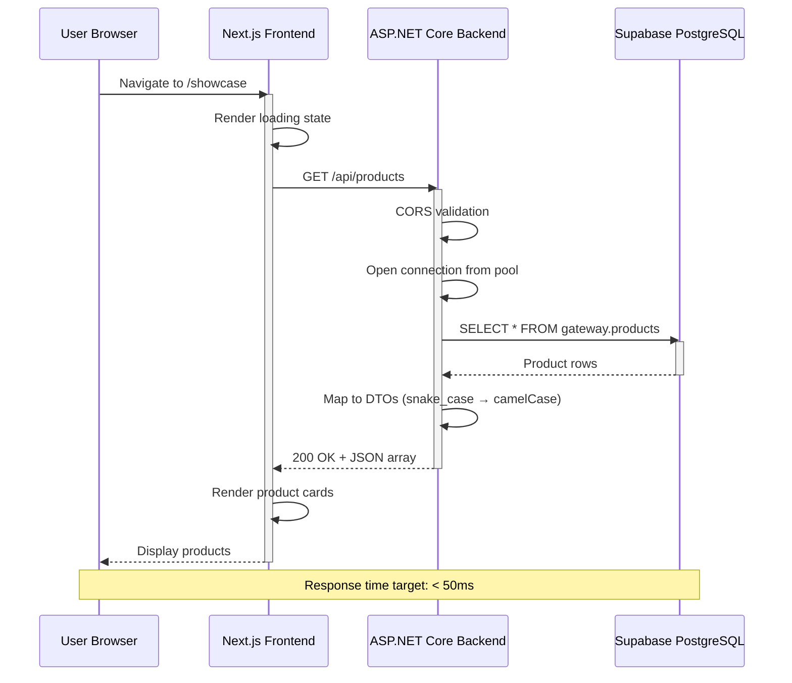
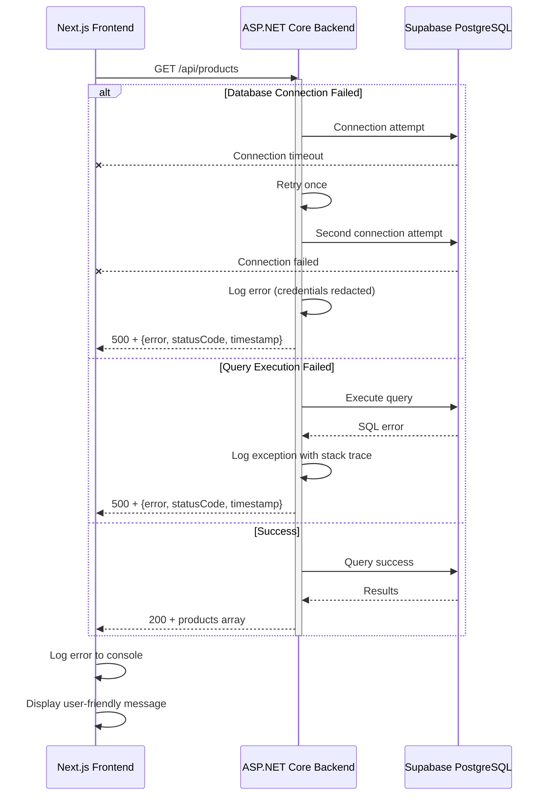
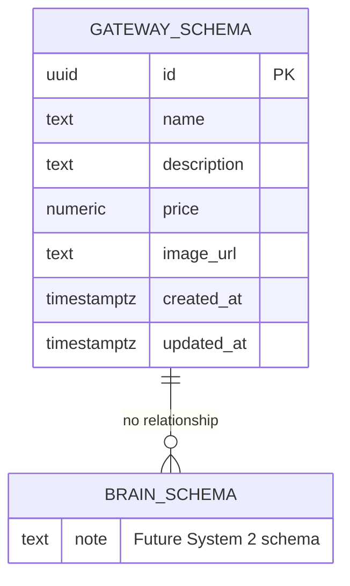
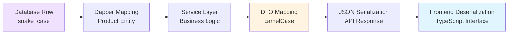
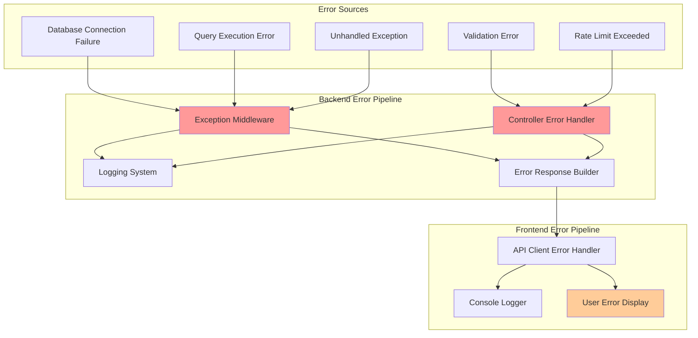

# Tài Liệu Thiết Kế - System 1 (Showcase & Gateway)

## Tổng Quan

System 1 là tầng trình diễn và gateway đa phương tiện cho hệ thống demo AI chatbot. Thiết kế này tập trung vào **chức năng showcase sản phẩm** với kiến trúc 3-tier đơn giản nhưng có khả năng mở rộng cho các tính năng đa phương tiện 3D AI trong tương lai.

### Mục Tiêu Thiết Kế

1. **Hiệu suất cao**: Response time < 50ms cho API queries trên localhost
2. **Tách biệt rõ ràng**: Frontend, Backend, Database hoàn toàn độc lập
3. **Khả năng mở rộng**: Chuẩn bị cho tích hợp System 2 (AI Brain) và multimedia orchestration
4. **Đơn giản hóa**: Sử dụng micro-ORM (Dapper) thay vì full ORM để giảm overhead
5. **Developer-friendly**: CORS configuration cho localhost development, comprehensive logging

### Phạm Vi Thiết Kế

**Trong phạm vi (Priority 1):**
- Product showcase với RESTful API
- Database schema design cho gateway
- Frontend product display với error handling
- CORS configuration cho localhost
- Performance optimization với Dapper
- API contract preparation cho System 2

**Ngoài phạm vi (Future specs):**
- 3D asset management với React Three Fiber
- Audio streaming, STT/TTS integration
- SignalR real-time communication
- Web Audio API lips-sync
- System 2 AI Brain implementation

## Kiến Trúc Hệ Thống

### Sơ Đồ Tổng Quan

```mermaid
graph TB
    subgraph "Client Layer"
        Browser[Browser<br/>Chrome/Firefox/Safari/Edge]
    end
    
    subgraph "Frontend - Next.js"
        NextApp[Next.js App<br/>Port 3000]
        ShowcasePage[/showcase Route]
        APIClient[API Client<br/>fetch with error handling]
    end
    
    subgraph "Backend - ASP.NET Core 9"
        API[System1 Backend<br/>Port 5000/5001]
        ProductController[ProductController<br/>/api/products]
        CORSMiddleware[CORS Middleware]
        ErrorHandler[Global Error Handler]
        ConnectionPool[Connection Pool<br/>Npgsql]
    end
    
    subgraph "Database - Supabase"
        Supabase[(Supabase PostgreSQL)]
        GatewaySchema[gateway schema]
        ProductsTable[products table]
    end
    
    subgraph "Future Integration"
        System2[System 2 API<br/>Port 5002<br/>Interface Only]
    end
    
    Browser --> NextApp
    NextApp --> ShowcasePage
    ShowcasePage --> APIClient
    APIClient -->|HTTP GET| API
    API --> CORSMiddleware
    CORSMiddleware --> ProductController
    ProductController --> ConnectionPool
    ConnectionPool -->|Dapper Query| Supabase
    Supabase --> GatewaySchema
    GatewaySchema --> ProductsTable
    
    API -.->|Future| System2
    
    ErrorHandler -.-> API
    
    style ShowcasePage fill:#e1f5ff
    style ProductController fill:#fff4e1
    style ProductsTable fill:#f0e1ff
    style System2 fill:#e0e0e0,stroke-dasharray: 5 5
```

### Luồng Dữ Liệu - Product Showcase



### Luồng Xử Lý Lỗi



## Thiết Kế Component

### Frontend Architecture (Next.js)

#### Project Structure

```
frontend/
├── app/
│   ├── showcase/
│   │   ├── page.tsx              # Main showcase route
│   │   ├── loading.tsx           # Loading UI
│   │   └── error.tsx             # Error boundary
│   ├── layout.tsx                # Root layout
│   └── globals.css
├── components/
│   ├── ProductCard.tsx           # Individual product display
│   ├── ProductGrid.tsx           # Responsive grid container
│   └── ErrorMessage.tsx          # Error display component
├── lib/
│   ├── api-client.ts             # API client with error handling
│   └── types.ts                  # TypeScript interfaces
├── public/
│   └── placeholder-product.png   # Fallback image
└── .env.local                    # Environment variables
```

#### Key Components

**1. Showcase Page (`app/showcase/page.tsx`)**

```typescript
// Server Component với SSR cho initial load performance
interface Product {
  id: string;
  name: string;
  description: string;
  price: number;
  imageUrl: string | null;
  createdAt: string;
  updatedAt: string;
}

export default async function ShowcasePage() {
  // Server-side data fetching với error handling
  const products = await fetchProducts();
  
  return (
    <main>
      <h1>Product Showcase</h1>
      <ProductGrid products={products} />
    </main>
  );
}
```

**2. API Client (`lib/api-client.ts`)**

```typescript
const API_BASE_URL = process.env.NEXT_PUBLIC_API_BASE_URL || 'http://localhost:5000';

export async function fetchProducts(): Promise<Product[]> {
  const controller = new AbortController();
  const timeoutId = setTimeout(() => controller.abort(), 10000); // 10s timeout
  
  try {
    const response = await fetch(`${API_BASE_URL}/api/products`, {
      signal: controller.signal,
      cache: 'no-store', // Disable Next.js caching cho development
    });
    
    if (!response.ok) {
      const errorData = await response.json().catch(() => ({}));
      console.error('API Error:', errorData);
      throw new Error(errorData.error || 'Failed to fetch products');
    }
    
    return await response.json();
  } catch (error) {
    console.error('Fetch Error:', error);
    throw error;
  } finally {
    clearTimeout(timeoutId);
  }
}
```

**3. Product Card Component**

```typescript
interface ProductCardProps {
  product: Product;
}

export function ProductCard({ product }: ProductCardProps) {
  const [imageError, setImageError] = useState(false);
  
  const formattedPrice = new Intl.NumberFormat('vi-VN', {
    style: 'currency',
    currency: 'VND'
  }).format(product.price);
  
  return (
    <article className="product-card">
       setImageError(true)}
      />
      <h3>{product.name}</h3>
      <p>{product.description}</p>
      <span className="price">{formattedPrice}</span>
    </article>
  );
}
```

#### Responsive Grid Layout

```css
/* Mobile-first approach */
.product-grid {
  display: grid;
  grid-template-columns: 1fr; /* Single column on mobile */
  gap: 1.5rem;
  padding: 1rem;
}

@media (min-width: 640px) {
  .product-grid {
    grid-template-columns: repeat(2, 1fr); /* 2 columns on tablet */
  }
}

@media (min-width: 1024px) {
  .product-grid {
    grid-template-columns: repeat(3, 1fr); /* 3 columns on desktop */
  }
}

@media (min-width: 1280px) {
  .product-grid {
    grid-template-columns: repeat(4, 1fr); /* 4 columns on large screens */
  }
}
```

### Backend Architecture (ASP.NET Core 9)

#### Project Structure

```
System1.Backend/
├── Controllers/
│   └── ProductsController.cs     # API endpoints
├── Models/
│   ├── Product.cs                # Domain model
│   └── ErrorResponse.cs          # Error DTO
├── Services/
│   ├── IProductService.cs        # Service interface
│   └── ProductService.cs         # Business logic
├── Data/
│   ├── IProductRepository.cs     # Repository interface
│   └── ProductRepository.cs      # Dapper queries
├── Middleware/
│   └── ExceptionHandlingMiddleware.cs
├── Program.cs                    # Application startup
├── appsettings.json              # Configuration
└── appsettings.Development.json  # Development config
```

#### Key Components

**1. Products Controller**

```csharp
[ApiController]
[Route("api/[controller]")]
public class ProductsController : ControllerBase
{
    private readonly IProductService _productService;
    private readonly ILogger<ProductsController> _logger;

    public ProductsController(IProductService productService, ILogger<ProductsController> logger)
    {
        _productService = productService;
        _logger = logger;
    }

    [HttpGet]
    public async Task<ActionResult<IEnumerable<ProductDto>>> GetProducts()
    {
        var stopwatch = Stopwatch.StartNew();
        
        try
        {
            var products = await _productService.GetAllProductsAsync();
            stopwatch.Stop();
            
            _logger.LogInformation("Products retrieved successfully in {ElapsedMs}ms", 
                stopwatch.ElapsedMilliseconds);
            
            return Ok(products);
        }
        catch (Exception ex)
        {
            stopwatch.Stop();
            _logger.LogError(ex, "Error retrieving products after {ElapsedMs}ms", 
                stopwatch.ElapsedMilliseconds);
            throw; // Handled by global exception middleware
        }
    }
}
```

**2. Product Repository với Dapper**

```csharp
public class ProductRepository : IProductRepository
{
    private readonly string _connectionString;
    private readonly ILogger<ProductRepository> _logger;

    public ProductRepository(IConfiguration configuration, ILogger<ProductRepository> logger)
    {
        _connectionString = configuration.GetConnectionString("Supabase")
            ?? throw new InvalidOperationException("Supabase connection string not found");
        _logger = logger;
    }

    public async Task<IEnumerable<Product>> GetAllAsync()
    {
        const string sql = @"
            SELECT 
                id, 
                name, 
                description, 
                price, 
                image_url AS ImageUrl, 
                created_at AS CreatedAt, 
                updated_at AS UpdatedAt
            FROM gateway.products
            ORDER BY created_at DESC";

        await using var connection = new NpgsqlConnection(_connectionString);
        
        try
        {
            await connection.OpenAsync();
            var products = await connection.QueryAsync<Product>(sql);
            return products;
        }
        catch (NpgsqlException ex)
        {
            _logger.LogError(ex, "Database query failed");
            
            // Retry logic
            _logger.LogInformation("Retrying database connection...");
            await Task.Delay(100); // Brief delay before retry
            
            await connection.OpenAsync();
            return await connection.QueryAsync<Product>(sql);
        }
    }
}
```

**3. Connection Pool Configuration**

```csharp
// In Program.cs
builder.Services.AddSingleton<IProductRepository, ProductRepository>();

// Connection pooling là automatic với Npgsql
// Configure pooling parameters in connection string:
// "Host=db.supabase.co;Database=postgres;Username=user;Password=pass;Pooling=true;Minimum Pool Size=0;Maximum Pool Size=10;Connection Lifetime=0;Command Timeout=30"
```

**4. CORS Middleware Setup**

```csharp
// In Program.cs
builder.Services.AddCors(options =>
{
    options.AddPolicy("LocalhostDevelopment", policy =>
    {
        policy.WithOrigins("http://localhost:3000")
              .AllowAnyMethod()
              .AllowAnyHeader()
              .AllowCredentials();
    });
});

var app = builder.Build();

app.UseCors("LocalhostDevelopment");
app.MapControllers();
```

**5. Global Exception Handling**

```csharp
public class ExceptionHandlingMiddleware
{
    private readonly RequestDelegate _next;
    private readonly ILogger<ExceptionHandlingMiddleware> _logger;

    public ExceptionHandlingMiddleware(RequestDelegate next, ILogger<ExceptionHandlingMiddleware> logger)
    {
        _next = next;
        _logger = logger;
    }

    public async Task InvokeAsync(HttpContext context)
    {
        try
        {
            await _next(context);
        }
        catch (Exception ex)
        {
            _logger.LogError(ex, "Unhandled exception occurred: {Message}", ex.Message);
            await HandleExceptionAsync(context, ex);
        }
    }

    private static async Task HandleExceptionAsync(HttpContext context, Exception exception)
    {
        context.Response.ContentType = "application/json";
        context.Response.StatusCode = StatusCodes.Status500InternalServerError;

        var errorResponse = new ErrorResponse
        {
            Error = "An internal server error occurred. Please try again later.",
            StatusCode = context.Response.StatusCode,
            Timestamp = DateTime.UtcNow.ToString("o")
        };

        await context.Response.WriteAsJsonAsync(errorResponse);
    }
}
```

**6. Security Headers Middleware**

```csharp
app.Use(async (context, next) =>
{
    context.Response.Headers.Add("X-Content-Type-Options", "nosniff");
    context.Response.Headers.Add("X-Frame-Options", "DENY");
    context.Response.Headers.Add("X-XSS-Protection", "1; mode=block");
    await next();
});
```

### Database Architecture (Supabase PostgreSQL)

#### Schema Design



#### SQL Schema Creation

```sql
-- Create gateway schema
CREATE SCHEMA IF NOT EXISTS gateway;

-- Create products table
CREATE TABLE gateway.products (
    id UUID PRIMARY KEY DEFAULT gen_random_uuid(),
    name TEXT NOT NULL CHECK (length(name) BETWEEN 1 AND 200),
    description TEXT,
    price NUMERIC(10, 2) NOT NULL CHECK (price >= 0),
    image_url TEXT,
    created_at TIMESTAMPTZ NOT NULL DEFAULT NOW(),
    updated_at TIMESTAMPTZ NOT NULL DEFAULT NOW()
);

-- Create index for time-based queries
CREATE INDEX idx_products_created_at ON gateway.products(created_at DESC);

-- Create trigger for automatic updated_at
CREATE OR REPLACE FUNCTION gateway.update_updated_at_column()
RETURNS TRIGGER AS $$
BEGIN
    NEW.updated_at = NOW();
    RETURN NEW;
END;
$$ LANGUAGE plpgsql;

CREATE TRIGGER update_products_updated_at
    BEFORE UPDATE ON gateway.products
    FOR EACH ROW
    EXECUTE FUNCTION gateway.update_updated_at_column();

-- Add comment for documentation
COMMENT ON TABLE gateway.products IS 'Product catalog for showcase display';
COMMENT ON COLUMN gateway.products.price IS 'Product price in VND, must be non-negative';
COMMENT ON COLUMN gateway.products.image_url IS 'HTTP/HTTPS URL to product image, nullable';
```

#### Index Strategy

**Primary Index:**
- `id` (UUID): Primary key, clustered index (automatic)

**Secondary Index:**
- `created_at DESC`: Optimizes sorting by newest products first
- **Rationale**: Product showcase displays newest items first, index enables fast ORDER BY queries

**Performance Estimate:**
- Without index: Full table scan, O(n) complexity
- With index: Index scan, O(log n) complexity
- For 10,000 products: ~14ms → ~3ms query time improvement

#### Connection String Configuration

```json
// appsettings.json
{
  "ConnectionStrings": {
    "Supabase": "Host=db.xxx.supabase.co;Port=5432;Database=postgres;Username=postgres;Password=${SUPABASE_PASSWORD};Pooling=true;Minimum Pool Size=0;Maximum Pool Size=10;Connection Lifetime=0"
  }
}
```

**Connection Pooling Parameters:**
- `Pooling=true`: Enable connection reuse
- `Minimum Pool Size=0`: No idle connections (reduce overhead)
- `Maximum Pool Size=10`: Support up to 10 concurrent connections
- `Connection Lifetime=0`: Connections never expire (stable for localhost)

## API Contract Specifications

### Endpoint: GET /api/products

**Request:**
```http
GET /api/products HTTP/1.1
Host: localhost:5000
Origin: http://localhost:3000
```

**Success Response (200 OK):**
```json
[
  {
    "id": "550e8400-e29b-41d4-a716-446655440000",
    "name": "Sản phẩm A",
    "description": "Mô tả chi tiết sản phẩm A",
    "price": 299000,
    "imageUrl": "https://example.com/product-a.jpg",
    "createdAt": "2025-06-15T08:30:00Z",
    "updatedAt": "2025-06-15T08:30:00Z"
  },
  {
    "id": "7c9e6679-7425-40de-944b-e07fc1f90ae7",
    "name": "Sản phẩm B",
    "description": "Mô tả chi tiết sản phẩm B",
    "price": 599000,
    "imageUrl": null,
    "createdAt": "2025-06-14T10:15:00Z",
    "updatedAt": "2025-06-14T10:15:00Z"
  }
]
```

**Empty Response (200 OK):**
```json
[]
```

**Error Response (500 Internal Server Error):**
```json
{
  "error": "An internal server error occurred. Please try again later.",
  "statusCode": 500,
  "timestamp": "2025-06-15T10:45:23.123Z"
}
```

**Error Response (400 Bad Request):**
```json
{
  "error": "Invalid request format",
  "statusCode": 400,
  "timestamp": "2025-06-15T10:45:23.123Z"
}
```

**Error Response (429 Too Many Requests):**
```http
HTTP/1.1 429 Too Many Requests
Retry-After: 60

{
  "error": "Rate limit exceeded. Please try again later.",
  "statusCode": 429,
  "timestamp": "2025-06-15T10:45:23.123Z"
}
```

### Future API Contract: System 2 Integration

**Endpoint: POST /api/chat/process** (Interface definition only, no implementation)

**Request:**
```http
POST /api/chat/process HTTP/1.1
Host: localhost:5002
Content-Type: application/json

{
  "userText": "Tôi muốn tìm sản phẩm giá rẻ",
  "sessionId": "550e8400-e29b-41d4-a716-446655440000",
  "timestamp": "2025-06-15T10:45:23.123Z"
}
```

**Success Response (200 OK):**
```json
{
  "aiResponse": "Tôi có thể giúp bạn tìm các sản phẩm giá rẻ. Dưới đây là danh sách...",
  "sessionId": "550e8400-e29b-41d4-a716-446655440000",
  "tokensUsed": 245
}
```

**Error Response (503 Service Unavailable):**
```json
{
  "error": "AI service is currently unavailable. Please try again later.",
  "statusCode": 503,
  "timestamp": "2025-06-15T10:45:23.123Z"
}
```

**Response Time SLA:** < 5000ms for normal chat requests

## Data Models

### Domain Models

#### Product Entity (C# - Backend)

```csharp
public class Product
{
    public Guid Id { get; set; }
    
    [Required]
    [StringLength(200, MinimumLength = 1)]
    public string Name { get; set; } = string.Empty;
    
    public string? Description { get; set; }
    
    [Range(0, double.MaxValue)]
    public decimal Price { get; set; }
    
    [Url]
    public string? ImageUrl { get; set; }
    
    public DateTime CreatedAt { get; set; }
    
    public DateTime UpdatedAt { get; set; }
}
```

#### Product DTO (C# - API Response)

```csharp
public class ProductDto
{
    public string Id { get; set; } = string.Empty;
    public string Name { get; set; } = string.Empty;
    public string? Description { get; set; }
    public decimal Price { get; set; }
    public string? ImageUrl { get; set; }
    public string CreatedAt { get; set; } = string.Empty;
    public string UpdatedAt { get; set; } = string.Empty;
}
```

#### Product Interface (TypeScript - Frontend)

```typescript
export interface Product {
  id: string;
  name: string;
  description: string;
  price: number;
  imageUrl: string | null;
  createdAt: string; // ISO 8601 format
  updatedAt: string; // ISO 8601 format
}
```

#### Error Response Model

```csharp
public class ErrorResponse
{
    public string Error { get; set; } = string.Empty;
    public int StatusCode { get; set; }
    public string Timestamp { get; set; } = string.Empty;
}
```

```typescript
export interface ErrorResponse {
  error: string;
  statusCode: number;
  timestamp: string;
}
```

### Data Transformation Pipeline



**Field Name Mapping:**

| Database (snake_case) | C# Entity (PascalCase) | JSON/TS (camelCase) |
|----------------------|------------------------|---------------------|
| id                   | Id                     | id                  |
| name                 | Name                   | name                |
| description          | Description            | description         |
| price                | Price                  | price               |
| image_url            | ImageUrl               | imageUrl            |
| created_at           | CreatedAt              | createdAt           |
| updated_at           | UpdatedAt              | updatedAt           |

### Data Validation Rules

**Backend Validation (ASP.NET Core Data Annotations):**
```csharp
[Required(ErrorMessage = "Product name is required")]
[StringLength(200, MinimumLength = 1, ErrorMessage = "Name must be between 1 and 200 characters")]
public string Name { get; set; }

[Range(0, double.MaxValue, ErrorMessage = "Price must be non-negative")]
public decimal Price { get; set; }

[Url(ErrorMessage = "Image URL must be a valid HTTP/HTTPS URL")]
public string? ImageUrl { get; set; }
```

**Database Constraints:**
```sql
CHECK (length(name) BETWEEN 1 AND 200)
CHECK (price >= 0)
NOT NULL constraints on id, name, created_at
```

**Frontend Validation:**
```typescript
function validateProduct(product: Product): boolean {
  if (!product.id || !product.name) return false;
  if (product.price < 0) return false;
  if (product.imageUrl && !isValidUrl(product.imageUrl)) return false;
  return true;
}
```


## Correctness Properties

*A property is a characteristic or behavior that should hold true across all valid executions of a system—essentially, a formal statement about what the system should do. Properties serve as the bridge between human-readable specifications and machine-verifiable correctness guarantees.*

### Property 1: Product Data Round-Trip Preservation

*For any* valid product object retrieved from the API, serializing to JSON and then deserializing back SHALL produce an object with semantically equivalent field values (id, name, description, price, imageUrl, createdAt, updatedAt).

**Validates: Requirements 9.6**

**Rationale:** This is the fundamental correctness property for data integrity. If data cannot survive a round-trip through serialization, the system cannot be trusted to preserve user data. This property ensures that database → backend → JSON → frontend → JSON → backend transformations are lossless.

### Property 2: Price Validation Invariant

*For any* product in the system (whether in database, API response, or frontend state), the price value SHALL be greater than or equal to zero.

**Validates: Requirements 1.5, 9.2**

**Rationale:** This invariant must hold at all layers: database constraints, backend validation, and frontend display. Negative prices violate business logic and could cause financial errors. This property ensures the constraint is enforced universally.

### Property 3: API Response Schema Consistency

*For any* successful GET request to `/api/products`, the JSON response SHALL be an array where each element contains exactly these fields with correct types: `id` (string), `name` (string), `description` (string), `price` (number), `imageUrl` (string or null), `createdAt` (string), `updatedAt` (string).

**Validates: Requirements 2.3, 2.5**

**Rationale:** API consumers (frontend, future integrations) rely on consistent response structure. Schema violations cause runtime errors and integration failures. This property ensures type safety and contract compliance.

### Property 4: Field Name Transformation Consistency

*For any* product data flowing from database to API response, database field names in snake_case (e.g., `image_url`, `created_at`) SHALL be consistently transformed to camelCase in JSON (e.g., `imageUrl`, `createdAt`), and this transformation SHALL be reversible (bijective mapping).

**Validates: Requirements 2.6**

**Rationale:** Naming convention consistency is critical for maintainability and integration. This property ensures that the mapping is deterministic and reversible, preventing data loss or confusion in the transformation pipeline.

### Property 5: Error Response Format Consistency

*For any* error condition in the backend (database failure, validation error, rate limit exceeded, unhandled exception), the error response SHALL contain exactly these fields: `error` (string), `statusCode` (integer), `timestamp` (ISO 8601 string).

**Validates: Requirements 2.4, 8.3, 8.6**

**Rationale:** Consistent error handling simplifies frontend error parsing and improves debugging. This property ensures that all error paths (middleware, controllers, validation) produce uniform responses, enabling generic error handling logic.

### Property 6: Timestamp Auto-Update Correctness

*For any* product inserted into the database, the `created_at` field SHALL be automatically set to the current timestamp, and *for any* product updated in the database, the `updated_at` field SHALL be automatically set to the current timestamp at the time of update.

**Validates: Requirements 1.6, 1.7**

**Rationale:** Automatic timestamp management prevents manual timestamp errors and ensures accurate audit trails. This property verifies that database triggers function correctly for both INSERT and UPDATE operations.

### Property 7: Frontend Price Formatting Consistency

*For any* product price value displayed in the frontend, the formatted string SHALL include thousand separators and the VND currency symbol, maintaining consistency across all price displays regardless of the numeric value.

**Validates: Requirements 3.6**

**Rationale:** Consistent price formatting improves user experience and prevents confusion. This property ensures that the Intl.NumberFormat implementation works correctly for all price ranges (small amounts, large amounts, zero).

### Property 8: Image Fallback Reliability

*For any* product with `imageUrl` that is null or fails to load, the frontend SHALL display a placeholder image, ensuring no product card is rendered without an image.

**Validates: Requirements 3.7**

**Rationale:** Broken images degrade user experience and make the interface appear unprofessional. This property ensures graceful degradation for all image loading failures.

### Property 9: CORS Preflight Idempotence

*For any* preflight OPTIONS request sent to System1_Backend from the allowed origin, executing the request multiple times SHALL return identical CORS headers (Access-Control-Allow-Origin, Access-Control-Allow-Methods, Access-Control-Allow-Headers, Access-Control-Allow-Credentials).

**Validates: Requirements 4.6**

**Rationale:** CORS preflight responses must be deterministic and cacheable. Non-idempotent CORS behavior can cause intermittent frontend failures. This property ensures that CORS middleware produces consistent results.

### Property 10: Security Header Presence

*For any* HTTP response from System1_Backend, the response SHALL include security headers: `X-Content-Type-Options: nosniff`, `X-Frame-Options: DENY`, `X-XSS-Protection: 1; mode=block`.

**Validates: Requirements 12.5**

**Rationale:** Security headers protect against common web vulnerabilities (XSS, clickjacking, MIME sniffing). This property ensures that security middleware is correctly applied to all responses.

### Property 11: Credentials Redaction in Logs

*For any* error logged by System1_Backend that involves database operations, the log entry SHALL contain error details but SHALL NOT expose connection strings, passwords, tokens, or other sensitive credentials in plain text.

**Validates: Requirements 6.6, 8.2, 8.5**

**Rationale:** Logging sensitive data creates security vulnerabilities (log exposure, insider threats). This property ensures that logging infrastructure properly redacts credentials while maintaining debugging capability.

### Property 12: Input Validation Comprehensive Coverage

*For any* product creation or update request, the backend SHALL validate:
- `name` is not empty and length is between 1 and 200 characters
- `price` is a non-negative number
- `imageUrl` is either null or a valid HTTP/HTTPS URL

Validation failures SHALL return HTTP 400 with descriptive error messages.

**Validates: Requirements 9.1, 9.2, 9.3**

**Rationale:** Input validation is the first line of defense against bad data. This property ensures comprehensive validation at the API boundary, preventing invalid data from entering the system.

### Property 13: Database Constraint Enforcement

*For any* attempt to insert or update a product with:
- Null values in `id`, `name`, or `created_at` columns
- Duplicate `id` value

The database SHALL reject the operation and return a constraint violation error.

**Validates: Requirements 9.4, 9.5**

**Rationale:** Database constraints are the last line of defense for data integrity. This property ensures that database-level validation complements application-level validation, preventing data corruption even if application logic fails.

### Property 14: SQL Injection Prevention

*For any* user input used in database queries (product search, filtering, etc.), the input SHALL be safely handled through parameterized queries, ensuring that SQL injection attempts (e.g., `' OR '1'='1`, `'; DROP TABLE--`) are treated as literal strings and do not execute as SQL code.

**Validates: Requirements 12.1**

**Rationale:** SQL injection is a critical security vulnerability. This property ensures that Dapper's parameterized query mechanism is used correctly for all user inputs, preventing arbitrary SQL execution.

### Property 15: Rate Limiting Enforcement

*For any* IP address making more than 100 requests per minute to API endpoints, the System1_Backend SHALL return HTTP 429 (Too Many Requests) with a `Retry-After` header, and subsequent requests within the time window SHALL continue to receive 429 responses until the rate limit window resets.

**Validates: Requirements 12.6, 12.7**

**Rationale:** Rate limiting prevents abuse and protects backend resources. This property ensures that the rate limiting mechanism correctly tracks requests per IP and enforces limits consistently.

### Property 16: Connection Retry Behavior

*For any* database connection failure during a product query, the System1_Backend SHALL attempt to reconnect exactly once before returning an error response, ensuring that transient network issues are handled gracefully without excessive retry overhead.

**Validates: Requirements 5.7**

**Rationale:** Single retry balances reliability (handling transient failures) with performance (avoiding excessive delays). This property ensures the retry logic is neither too aggressive (causing cascading failures) nor too passive (failing on transient issues).

### Property 17: Frontend Error Display Consistency

*For any* API error response (4xx or 5xx status codes), the frontend SHALL display a user-friendly error message and log the full error details (including status code, error message, and request details) to the browser console for debugging.

**Validates: Requirements 3.4, 8.4**

**Rationale:** Dual error handling (user-facing + developer-facing) balances user experience with debuggability. This property ensures that users see helpful messages while developers get detailed error information.

### Property 18: Frontend Product Rendering Completeness

*For any* product object received from the API, the frontend SHALL render a product card that displays all required fields: name, description, price (formatted), and image (or placeholder).

**Validates: Requirements 3.3**

**Rationale:** Incomplete product displays confuse users and damage trust. This property ensures that the frontend rendering logic handles all product data fields correctly, including null/missing values.


## Error Handling

### Error Handling Architecture



### Backend Error Handling Strategy

#### 1. Global Exception Middleware

Catches all unhandled exceptions and converts them to consistent error responses:

```csharp
public class ExceptionHandlingMiddleware
{
    public async Task InvokeAsync(HttpContext context)
    {
        try
        {
            await _next(context);
        }
        catch (NpgsqlException ex)
        {
            _logger.LogError(ex, "Database error: {Message}", ex.Message);
            await HandleDatabaseError(context, ex);
        }
        catch (ValidationException ex)
        {
            _logger.LogWarning(ex, "Validation error: {Message}", ex.Message);
            await HandleValidationError(context, ex);
        }
        catch (Exception ex)
        {
            _logger.LogError(ex, "Unhandled exception: {Message}\nStack Trace: {StackTrace}", 
                ex.Message, ex.StackTrace);
            await HandleGenericError(context, ex);
        }
    }
}
```

#### 2. Database Connection Retry Logic

```csharp
public async Task<IEnumerable<Product>> GetAllAsync()
{
    await using var connection = new NpgsqlConnection(_connectionString);
    
    try
    {
        return await ExecuteQuery(connection);
    }
    catch (NpgsqlException ex) when (IsTransientError(ex))
    {
        _logger.LogWarning("Transient database error, retrying once...");
        await Task.Delay(100); // Brief delay before retry
        
        try
        {
            return await ExecuteQuery(connection);
        }
        catch (NpgsqlException retryEx)
        {
            _logger.LogError(retryEx, "Database connection failed after retry");
            throw; // Will be caught by middleware
        }
    }
}

private bool IsTransientError(NpgsqlException ex)
{
    // Connection timeout, network errors, etc.
    return ex.IsTransient || 
           ex.Message.Contains("timeout") || 
           ex.Message.Contains("connection");
}
```

#### 3. Validation Error Handling

```csharp
[HttpPost]
public async Task<ActionResult<ProductDto>> CreateProduct([FromBody] CreateProductRequest request)
{
    if (!ModelState.IsValid)
    {
        var errors = ModelState.Values
            .SelectMany(v => v.Errors)
            .Select(e => e.ErrorMessage)
            .ToList();
        
        _logger.LogWarning("Validation failed: {Errors}", string.Join(", ", errors));
        
        return BadRequest(new ErrorResponse
        {
            Error = $"Validation failed: {string.Join("; ", errors)}",
            StatusCode = 400,
            Timestamp = DateTime.UtcNow.ToString("o")
        });
    }
    
    // Process valid request...
}
```

#### 4. Rate Limiting Error Response

```csharp
public class RateLimitingMiddleware
{
    public async Task InvokeAsync(HttpContext context)
    {
        var ipAddress = context.Connection.RemoteIpAddress?.ToString() ?? "unknown";
        
        if (!_rateLimiter.TryAcquire(ipAddress, out var retryAfter))
        {
            context.Response.StatusCode = 429;
            context.Response.Headers.Add("Retry-After", retryAfter.ToString());
            
            await context.Response.WriteAsJsonAsync(new ErrorResponse
            {
                Error = "Rate limit exceeded. Please try again later.",
                StatusCode = 429,
                Timestamp = DateTime.UtcNow.ToString("o")
            });
            
            return;
        }
        
        await _next(context);
    }
}
```

#### 5. Credentials Redaction in Logs

```csharp
public static class LogHelper
{
    public static string RedactConnectionString(string connectionString)
    {
        var builder = new NpgsqlConnectionStringBuilder(connectionString);
        builder.Password = "***REDACTED***";
        return builder.ToString();
    }
    
    public static string RedactSensitiveData(string message)
    {
        // Redact patterns: passwords, tokens, API keys
        var patterns = new[]
        {
            @"password\s*[=:]\s*[^\s;]+",
            @"token\s*[=:]\s*[^\s;]+",
            @"api[_-]?key\s*[=:]\s*[^\s;]+"
        };
        
        foreach (var pattern in patterns)
        {
            message = Regex.Replace(message, pattern, "***REDACTED***", 
                RegexOptions.IgnoreCase);
        }
        
        return message;
    }
}
```

### Frontend Error Handling Strategy

#### 1. API Client Error Handler

```typescript
export async function fetchProducts(): Promise<Product[]> {
  const controller = new AbortController();
  const timeoutId = setTimeout(() => controller.abort(), 10000);
  
  try {
    const response = await fetch(`${API_BASE_URL}/api/products`, {
      signal: controller.signal,
      cache: 'no-store',
    });
    
    if (!response.ok) {
      const errorData: ErrorResponse = await response.json()
        .catch(() => ({
          error: 'Unknown error occurred',
          statusCode: response.status,
          timestamp: new Date().toISOString()
        }));
      
      // Log detailed error for debugging
      console.error('API Error:', {
        url: `${API_BASE_URL}/api/products`,
        status: response.status,
        statusText: response.statusText,
        error: errorData,
        timestamp: new Date().toISOString()
      });
      
      throw new APIError(errorData.error, response.status);
    }
    
    return await response.json();
    
  } catch (error) {
    if (error instanceof DOMException && error.name === 'AbortError') {
      console.error('Request timeout after 10 seconds');
      throw new APIError('Request timeout. Please try again.', 408);
    }
    
    if (error instanceof APIError) {
      throw error;
    }
    
    // Network error or other fetch failure
    console.error('Network error:', error);
    throw new APIError('Network error. Please check your connection.', 0);
  } finally {
    clearTimeout(timeoutId);
  }
}

export class APIError extends Error {
  constructor(message: string, public statusCode: number) {
    super(message);
    this.name = 'APIError';
  }
}
```

#### 2. Error Display Component

```typescript
interface ErrorMessageProps {
  error: APIError | Error;
  onRetry?: () => void;
}

export function ErrorMessage({ error, onRetry }: ErrorMessageProps) {
  const isAPIError = error instanceof APIError;
  const statusCode = isAPIError ? error.statusCode : null;
  
  // User-friendly messages based on status code
  const getUserMessage = () => {
    if (!isAPIError) return 'An unexpected error occurred. Please try again.';
    
    switch (statusCode) {
      case 0:
        return 'Cannot connect to server. Please check your internet connection.';
      case 400:
        return 'Invalid request. Please check your input.';
      case 408:
        return 'Request timeout. The server took too long to respond.';
      case 429:
        return 'Too many requests. Please wait a moment and try again.';
      case 500:
        return 'Server error. Our team has been notified.';
      case 503:
        return 'Service temporarily unavailable. Please try again later.';
      default:
        return error.message || 'An error occurred. Please try again.';
    }
  };
  
  return (
    <div className="error-container" role="alert">
      <p className="error-message">{getUserMessage()}</p>
      {onRetry && (
        <button onClick={onRetry} className="retry-button">
          Try Again
        </button>
      )}
    </div>
  );
}
```

#### 3. Loading and Error States

```typescript
export default function ShowcasePage() {
  const [products, setProducts] = useState<Product[]>([]);
  const [loading, setLoading] = useState(true);
  const [error, setError] = useState<Error | null>(null);
  
  const loadProducts = async () => {
    setLoading(true);
    setError(null);
    
    try {
      const data = await fetchProducts();
      setProducts(data);
    } catch (err) {
      setError(err instanceof Error ? err : new Error('Unknown error'));
    } finally {
      setLoading(false);
    }
  };
  
  useEffect(() => {
    loadProducts();
  }, []);
  
  if (loading) {
    return <LoadingSpinner />;
  }
  
  if (error) {
    return <ErrorMessage error={error} onRetry={loadProducts} />;
  }
  
  if (products.length === 0) {
    return <EmptyState message="No products available" />;
  }
  
  return <ProductGrid products={products} />;
}
```

### Error Scenarios and Handling

| Error Scenario | HTTP Status | Backend Action | Frontend Display | Retry Strategy |
|---------------|-------------|----------------|------------------|----------------|
| Database connection failed | 500 | Log error (redacted), retry once | "Server error" | Auto-retry once, manual retry button |
| Query execution failed | 500 | Log full exception | "Server error" | Manual retry button |
| Invalid JSON request | 400 | Log warning | "Invalid request" | No retry (user error) |
| Validation failed | 400 | Return validation errors | Specific field errors | No retry (user error) |
| Rate limit exceeded | 429 | Return Retry-After header | "Too many requests" | Auto-retry after delay |
| Request timeout | 408 | N/A (client-side) | "Request timeout" | Manual retry button |
| Network error | 0 | N/A (client-side) | "Connection error" | Manual retry button |
| No products found | 200 | Return empty array | "No products available" | No retry needed |

### Logging Strategy

#### Backend Logging Levels

```csharp
// appsettings.json
{
  "Logging": {
    "LogLevel": {
      "Default": "Information",
      "Microsoft.AspNetCore": "Warning",
      "System1.Backend": "Debug"
    }
  }
}
```

**Log Levels Usage:**
- **Trace**: Detailed diagnostic information (not used in production)
- **Debug**: Development-time debugging (query details, performance metrics)
- **Information**: Normal application flow (requests completed, performance times)
- **Warning**: Validation failures, retries, transient errors
- **Error**: Database errors, unhandled exceptions
- **Critical**: System-level failures (not expected in this application)

#### Structured Logging Example

```csharp
_logger.LogInformation(
    "Product query completed: {ElapsedMs}ms, {ProductCount} products, {UserId}",
    stopwatch.ElapsedMilliseconds,
    products.Count(),
    context.User?.Identity?.Name ?? "anonymous"
);

_logger.LogError(
    ex,
    "Database query failed: {ErrorMessage}, ConnectionString: {ConnectionString}",
    ex.Message,
    LogHelper.RedactConnectionString(_connectionString)
);
```

## Testing Strategy

### Testing Approach

System 1 uses a **dual testing approach** combining example-based unit tests with property-based tests (PBT) for comprehensive coverage:

1. **Unit Tests**: Verify specific examples, edge cases, and error conditions
2. **Property Tests**: Verify universal properties across randomized inputs
3. **Integration Tests**: Verify database, API, and frontend integration
4. **Manual Tests**: Browser compatibility and UI responsiveness

### Property-Based Testing (PBT)

#### PBT Library Selection

**Backend (C#):** [FsCheck](https://fscheck.github.io/FsCheck/) or [CsCheck](https://github.com/AnthonyLloyd/CsCheck)
- Integrates with xUnit/NUnit
- Supports custom generators for domain types
- Provides shrinking for minimal failing examples

**Frontend (TypeScript):** [fast-check](https://fast-check.dev/)
- Excellent TypeScript support
- Rich set of built-in generators
- Integrates with Jest/Vitest

#### PBT Configuration

**Minimum 100 iterations per property test** due to randomization requirements.

Each property test MUST be tagged with a comment referencing the design property:

```csharp
// Feature: system1-showcase-gateway, Property 1: Product Data Round-Trip Preservation
[Property(Arbitrary = new[] { typeof(ProductGenerators) })]
public Property RoundTripSerializationPreservesData(Product product)
{
    var json = JsonSerializer.Serialize(product);
    var deserialized = JsonSerializer.Deserialize<Product>(json);
    
    return (product.Id == deserialized.Id &&
            product.Name == deserialized.Name &&
            product.Price == deserialized.Price &&
            product.ImageUrl == deserialized.ImageUrl).ToProperty();
}
```

```typescript
// Feature: system1-showcase-gateway, Property 1: Product Data Round-Trip Preservation
test('product round-trip serialization preserves data', () => {
  fc.assert(
    fc.property(productArbitrary(), (product) => {
      const json = JSON.stringify(product);
      const deserialized = JSON.parse(json);
      
      expect(deserialized).toEqual(product);
    }),
    { numRuns: 100 }
  );
});
```

### Test Coverage Plan

#### Backend Tests (ASP.NET Core 9)

**1. Property-Based Tests (18 properties from design document)**

| Property | Test Type | Generator Requirements |
|----------|-----------|------------------------|
| Property 1: Round-trip serialization | PBT | Product generator with all field variations |
| Property 2: Price >= 0 invariant | PBT | Price generator (negative, zero, positive) |
| Property 3: API response schema | PBT | Product list generator (empty, single, multiple) |
| Property 4: Field name transformation | PBT | Product generator, verify camelCase mapping |
| Property 5: Error response format | PBT | Error scenario generator (DB error, validation, etc.) |
| Property 6: Timestamp auto-update | PBT | Product generator, verify trigger execution |
| Property 10: Security headers | PBT | Random request generator |
| Property 11: Credentials redaction | PBT | Error message generator with sensitive data |
| Property 12: Input validation | PBT | Invalid input generator (empty names, negative prices, bad URLs) |
| Property 13: Database constraints | PBT | Invalid product generator (null fields, duplicate IDs) |
| Property 14: SQL injection prevention | PBT | SQL injection string generator |
| Property 15: Rate limiting | PBT | High request volume generator |
| Property 16: Connection retry | PBT | Connection failure simulator |

**2. Unit Tests (Example-based)**

- Controller action returns 200 for successful query
- Controller action returns 500 for database error
- Repository maps database columns correctly
- Validation rejects empty product names
- Validation rejects negative prices
- CORS middleware allows localhost:3000
- Exception middleware catches unhandled exceptions

**3. Integration Tests**

- Full API flow: database → controller → JSON response
- Database connection pooling under load (1-5 concurrent requests)
- Dapper query execution time < 20ms
- End-to-end response time < 50ms on localhost

#### Frontend Tests (Next.js)

**1. Property-Based Tests**

| Property | Test Type | Generator Requirements |
|----------|-----------|------------------------|
| Property 7: Price formatting | PBT | Price generator (various magnitudes) |
| Property 8: Image fallback | PBT | Product generator with null/invalid imageUrls |
| Property 17: Error display | PBT | Error response generator (various status codes) |
| Property 18: Product rendering | PBT | Product generator, verify all fields rendered |

**2. Component Tests (Example-based)**

- ProductCard renders with valid product data
- ProductCard displays placeholder for null imageUrl
- ProductGrid adapts to screen width (responsive)
- ErrorMessage displays user-friendly text
- LoadingSpinner appears during fetch
- Retry button calls loadProducts on click

**3. Integration Tests**

- Showcase page fetches and displays products
- API client handles 200 response correctly
- API client handles 500 error correctly
- Request timeout triggers after 10 seconds

#### Database Tests (Supabase PostgreSQL)

**1. Property-Based Tests**

- INSERT trigger sets created_at automatically (100 random products)
- UPDATE trigger updates updated_at automatically (100 random updates)
- Price constraint rejects negative values (100 random attempts)
- NOT NULL constraint rejects null required fields (100 random attempts)
- UNIQUE constraint rejects duplicate IDs (100 random attempts)

**2. Schema Validation Tests**

- `gateway` schema exists
- `products` table has correct columns
- Index on `created_at` exists
- Triggers are defined correctly

### Custom Generators for PBT

#### Backend Product Generator (C#)

```csharp
public static class ProductGenerators
{
    public static Arbitrary<Product> Products()
    {
        return Arb.From(
            from id in Arb.Generate<Guid>()
            from name in Gen.Elements("Product A", "Product B", "Sản phẩm C")
                .Zip(Gen.Choose(0, 9999), (n, i) => $"{n} {i}")
            from description in Gen.Elements<string?>(
                "Short description",
                "Very long description with many details about the product...",
                null
            )
            from price in Gen.Choose(0, 10000000).Select(p => (decimal)p)
            from hasImage in Arb.Generate<bool>()
            from imageUrl in hasImage
                ? Gen.Elements("https://example.com/image.jpg", "https://cdn.com/product.png")
                : Gen.Constant<string?>(null)
            select new Product
            {
                Id = id,
                Name = name,
                Description = description,
                Price = price,
                ImageUrl = imageUrl,
                CreatedAt = DateTime.UtcNow.AddDays(-Gen.Choose(0, 365).Sample(0, 0)),
                UpdatedAt = DateTime.UtcNow
            }
        );
    }
    
    public static Arbitrary<string> SQLInjectionStrings()
    {
        return Gen.Elements(
            "' OR '1'='1",
            "'; DROP TABLE products--",
            "1' UNION SELECT * FROM users--",
            "<script>alert('xss')</script>",
            "../../../etc/passwd"
        ).ToArbitrary();
    }
}
```

#### Frontend Product Generator (TypeScript)

```typescript
function productArbitrary(): fc.Arbitrary<Product> {
  return fc.record({
    id: fc.uuid(),
    name: fc.string({ minLength: 1, maxLength: 200 }),
    description: fc.oneof(
      fc.string({ maxLength: 500 }),
      fc.constant('')
    ),
    price: fc.nat({ max: 10000000 }),
    imageUrl: fc.oneof(
      fc.webUrl(),
      fc.constant(null)
    ),
    createdAt: fc.date().map(d => d.toISOString()),
    updatedAt: fc.date().map(d => d.toISOString()),
  });
}

function errorResponseArbitrary(): fc.Arbitrary<ErrorResponse> {
  return fc.record({
    error: fc.string({ minLength: 10 }),
    statusCode: fc.constantFrom(400, 429, 500, 503),
    timestamp: fc.date().map(d => d.toISOString()),
  });
}
```

### Test Execution Plan

#### Development (TDD Workflow)

1. Write property test based on design property
2. Implement minimal code to make test pass
3. Run property test (100 iterations)
4. If failure: analyze shrunk counterexample
5. Fix code and re-run test
6. Write unit tests for specific edge cases discovered
7. Run full test suite before commit

#### CI/CD Pipeline

```yaml
# .github/workflows/test.yml
name: Test Suite

on: [push, pull_request]

jobs:
  backend-tests:
    runs-on: ubuntu-latest
    steps:
      - uses: actions/checkout@v3
      - name: Setup .NET
        uses: actions/setup-dotnet@v3
        with:
          dotnet-version: '9.0.x'
      - name: Run unit tests
        run: dotnet test --filter Category=Unit
      - name: Run property tests (100 iterations each)
        run: dotnet test --filter Category=Property
      - name: Run integration tests
        run: dotnet test --filter Category=Integration
        env:
          SUPABASE_CONNECTION: ${{ secrets.SUPABASE_CONNECTION }}
  
  frontend-tests:
    runs-on: ubuntu-latest
    steps:
      - uses: actions/checkout@v3
      - name: Setup Node.js
        uses: actions/setup-node@v3
        with:
          node-version: '18'
      - name: Install dependencies
        run: npm ci
      - name: Run component tests
        run: npm test
      - name: Run property tests
        run: npm run test:property
```

### Performance Testing

#### Load Testing Script (K6)

```javascript
import http from 'k6/http';
import { check, sleep } from 'k6';

export let options = {
  stages: [
    { duration: '30s', target: 5 },  // Ramp up to 5 CCU
    { duration: '1m', target: 5 },   // Stay at 5 CCU
    { duration: '30s', target: 0 },  // Ramp down
  ],
  thresholds: {
    http_req_duration: ['p(95)<50'], // 95% of requests < 50ms
  },
};

export default function () {
  let response = http.get('http://localhost:5000/api/products');
  
  check(response, {
    'status is 200': (r) => r.status === 200,
    'response time < 50ms': (r) => r.timings.duration < 50,
    'response is JSON array': (r) => Array.isArray(r.json()),
  });
  
  sleep(1);
}
```

### Browser Compatibility Testing

**Manual Testing Matrix:**

| Browser | Version | Tests |
|---------|---------|-------|
| Chrome | 120+ | Full showcase flow, responsive grid, error handling |
| Firefox | 120+ | Full showcase flow, responsive grid, error handling |
| Safari | 17+ | Full showcase flow, responsive grid, error handling |
| Edge | 120+ | Full showcase flow, responsive grid, error handling |

**Automated Testing (Playwright):**

```typescript
test.describe('Browser Compatibility', () => {
  test('showcase page loads on Chrome', async ({ page }) => {
    await page.goto('http://localhost:3000/showcase');
    await expect(page.locator('h1')).toContainText('Product Showcase');
    await expect(page.locator('.product-card')).toHaveCount(3);
  });
  
  // Similar tests for Firefox, Safari, Edge...
});
```

### Test Documentation

Each test file MUST include:
- Comments linking to design properties
- Description of what is being tested
- Rationale for test approach (PBT vs unit test)
- Example failing cases (for property tests)

Example:

```csharp
/// <summary>
/// Tests Property 1: Product Data Round-Trip Preservation
/// 
/// Ensures that any product can be serialized to JSON and deserialized back
/// without data loss. This is critical for API reliability.
/// 
/// Example failing cases discovered during development:
/// - DateTime serialization lost milliseconds (fixed by using ISO 8601)
/// - Null imageUrl caused deserialization error (fixed by nullable type)
/// </summary>
[Property]
public Property ProductRoundTripPreservesData(Product product) { ... }
```

