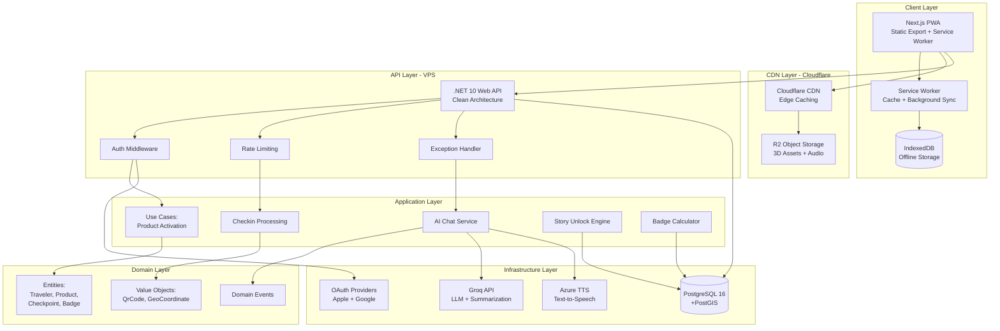
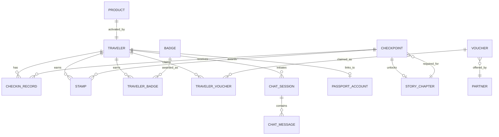
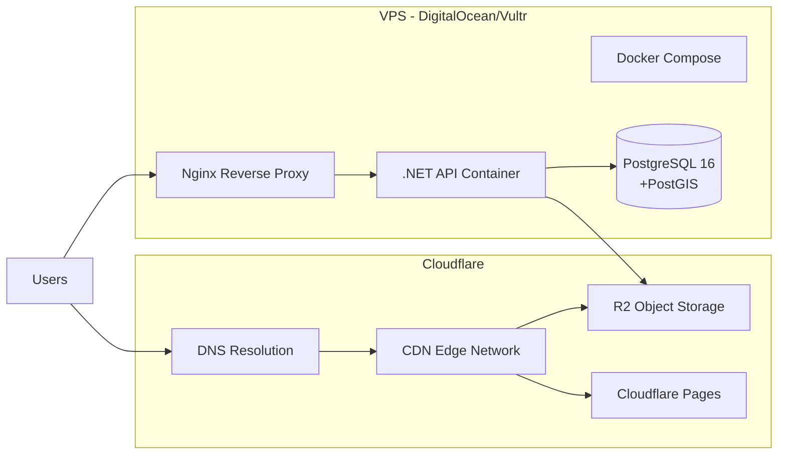

# Technical Design Document: ViTale Platform Complete

## Overview

ViTale is an AI-powered travel platform that bridges physical handcrafted wool dolls with digital experiences through QR code activation. The platform combines a Progressive Web App (PWA) frontend, .NET backend API, PostgreSQL database, and 3D rendering engine to deliver location-based cultural storytelling through a gamified checkpoint system. The solution supports offline-first functionality, B2B partner integrations, and multi-language content (Vietnamese/English).

### Core Value Propositions

1. **Physical-Digital Bridge**: QR-coded wool dolls unlock 3D digital characters representing regional cultural figures
2. **Location-Based Narratives**: GPS-triggered checkpoints unlock story chapters as travelers explore
3. **Gamification Layer**: Stamps, badges, and achievements motivate exploration and engagement
4. **B2B Ecosystem**: Restaurant, hotel, and tour operator partnerships provide vouchers and drive customer traffic
5. **Offline-First Experience**: Progressive Web App with IndexedDB storage ensures functionality without connectivity
6. **Minimal Infrastructure**: Single VPS deployment (<$10/month) with CDN for global asset delivery

### Design Principles

- **Clean Architecture**: Clear separation between Domain, Application, Infrastructure, and Presentation layers
- **Offline-First**: All core user actions work offline with background synchronization
- **Cost-Efficient**: Optimized for minimal infrastructure while supporting global reach via CDN
- **Mobile-First**: Designed for smartphone users exploring cities, with 3D performance optimization
- **Progressive Enhancement**: Core functionality works on all devices; enhanced features on capable browsers
- **Lazy Registration**: Anonymous users can explore immediately; account linking preserves progress
- **Security by Design**: Rate limiting, secure authentication, input validation at all layers


## Architecture

### High-Level Architecture Diagram




### Clean Architecture Layers

#### Domain Layer (ViTale.Domain)

**Purpose**: Contains pure business logic with zero external dependencies.

**Entities**:
- `Traveler`: User aggregate root supporting anonymous and registered states
- `Product`: Physical QR-coded wool doll or passport cover
- `Character`: 3D digital representation of regional cultural figure
- `Checkpoint`: GPS location that unlocks content
- `StoryChapter`: Cultural narrative segment
- `CheckinRecord`: Record of traveler visiting checkpoint
- `Stamp`, `Badge`, `TravelerBadge`: Gamification elements
- `Voucher`, `TravelerVoucher`, `Partner`: B2B ecosystem
- `ChatSession`, `ChatMessage`: AI conversation tracking

**Value Objects**:
- `QrCode`: Validates 16-32 character alphanumeric codes
- `GeoCoordinate`: Validates latitude (-90 to 90) and longitude (-180 to 180)

**Domain Events**:
- `ProductActivatedEvent`: Fired when QR code scanned
- `CheckpointUnlockedEvent`: Fired when story chapter requirements met
- `AccountLinkedEvent`: Fired when anonymous user registers

**Business Rules**:
- Traveler can be anonymous (no LinkedAccountId) or registered
- Product activation is one-time and immutable (ActivatedAt set once)
- Stamp is awarded only once per Traveler-Checkpoint pair
- Story chapter unlocks only when ALL required checkpoints visited
- Badge awards are retroactive (evaluate on each checkin batch)


#### Application Layer (ViTale.Application)

**Purpose**: Orchestrates use cases and defines interfaces for external dependencies.

**Use Case Interfaces**:
- `IProductRepository`: CRUD for products and activation
- `ICheckpointService`: Nearby search, checkin validation
- `IAiChatService`: LLM integration for conversational AI
- `IAuthenticationService`: OAuth token validation, JWT generation
- `IStoryUnlockService`: Evaluates unlock conditions for chapters
- `IBadgeCalculationService`: Evaluates badge earning conditions
- `IVoucherService`: Claim and redemption logic
- `IGeolocationService`: Distance calculations (haversine formula)

**Key Use Cases**:
1. **ActivateProduct**: Validate QR code, mark product as activated, return character
2. **ProcessCheckinBatch**: Validate coordinates, create stamps, evaluate badges/stories
3. **SendChatMessage**: Build context, call LLM, generate TTS, parse action tags
4. **LinkAccount**: Validate OAuth token, create PassportAccount, merge anonymous data
5. **GetPassportStatus**: Aggregate stamps, badges, stories, calculate region progress
6. **ClaimVoucher**: Validate availability, generate redemption code
7. **RefreshJWT**: Validate existing token, issue new token with extended expiration

**Cross-Cutting Concerns**:
- Transaction management for multi-step operations (checkin batch, account linking)
- Domain event dispatching after successful commits
- Input validation using FluentValidation library
- Result pattern for operation outcomes (Success/Failure with error messages)


#### Infrastructure Layer (ViTale.Infrastructure)

**Purpose**: Implements Application interfaces with concrete technologies.

**Data Access**:
- Entity Framework Core 9.0 with PostgreSQL provider (Npgsql)
- Repository pattern implementations for all aggregates
- PostGIS extension for spatial queries (checkpoint proximity)
- JSONB columns for flexible data (Preferences, UnlockConditions, AnimationClips)
- Database context with explicit table/column mapping (snake_case convention)

**External Service Integrations**:
- **Groq Cloud**: Llama 3 8B for chat responses and conversation summarization
- **Azure Cognitive Services**: Text-to-Speech for Vietnamese/English audio
- **Apple Sign-In SDK**: OAuth token validation
- **Google Identity Services**: OAuth token validation
- **Cloudflare R2**: Object storage for TTS audio files (7-day TTL)

**Supporting Services**:
- Serilog for structured logging (console + file outputs)
- BCrypt.Net for password hashing (if needed for admin accounts)
- System.Security.Cryptography for secure random generation (QR codes, redemption codes)

#### Presentation Layer (ViTale.WebApi)

**Purpose**: Exposes HTTP API endpoints with middleware pipeline.

**API Controllers**:
- `AuthController`: /auth/link-account, /auth/refresh
- `ProductsController`: /products/activate
- `PassportController`: /passport/me
- `CheckinsController`: /checkins (batch POST)
- `CheckpointsController`: /checkpoints/nearby
- `ChatController`: /chat/message
- `VouchersController`: /vouchers/claim
- `PartnersController`: /partners, /partners/recommendations, /partners/{id}/analytics
- `AdminController`: /admin/partners, /admin/qr-generate
- `HealthController`: /health


**Middleware Pipeline** (execution order):
1. Exception Handling Middleware (global try-catch, structured errors)
2. CORS Middleware (allow app.vitale.vn, localhost:3000)
3. Authentication Middleware (vitale_session cookie → Traveler identity)
4. Rate Limiting Middleware (IP-based for activation, Traveler-based for chat)
5. RBAC Middleware (admin-only endpoints require role validation)
6. MVC Framework (routing to controllers)

**Configuration Management**:
- appsettings.json for development defaults
- Environment variables for production secrets (Docker secrets preferred)
- Required variables: DB_CONNECTION_STRING, JWT_SECRET, GROQ_API_KEY, AZURE_TTS_KEY, OAUTH_APPLE_CLIENT_ID, OAUTH_GOOGLE_CLIENT_ID

### Frontend Architecture (Next.js PWA)

#### Technology Stack
- **Next.js 14+**: App Router with Static Site Generation (export mode)
- **React 18**: Component-based UI with hooks
- **React Three Fiber**: 3D rendering engine for character models
- **@react-three/drei**: Helper components for 3D scenes (OrbitControls, useGLTF, useAnimations)
- **next-pwa / Workbox**: Service Worker generation for offline support
- **idb**: IndexedDB wrapper for offline storage
- **next-i18next / next-intl**: Internationalization (Vietnamese/English)
- **Mapbox GL JS / Leaflet**: Map rendering for checkpoints
- **Tailwind CSS**: Utility-first styling


#### Page Structure
- `/`: Landing page (SSG, info about platform)
- `/activate`: QR activation flow (query param: ?code=XXX)
- `/passport`: Digital passport view (stamps, badges, stories)
- `/map`: Interactive map with checkpoint markers
- `/explore`: List view of nearby checkpoints
- `/chat`: AI conversation interface with 3D character
- `/partners`: Partner discovery and voucher browsing
- `/settings`: Account linking, language selection, data deletion

#### Component Architecture

**Core Components**:
- `CharacterViewer`: 3D model renderer with animation controls
  - Props: `characterId`, `modelUrl`, `animationClips`, `playAnimation`, `isTalking`
  - Uses React Three Fiber canvas with OrbitControls
  - Implements progressive loading (low-poly → high-poly)
  - Target: 30+ FPS on iPhone 12-class devices
  
- `StampCollection`: Grid display of earned stamps
  - Masonry layout with checkpoint images
  - Shows date, location name
  - Empty state for new users
  
- `BadgeGrid`: Achievement showcase
  - Card layout with badge icons
  - Hover tooltips for descriptions
  - Celebration animation on new badge earn
  
- `CheckpointMap`: Interactive location display
  - Mapbox/Leaflet base layer
  - Custom markers for visited (green) vs unvisited (gray)
  - Current location indicator
  - Click marker to view checkpoint details


- `ChatInterface`: Message history + input
  - Text input with send button
  - Microphone button for voice input (MediaRecorder API)
  - Audio playback of TTS responses
  - Auto-scroll to latest message
  - Action tag → animation trigger system
  
- `AccountLinkPrompt`: Modal for registration conversion
  - Triggers on 5 stamps, badge earn, or voucher claim
  - Apple Sign-In and Google Sign-In buttons
  - "Maybe Later" dismissal (24-hour snooze in localStorage)
  
- `SyncStatusIndicator`: Offline mode banner
  - Shows "Offline - X checkins pending sync"
  - Manual "Sync Now" button fallback
  - Disappears when all synced

#### Offline-First Storage Schema

**IndexedDB Database**: `vitale_db` version 1

**Object Stores**:
1. `checkins_pending`
   - KeyPath: `clientGeneratedId` (UUID v4)
   - Index: `syncStatus` (pending, synced, failed)
   - Fields: checkpointId, checkinAt (ISO8601), latitude, longitude, syncStatus
   
2. `passport_cache`
   - KeyPath: `cacheKey` (always "current")
   - Fields: stamps[], badges[], unlockedStories[], regionProgress{}, timestamp
   - Serves as optimistic cache for passport data
   
3. `story_cache`
   - KeyPath: `chapterId`
   - Fields: title, contentKey, region, content (localized text)
   - Caches story chapter content for offline reading


#### Service Worker Strategy

**Caching Strategies by Resource Type**:
- **App Shell** (HTML, CSS, JS): Cache-first with network fallback
- **3D Assets** (.glb files): Cache-first, cache on first access
- **Images** (stamps, badges, avatars): Cache-first with network fallback
- **API Responses** (passport, checkpoints): Network-first with cache fallback (stale-while-revalidate)
- **API Mutations** (checkins, chat): Network-only (queued via Background Sync)

**Background Sync**:
- Register 'sync-checkins' tag when offline checkin created
- Service Worker listens for sync event
- On sync: POST pending checkins to /api/v1/checkins
- Update IndexedDB syncStatus on success/failure
- Retry with exponential backoff (30s, 60s, 120s) up to 3 attempts

**Cache Eviction**:
- Request persistent storage (`navigator.storage.persist()`)
- Maximum cache size: 50MB for assets
- LRU eviction for old GLB files if quota exceeded

## Components and Interfaces

### Backend API Contracts


#### Authentication API

**POST /api/v1/auth/link-account**
```json
Request:
{
  "oAuthProvider": "Apple" | "Google",
  "oAuthToken": "eyJhbGciOiJSUzI1Ni..."
}

Response (200 OK):
{
  "success": true,
  "jwt": "eyJhbGciOiJIUzI1NiIs...",
  "traveler": {
    "id": "guid",
    "email": "user@example.com",
    "isRegistered": true
  }
}

Errors:
401: Invalid OAuth token
409: Account already linked to another user
```

**POST /api/v1/auth/refresh**
```json
Request: (none, reads JWT from vitale_session cookie)

Response (200 OK):
{
  "jwt": "eyJhbGciOiJIUzI1NiIs...",
  "expiresAt": "2024-01-15T10:00:00Z"
}

Errors:
401: Session expired or invalid token
```


#### Product API

**POST /api/v1/products/activate**
```json
Request:
{
  "qrCode": "A1B2C3D4E5F6G7H8I9J0"
}

Response (200 OK):
{
  "travelerId": "guid",
  "character": {
    "id": "guid",
    "name": "Thăng Long Princess",
    "region": "VN-HN",
    "modelUrl": "https://app.vitale.vn/assets/characters/hanoi-princess-abc123.glb",
    "animationClips": {
      "WAVE": "Wave_Anim",
      "SMILE": "Smile_Anim",
      "NOD": "Nod_Anim",
      "POINT": "Point_Anim"
    }
  }
}

Errors:
404: Product not found
409: Product already activated
429: Rate limit exceeded (5 per 60s per IP)
```


#### Passport API

**GET /api/v1/passport/me**
```json
Response (200 OK):
{
  "stamps": [
    {
      "stampId": "guid",
      "checkpointId": "guid",
      "checkpointName": "Hoan Kiem Lake",
      "imageUrl": "https://app.vitale.vn/assets/stamps/hoan-kiem.png",
      "earnedAt": "2024-01-10T14:30:00Z"
    }
  ],
  "badges": [
    {
      "badgeId": "guid",
      "name": "Hanoi Explorer",
      "description": "Visited 5 checkpoints in Hanoi",
      "imageUrl": "https://app.vitale.vn/assets/badges/hanoi-explorer.png",
      "earnedAt": "2024-01-10T15:00:00Z"
    }
  ],
  "unlockedStories": [
    {
      "chapterId": "guid",
      "title": "The Legend of Sword Lake",
      "contentKey": "story.hanoi.sword_lake",
      "region": "VN-HN"
    }
  ],
  "regionProgress": {
    "VN-HN": 33.33,
    "VN-SG": 0
  },
  "totalCheckpoints": 15,
  "visitedCheckpoints": 5
}
```


#### Checkin API

**POST /api/v1/checkins**
```json
Request:
{
  "checkins": [
    {
      "checkpointId": "guid",
      "checkinAt": "2024-01-10T14:30:00Z",
      "clientGeneratedId": "uuid-v4",
      "latitude": 21.0285,
      "longitude": 105.8542
    }
  ]
}

Response (200 OK):
{
  "processedCount": 1,
  "skippedCount": 0,
  "newBadges": [
    {
      "badgeId": "guid",
      "name": "Hanoi Explorer",
      "description": "Visited 5 checkpoints in Hanoi",
      "imageUrl": "url"
    }
  ],
  "unlockedStories": [
    {
      "chapterId": "guid",
      "title": "The Legend of Sword Lake",
      "region": "VN-HN"
    }
  ],
  "invalidCheckins": [
    {
      "checkpointId": "guid",
      "reason": "Outside checkpoint radius"
    }
  ]
}

Errors:
400: Empty checkins array or invalid data
```


#### Checkpoint API

**GET /api/v1/checkpoints/nearby?lat=21.0285&lng=105.8542&radius=5000**
```json
Response (200 OK):
{
  "checkpoints": [
    {
      "checkpointId": "guid",
      "name": "Hoan Kiem Lake",
      "latitude": 21.0285,
      "longitude": 105.8542,
      "distance": 150,
      "isVisited": true,
      "storyChapterTitle": "The Legend of Sword Lake",
      "region": "VN-HN"
    }
  ]
}

Errors:
400: Missing or invalid lat/lng parameters
```

#### Chat API

**POST /api/v1/chat/message**
```json
Request (JSON):
{
  "sessionId": "guid?",
  "message": "Tell me about Hoan Kiem Lake",
  "currentCheckpointId": "guid?"
}

OR Request (multipart/form-data):
{
  "sessionId": "guid?",
  "audio": <file>,
  "currentCheckpointId": "guid?"
}

Response (200 OK):
{
  "text": "Hoan Kiem Lake is a historic... [WAVE] Let me show you around! [POINT]",
  "audioUrl": "https://r2.vitale.vn/audio/temp-abc123.mp3",
  "actionTags": ["WAVE", "POINT"],
  "sessionId": "guid"
}

Errors:
429: Rate limit exceeded (20 per 60s for anonymous, 30 for registered)
503: AI service temporarily unavailable
```


#### Voucher API

**POST /api/v1/vouchers/claim**
```json
Request:
{
  "voucherId": "guid"
}

Response (200 OK):
{
  "redemptionCode": "AB12CD34",
  "voucher": {
    "voucherId": "guid",
    "title": "20% off at Hanoi Pho House",
    "description": "Valid for lunch or dinner",
    "discountType": "Percentage",
    "discountValue": 20,
    "validUntil": "2024-02-01T00:00:00Z",
    "partnerName": "Hanoi Pho House"
  }
}

Errors:
404: Voucher not found or inactive
400: Voucher not yet valid or expired
409: Voucher fully claimed or already claimed by user
```

#### Partner API

**GET /api/v1/partners/recommendations?type=Restaurant&lat=21.0285&lng=105.8542**
```json
Response (200 OK):
{
  "partners": [
    {
      "partnerId": "guid",
      "name": "Hanoi Pho House",
      "type": "Restaurant",
      "address": "123 Hang Bong Street",
      "latitude": 21.0290,
      "longitude": 105.8550,
      "distance": 120,
      "availableVouchers": 3,
      "priorityScore": 85
    }
  ]
}
```


### External Service Interfaces

#### Groq Cloud API Integration

**Purpose**: Primary LLM for chat responses and conversation summarization.

**Configuration**:
- API Endpoint: `https://api.groq.com/v1/chat/completions`
- Model: `llama-3.1-8b-instant` for chat, `llama-3-8b` for summarization
- Authentication: Bearer token via `GROQ_API_KEY` environment variable
- Timeout: 15 seconds for chat, 5 seconds for summarization

**Chat Request Format**:
```json
{
  "model": "llama-3.1-8b-instant",
  "messages": [
    {"role": "system", "content": "You are a Vietnamese cultural guide..."},
    {"role": "user", "content": "Tell me about Hoan Kiem Lake"}
  ],
  "temperature": 0.7,
  "max_tokens": 300,
  "stream": false
}
```

**Action Tag Parsing**:
- System prompt instructs model to include tags like `[WAVE]`, `[SMILE]`, `[NOD]`, `[POINT]`
- Backend regex: `\[([A-Z_]+)\]` to extract tags
- Tags mapped to animation clips via Character.AnimationClips JSONB

**Summarization Request** (when TurnCount % 20 == 0):
```json
{
  "model": "llama-3-8b",
  "messages": [
    {"role": "system", "content": "Summarize this conversation history in 150 tokens or less"},
    {"role": "user", "content": "Conversation history: [last 20 messages]"}
  ],
  "temperature": 0.3,
  "max_tokens": 150
}
```


#### Azure Cognitive Services TTS Integration

**Purpose**: Generate natural-sounding audio from text responses.

**Configuration**:
- API Endpoint: `https://{AZURE_REGION}.tts.speech.microsoft.com/cognitiveservices/v1`
- Authentication: Ocp-Apim-Subscription-Key header with `AZURE_TTS_KEY`
- Region: `southeastasia` (optimal for Vietnamese users)

**Voice Configuration**:
- Vietnamese: `vi-VN-HoaiMyNeural` (female) or `vi-VN-NamMinhNeural` (male)
- English: `en-US-JennyNeural` (female) or `en-US-GuyNeural` (male)
- Speech rate: +0% (natural speed)
- Output format: audio-16khz-32kbitrate-mono-mp3

**Request Format** (SSML):
```xml
<speak version="1.0" xmlns="http://www.w3.org/2001/10/synthesis" xml:lang="vi-VN">
  <voice name="vi-VN-HoaiMyNeural">
    <prosody rate="+0%">
      Hồ Hoàn Kiếm là một di tích lịch sử...
    </prosody>
  </voice>
</speak>
```

**Audio File Handling**:
- Upload to Cloudflare R2 with 7-day lifecycle policy
- Naming: `audio/{sessionId}-{timestamp}-{hash}.mp3`
- Return URL: `https://r2.vitale.vn/audio/...`
- CDN caching: 7 days, then auto-delete via lifecycle rule


#### OAuth Provider Integration

**Apple Sign-In**:
- Client ID: Configured in Apple Developer Console
- Redirect URI: `https://app.vitale.vn/auth/callback/apple`
- Token validation: `https://appleid.apple.com/auth/token`
- Extract: `sub` (user ID), `email` (if granted)

**Google Identity Services**:
- Client ID: Configured in Google Cloud Console
- Redirect URI: `https://app.vitale.vn/auth/callback/google`
- Token validation: `https://oauth2.googleapis.com/tokeninfo?id_token={token}`
- Extract: `sub` (user ID), `email`

**Backend Validation Flow**:
1. Frontend receives ID token from provider
2. POST token to /auth/link-account
3. Backend validates with provider's token endpoint
4. Extract user_id and email
5. Check for existing PassportAccount with (provider, user_id)
6. If exists → return 409
7. If not → create PassportAccount, link to current Traveler
8. Generate JWT with claims: TravelerId, Email, IsRegistered=true
9. Return JWT to frontend

## Data Models


### Database Schema

#### Entity Relationship Diagram



#### Core Entities Schema

**Travelers Table**:
```sql
CREATE TABLE travelers (
    id UUID PRIMARY KEY DEFAULT gen_random_uuid(),
    anonymous_id VARCHAR(12) UNIQUE,
    linked_account_id UUID REFERENCES passport_accounts(id),
    preferences JSONB DEFAULT '{"preferredLanguage":"en","notificationsEnabled":true}',
    created_at TIMESTAMPTZ DEFAULT NOW()
);

CREATE INDEX idx_travelers_anonymous_id ON travelers(anonymous_id);
```


**PassportAccounts Table**:
```sql
CREATE TABLE passport_accounts (
    id UUID PRIMARY KEY DEFAULT gen_random_uuid(),
    oauth_provider VARCHAR(20) NOT NULL CHECK (oauth_provider IN ('Apple', 'Google')),
    oauth_user_id VARCHAR(255) NOT NULL,
    email VARCHAR(255) NOT NULL,
    created_at TIMESTAMPTZ DEFAULT NOW(),
    UNIQUE(oauth_provider, oauth_user_id)
);
```

**Products Table**:
```sql
CREATE TABLE products (
    id UUID PRIMARY KEY DEFAULT gen_random_uuid(),
    qr_code VARCHAR(32) UNIQUE NOT NULL,
    product_type VARCHAR(20) NOT NULL CHECK (product_type IN ('Doll', 'PassportCover')),
    region VARCHAR(10) NOT NULL,
    activated_at TIMESTAMPTZ,
    activated_by_traveler_id UUID REFERENCES travelers(id),
    created_at TIMESTAMPTZ DEFAULT NOW()
);

CREATE UNIQUE INDEX idx_products_qr_code ON products(qr_code);
```

**Characters Table**:
```sql
CREATE TABLE characters (
    id UUID PRIMARY KEY DEFAULT gen_random_uuid(),
    name VARCHAR(100) NOT NULL,
    region VARCHAR(10) NOT NULL,
    model_url TEXT NOT NULL,
    animation_clips JSONB NOT NULL,
    description TEXT
);
```


**Checkpoints Table**:
```sql
CREATE TABLE checkpoints (
    id UUID PRIMARY KEY DEFAULT gen_random_uuid(),
    name VARCHAR(200) NOT NULL,
    latitude DECIMAL(10,7) NOT NULL CHECK (latitude BETWEEN -90 AND 90),
    longitude DECIMAL(10,7) NOT NULL CHECK (longitude BETWEEN -180 AND 180),
    radius INT NOT NULL CHECK (radius BETWEEN 10 AND 1000),
    story_chapter_id UUID REFERENCES story_chapters(id),
    region VARCHAR(10) NOT NULL,
    is_active BOOLEAN DEFAULT true,
    created_at TIMESTAMPTZ DEFAULT NOW()
);

CREATE INDEX idx_checkpoints_spatial ON checkpoints USING GIST (
    ll_to_earth(latitude, longitude)
);
```

**StoryChapters Table**:
```sql
CREATE TABLE story_chapters (
    id UUID PRIMARY KEY DEFAULT gen_random_uuid(),
    title VARCHAR(200) NOT NULL,
    content_key VARCHAR(100) NOT NULL,
    region VARCHAR(10) NOT NULL,
    unlock_condition JSONB NOT NULL,
    sort_order INT NOT NULL,
    created_at TIMESTAMPTZ DEFAULT NOW()
);
```

**CheckinRecords Table**:
```sql
CREATE TABLE checkin_records (
    id UUID PRIMARY KEY DEFAULT gen_random_uuid(),
    traveler_id UUID NOT NULL REFERENCES travelers(id),
    checkpoint_id UUID NOT NULL REFERENCES checkpoints(id),
    checkin_at TIMESTAMPTZ NOT NULL,
    client_generated_id UUID NOT NULL,
    sync_status VARCHAR(20) DEFAULT 'Synced' CHECK (sync_status IN ('Pending', 'Synced')),
    created_at TIMESTAMPTZ DEFAULT NOW(),
    UNIQUE(traveler_id, checkpoint_id, client_generated_id)
);

CREATE INDEX idx_checkin_records_traveler_id ON checkin_records(traveler_id, checkin_at DESC);
```


**Stamps Table**:
```sql
CREATE TABLE stamps (
    id UUID PRIMARY KEY DEFAULT gen_random_uuid(),
    traveler_id UUID NOT NULL REFERENCES travelers(id),
    checkpoint_id UUID NOT NULL REFERENCES checkpoints(id),
    image_url TEXT NOT NULL,
    earned_at TIMESTAMPTZ DEFAULT NOW(),
    UNIQUE(traveler_id, checkpoint_id)
);

CREATE INDEX idx_stamps_traveler_id ON stamps(traveler_id);
```

**Badges Table**:
```sql
CREATE TABLE badges (
    id UUID PRIMARY KEY DEFAULT gen_random_uuid(),
    name VARCHAR(100) NOT NULL,
    description TEXT,
    image_url TEXT NOT NULL,
    condition_type VARCHAR(30) NOT NULL CHECK (condition_type IN 
        ('CheckpointCount', 'RegionComplete', 'VoucherCount', 'ConsecutiveDays', 'PartnerVisit')),
    condition_value JSONB NOT NULL
);
```

**TravelerBadges Table**:
```sql
CREATE TABLE traveler_badges (
    traveler_id UUID NOT NULL REFERENCES travelers(id),
    badge_id UUID NOT NULL REFERENCES badges(id),
    earned_at TIMESTAMPTZ DEFAULT NOW(),
    PRIMARY KEY (traveler_id, badge_id)
);

CREATE INDEX idx_traveler_badges_traveler_id ON traveler_badges(traveler_id);
```


**Partners Table**:
```sql
CREATE TABLE partners (
    id UUID PRIMARY KEY DEFAULT gen_random_uuid(),
    name VARCHAR(200) NOT NULL,
    type VARCHAR(30) NOT NULL CHECK (type IN 
        ('Restaurant', 'Hotel', 'TourOperator', 'Museum', 'Shop')),
    contact_email VARCHAR(255),
    phone_number VARCHAR(50),
    address TEXT,
    latitude DECIMAL(10,7),
    longitude DECIMAL(10,7),
    priority_score INT DEFAULT 50 CHECK (priority_score BETWEEN 0 AND 100),
    is_active BOOLEAN DEFAULT true,
    created_at TIMESTAMPTZ DEFAULT NOW()
);

CREATE INDEX idx_partners_type ON partners(type);
CREATE INDEX idx_partners_priority_score ON partners(priority_score DESC);
```

**Vouchers Table**:
```sql
CREATE TABLE vouchers (
    id UUID PRIMARY KEY DEFAULT gen_random_uuid(),
    partner_id UUID NOT NULL REFERENCES partners(id),
    title VARCHAR(200) NOT NULL,
    description TEXT,
    discount_type VARCHAR(20) NOT NULL CHECK (discount_type IN 
        ('Percentage', 'FixedAmount', 'FreeItem')),
    discount_value DECIMAL(10,2) NOT NULL,
    minimum_spend DECIMAL(10,2),
    max_redemptions INT,
    valid_from TIMESTAMPTZ NOT NULL,
    valid_until TIMESTAMPTZ NOT NULL,
    is_active BOOLEAN DEFAULT true,
    created_at TIMESTAMPTZ DEFAULT NOW()
);

CREATE INDEX idx_vouchers_partner_id ON vouchers(partner_id);
CREATE INDEX idx_vouchers_valid_period ON vouchers(valid_from, valid_until);
```


**TravelerVouchers Table**:
```sql
CREATE TABLE traveler_vouchers (
    id UUID PRIMARY KEY DEFAULT gen_random_uuid(),
    traveler_id UUID NOT NULL REFERENCES travelers(id),
    voucher_id UUID NOT NULL REFERENCES vouchers(id),
    claimed_at TIMESTAMPTZ DEFAULT NOW(),
    redeemed_at TIMESTAMPTZ,
    redemption_code VARCHAR(8) UNIQUE NOT NULL
);

CREATE INDEX idx_traveler_vouchers_traveler_id ON traveler_vouchers(traveler_id);
CREATE INDEX idx_traveler_vouchers_redemption_code ON traveler_vouchers(redemption_code);
```

**ChatSessions Table**:
```sql
CREATE TABLE chat_sessions (
    id UUID PRIMARY KEY DEFAULT gen_random_uuid(),
    traveler_id UUID NOT NULL REFERENCES travelers(id),
    started_at TIMESTAMPTZ DEFAULT NOW(),
    last_message_at TIMESTAMPTZ DEFAULT NOW(),
    turn_count INT DEFAULT 0,
    condensed_context TEXT,
    current_checkpoint_id UUID REFERENCES checkpoints(id)
);

CREATE INDEX idx_chat_sessions_traveler_id ON chat_sessions(traveler_id);
```

**ChatMessages Table**:
```sql
CREATE TABLE chat_messages (
    id UUID PRIMARY KEY DEFAULT gen_random_uuid(),
    session_id UUID NOT NULL REFERENCES chat_sessions(id) ON DELETE CASCADE,
    role VARCHAR(20) NOT NULL CHECK (role IN ('User', 'Assistant', 'System')),
    content TEXT NOT NULL,
    audio_url TEXT,
    action_tags TEXT[],
    created_at TIMESTAMPTZ DEFAULT NOW()
);

CREATE INDEX idx_chat_messages_session_id ON chat_messages(session_id, created_at);
```


**Translations Table**:
```sql
CREATE TABLE translations (
    id UUID PRIMARY KEY DEFAULT gen_random_uuid(),
    language_code VARCHAR(5) NOT NULL,
    content_key VARCHAR(100) NOT NULL,
    content_value TEXT NOT NULL,
    UNIQUE(language_code, content_key)
);

CREATE INDEX idx_translations_lookup ON translations(language_code, content_key);
```

### Value Objects

**QrCode** (C# Value Object):
```csharp
public sealed class QrCode : ValueObject
{
    public string Value { get; }
    
    private QrCode(string value)
    {
        Value = value;
    }
    
    public static Result<QrCode> Create(string value)
    {
        if (string.IsNullOrWhiteSpace(value))
            return Result.Failure<QrCode>("QR code cannot be empty");
            
        if (value.Length < 16 || value.Length > 32)
            return Result.Failure<QrCode>("QR code must be 16-32 characters");
            
        if (!IsAlphanumeric(value))
            return Result.Failure<QrCode>("QR code must be alphanumeric");
            
        return Result.Success(new QrCode(value));
    }
    
    private static bool IsAlphanumeric(string str) =>
        str.All(char.IsLetterOrDigit);
}
```


**GeoCoordinate** (C# Value Object):
```csharp
public sealed class GeoCoordinate : ValueObject
{
    public decimal Latitude { get; }
    public decimal Longitude { get; }
    
    private GeoCoordinate(decimal latitude, decimal longitude)
    {
        Latitude = latitude;
        Longitude = longitude;
    }
    
    public static Result<GeoCoordinate> Create(decimal latitude, decimal longitude)
    {
        if (latitude < -90 || latitude > 90)
            return Result.Failure<GeoCoordinate>("Latitude must be between -90 and 90");
            
        if (longitude < -180 || longitude > 180)
            return Result.Failure<GeoCoordinate>("Longitude must be between -180 and 180");
            
        return Result.Success(new GeoCoordinate(latitude, longitude));
    }
    
    public double DistanceTo(GeoCoordinate other)
    {
        // Haversine formula implementation
        const double EarthRadiusMeters = 6371000;
        var lat1Rad = ToRadians((double)Latitude);
        var lat2Rad = ToRadians((double)other.Latitude);
        var deltaLat = ToRadians((double)(other.Latitude - Latitude));
        var deltaLon = ToRadians((double)(other.Longitude - Longitude));
        
        var a = Math.Sin(deltaLat / 2) * Math.Sin(deltaLat / 2) +
                Math.Cos(lat1Rad) * Math.Cos(lat2Rad) *
                Math.Sin(deltaLon / 2) * Math.Sin(deltaLon / 2);
                
        var c = 2 * Math.Atan2(Math.Sqrt(a), Math.Sqrt(1 - a));
        return EarthRadiusMeters * c;
    }
    
    private static double ToRadians(double degrees) => degrees * Math.PI / 180;
}
```


## Correctness Properties

*A property is a characteristic or behavior that should hold true across all valid executions of a system—essentially, a formal statement about what the system should do. Properties serve as the bridge between human-readable specifications and machine-verifiable correctness guarantees.*

### Property-Based Testing Applicability

This feature includes significant business logic suitable for property-based testing, specifically:
- **Domain validation logic**: QR codes, geographic coordinates
- **Serialization/deserialization**: JSON handling, date parsing
- **Idempotent operations**: Checkin submission, product activation
- **System invariants**: Gamification rules, data integrity
- **Distance calculations**: Haversine formula for geolocation

Infrastructure components (Docker, DNS, CDN configuration) and pure UI rendering are tested with integration and smoke tests instead of PBT.

### Property Reflection

After analyzing all testable criteria, I identified the following consolidated properties that eliminate redundancy:

**Consolidated Properties**:
1. Anonymous ID generation (combines requirements 5.6 and 12.2)
2. QR code validation round-trip (requirement 6.3)
3. GeoCoordinate validation (requirement 7.4)
4. Idempotency for checkins (combines requirements 7.10, 17.9, 59.2)
5. Idempotency for product activation (combines requirements 15.12, 59.5)
6. Stamp uniqueness invariant (requirements 8.11, 60.1)
7. Distance calculation symmetry and correctness (requirements 18.12, 61.1-61.6)
8. Data preservation on account linking (requirement 13.9)
9. Story unlock monotonicity (requirements 38.6, 60.5)
10. Badge award monotonicity (requirements 39.6-39.10, 60.5)
11. Serialization round-trips (requirement 58.1-58.3)
12. Error handling robustness (requirement 62.1-62.6)


### Property 1: Anonymous ID Generation Consistency

*For any* traveler created without OAuth authentication, the generated AnonymousId SHALL be exactly 12 characters in length and contain only alphanumeric characters (A-Z, a-z, 0-9).

**Validates: Requirements 5.6, 12.2**

**Test Strategy**: Generate 100+ random traveler creation requests, verify all AnonymousIds match format constraints.

### Property 2: QR Code Validation Round-Trip

*For any* valid QR code string (16-32 alphanumeric characters), parsing into a QrCode value object and then formatting back to string SHALL yield the original input value.

**Validates: Requirements 6.3, 58.4**

**Test Strategy**: Generate random valid QR code strings, verify `QrCode.Create(str).Value == str`.

### Property 3: GeoCoordinate Validation Correctness

*For any* coordinate pair, creating a GeoCoordinate value object SHALL succeed if and only if latitude is in range [-90, 90] and longitude is in range [-180, 180].

**Validates: Requirements 7.4, 62.2**

**Test Strategy**: Generate random coordinate pairs including edge cases (±90, ±180, out-of-range), verify validation behavior matches specification.

### Property 4: Distance Calculation Symmetry and Accuracy

*For any* two valid GeoCoordinate instances A and B, the distance calculation SHALL satisfy:
1. Symmetry: `A.DistanceTo(B) == B.DistanceTo(A)` (within floating-point tolerance)
2. Non-negativity: `A.DistanceTo(B) >= 0`
3. Identity: `A.DistanceTo(A) == 0`
4. Matches reference haversine implementation within 1 meter tolerance

**Validates: Requirements 18.12, 61.1-61.6, 60.9**

**Test Strategy**: Generate random coordinate pairs, verify properties hold. Compare against reference haversine implementation.


### Property 5: Checkin Idempotency

*For any* valid checkin batch with ClientGeneratedIds, submitting the batch N times (N ≥ 1) SHALL result in the same database state as submitting once. Specifically:
1. CheckinRecord count equals number of unique (TravelerId, CheckpointId, ClientGeneratedId) tuples
2. All checkin timestamps match the first submission
3. Stamps are created only once per unique traveler-checkpoint pair

**Validates: Requirements 7.10, 17.9, 59.2, 59.3**

**Test Strategy**: Generate random checkin batches, POST multiple times with same ClientGeneratedIds, verify database state is identical.

### Property 6: Product Activation Idempotency

*For any* Product with a valid QR code, activating the product N times (N ≥ 1) by the same Traveler SHALL result in:
1. ActivatedAt timestamp set on first activation and unchanged on subsequent attempts
2. ActivatedByTravelerId set on first activation and unchanged
3. Subsequent activation attempts return 409 Conflict
4. Product state after N activations equals state after 1 activation

**Validates: Requirements 15.12, 59.5, 59.6**

**Test Strategy**: Generate random products and travelers, attempt activation multiple times, verify idempotency.

### Property 7: Stamp Uniqueness Invariant

*For any* Traveler and any Checkpoint, the Stamps table SHALL contain at most one Stamp record for that (TravelerId, CheckpointId) pair. Furthermore:
1. Stamp count for a traveler = COUNT(DISTINCT CheckpointId) from their CheckinRecords
2. Each stamp's EarnedAt timestamp matches the first checkin at that checkpoint

**Validates: Requirements 8.11, 60.1**

**Test Strategy**: Generate random checkin sequences, verify stamp count equals distinct checkpoint count after each batch.


### Property 8: Account Linking Data Preservation

*For any* anonymous Traveler with existing data (CheckinRecords, Stamps, TravelerBadges, TravelerVouchers, ChatSessions), after successfully linking to a PassportAccount:
1. All CheckinRecords remain associated with the same TravelerId
2. Stamp count is unchanged
3. Badge count is unchanged
4. Voucher count is unchanged
5. ChatSession count is unchanged
6. All foreign key relationships remain valid

**Validates: Requirements 13.9**

**Test Strategy**: Generate random anonymous travelers with various data, link accounts, verify all data preserved and accessible.

### Property 9: Story Unlock Monotonicity

*For any* Traveler and sequence of checkin operations, the set of unlocked StoryChapters SHALL only grow (monotonically increasing). Specifically:
1. Adding checkins never removes unlocked stories
2. For all story chapters with unlock condition "visit checkpoints X, Y, Z", the chapter unlocks if and only if ALL required checkpoints have been visited
3. Once unlocked, a story remains unlocked permanently

**Validates: Requirements 38.6, 60.3, 60.5**

**Test Strategy**: Generate random checkin sequences, verify unlocked story set never decreases. Test stories with multiple required checkpoints unlock only when all visited.

### Property 10: Badge Award Monotonicity

*For any* Traveler and sequence of activity operations (checkins, voucher claims), the set of earned Badges SHALL only grow (monotonically increasing). Specifically:
1. Adding activity never removes earned badges
2. Badge EarnedAt timestamp is ≥ timestamp of earliest activity satisfying the badge condition
3. Once earned, a badge remains in TravelerBadges permanently

**Validates: Requirements 39.6-39.10, 60.2, 60.5**

**Test Strategy**: Generate random activity sequences, verify badge set never decreases. Test badge conditions (CheckpointCount, ConsecutiveDays, etc.) award correctly.


### Property 11: JSON Serialization Round-Trip

*For any* valid domain object (Traveler, Product, Checkpoint, StoryChapter, Badge, Voucher, Partner, ChatMessage), serializing to JSON and then deserializing SHALL yield an object equivalent to the original. Specifically:
1. All primitive fields match exactly
2. All JSONB fields (Preferences, AnimationClips, UnlockCondition, ConditionValue) preserve structure
3. All DateTime fields preserve timestamp (UTC, ISO8601 format)
4. All Guid fields preserve value

**Validates: Requirements 58.2, 58.3**

**Test Strategy**: Generate 100+ random instances of each domain entity, serialize→deserialize, verify equality.

### Property 12: Checkin Radius Validation Correctness

*For any* Checkpoint with radius R meters and any coordinates (lat, lng), a checkin attempt SHALL be accepted if and only if the haversine distance from (lat, lng) to the checkpoint's (latitude, longitude) is ≤ R meters. The backend validation SHALL match a reference haversine implementation within 1 meter tolerance.

**Validates: Requirements 17.6, 61.1-61.6**

**Test Strategy**: Generate random checkpoints and test coordinates both inside and outside radius. Compare backend validation against reference implementation.

### Property 13: Date/Time Parsing Round-Trip

*For any* valid DateTime in UTC, formatting to ISO8601 string and then parsing back SHALL yield the original timestamp within millisecond precision.

**Validates: Requirements 58.3**

**Test Strategy**: Generate random UTC timestamps, verify `DateTime.Parse(dt.ToString("o")) == dt`.


### Property 14: Error Handling Robustness

*For any* invalid input to validation functions (QrCode.Create, GeoCoordinate.Create, API endpoints), the system SHALL:
1. Return appropriate 4xx error status (400 for validation, 404 for not found, 409 for conflict)
2. Include descriptive error message in response
3. NOT throw unhandled exceptions (all exceptions caught by middleware)
4. Log the error with sufficient context (requestPath, method, input values)

**Validates: Requirements 62.1-62.6**

**Test Strategy**: Generate random invalid inputs (empty strings, out-of-range numbers, malformed JSON), verify graceful error responses.

### Property 15: Voucher Claim Constraint Validation

*For any* Voucher with MaxRedemptions set to M, the total number of TravelerVoucher records for that VoucherId SHALL never exceed M. Additionally:
1. Each RedemptionCode is globally unique (8 alphanumeric characters)
2. A Traveler cannot claim the same Voucher more than once
3. Concurrent claim attempts respect MaxRedemptions (no race conditions)

**Validates: Requirements 23.7, 23.10, 60.7**

**Test Strategy**: Generate random vouchers with low MaxRedemptions, attempt concurrent claims from multiple travelers, verify constraints hold.


## Error Handling

### Global Exception Middleware

**Purpose**: Provide consistent error responses across all endpoints and prevent sensitive information leakage.

**Implementation**:
```csharp
public class ExceptionHandlingMiddleware
{
    public async Task InvokeAsync(HttpContext context, RequestDelegate next)
    {
        try
        {
            await next(context);
        }
        catch (ValidationException ex)
        {
            await WriteErrorResponse(context, 400, "VALIDATION_ERROR", ex.Message);
        }
        catch (NotFoundException ex)
        {
            await WriteErrorResponse(context, 404, "NOT_FOUND", ex.Message);
        }
        catch (ConflictException ex)
        {
            await WriteErrorResponse(context, 409, "CONFLICT", ex.Message);
        }
        catch (UnauthorizedException ex)
        {
            await WriteErrorResponse(context, 401, "UNAUTHORIZED", ex.Message);
        }
        catch (RateLimitExceededException ex)
        {
            context.Response.Headers["Retry-After"] = ex.RetryAfterSeconds.ToString();
            await WriteErrorResponse(context, 429, "RATE_LIMIT_EXCEEDED", ex.Message);
        }
        catch (Exception ex)
        {
            // Log full exception with stack trace
            _logger.LogError(ex, "Unhandled exception for {Method} {Path}", 
                context.Request.Method, context.Request.Path);
            
            // Return generic error to client
            await WriteErrorResponse(context, 500, "INTERNAL_ERROR", 
                "An unexpected error occurred. Please try again later.");
        }
    }
    
    private async Task WriteErrorResponse(HttpContext context, int statusCode, 
        string errorCode, string message)
    {
        context.Response.StatusCode = statusCode;
        context.Response.ContentType = "application/json";
        
        var error = new
        {
            error = message,
            errorCode = errorCode,
            timestamp = DateTime.UtcNow.ToString("o"),
            traceId = Activity.Current?.Id ?? context.TraceIdentifier
        };
        
        await context.Response.WriteAsJsonAsync(error);
    }
}
```


### Domain-Level Error Handling

**Result Pattern**:
```csharp
public class Result<T>
{
    public bool IsSuccess { get; }
    public T Value { get; }
    public string Error { get; }
    
    public static Result<T> Success(T value) => new Result<T>(true, value, null);
    public static Result<T> Failure(string error) => new Result<T>(false, default, error);
}
```

**Usage in Use Cases**:
- Domain validation returns `Result<T>` instead of throwing exceptions
- Application layer converts `Result.Failure` to appropriate HTTP status
- Preserves domain purity (no HTTP dependencies in Domain layer)

### Frontend Error Handling

**API Error States**:
```typescript
interface ApiError {
  error: string;
  errorCode: string;
  timestamp: string;
  traceId: string;
}

async function handleApiCall<T>(call: Promise<Response>): Promise<T> {
  try {
    const response = await call;
    
    if (response.ok) {
      return await response.json();
    }
    
    const error: ApiError = await response.json();
    
    if (response.status === 429) {
      const retryAfter = response.headers.get('Retry-After');
      showRateLimitError(retryAfter);
    } else if (response.status >= 500) {
      showGenericError("Something went wrong. Please try again later.");
    } else {
      showSpecificError(error.error);
    }
    
    throw new Error(error.error);
  } catch (err) {
    if (err instanceof TypeError) {
      // Network error
      showOfflineMessage();
    }
    throw err;
  }
}
```


### Validation Error Messages

**Consistent Format**:
- Field-level errors: `"Field 'latitude' must be between -90 and 90"`
- Resource not found: `"Product with QR code 'ABC123' not found"`
- Constraint violations: `"Product already activated on 2024-01-10"`
- Rate limits: `"Rate limit exceeded, please try again in 45 seconds"`

**Localization**:
- Error messages respect Accept-Language header
- Translations stored in Translations table with contentKey pattern: `error.{code}`
- Fallback to English if translation not available

## Testing Strategy

### Testing Pyramid Overview

```
                /\
               /  \
              /E2E \         E2E Tests (Playwright)
             /______\         - Critical user journeys
            /        \        - 5-10 tests, ~5 min runtime
           / Integr. \       
          /___  ation_\      Integration Tests (Testcontainers)
         /            \      - API endpoints end-to-end
        /   Property   \     - 30-40 tests, ~60 sec runtime
       /     Based      \    
      /_________________\   Property-Based Tests (FsCheck/CsCheck)
     /                   \   - Domain logic, validation, invariants
    /   Unit Tests        \  - 100+ tests, ~5 sec runtime
   /_______________________\
```

### Unit Testing Strategy

**Scope**: Domain layer entities, value objects, business rules

**Framework**: xUnit with FluentAssertions

**Test Organization**:
- `ViTale.Domain.Tests/Entities/` - Entity behavior tests
- `ViTale.Domain.Tests/ValueObjects/` - QrCode, GeoCoordinate validation tests
- `ViTale.Domain.Tests/Services/` - Domain service tests (story unlock, badge calculation)

**Example Unit Tests**:
```csharp
public class QrCodeTests
{
    [Theory]
    [InlineData("A1B2C3D4E5F6G7H8")]  // 16 chars minimum
    [InlineData("A1B2C3D4E5F6G7H8I9J0K1L2M3N4O5P6")]  // 32 chars maximum
    public void Create_ValidQrCode_ReturnsSuccess(string qrCode)
    {
        var result = QrCode.Create(qrCode);
        result.IsSuccess.Should().BeTrue();
        result.Value.Value.Should().Be(qrCode);
    }
    
    [Theory]
    [InlineData("ABC")]  // Too short
    [InlineData("ABC@123")]  // Contains special char
    public void Create_InvalidQrCode_ReturnsFailure(string qrCode)
    {
        var result = QrCode.Create(qrCode);
        result.IsSuccess.Should().BeFalse();
    }
}
```


### Property-Based Testing Strategy

**Scope**: Domain validation, serialization, idempotency, invariants, distance calculations

**Framework**: FsCheck or CsCheck for C#

**Configuration**:
- **Minimum iterations**: 100 per property
- **Shrinking enabled**: Automatically find minimal failing example
- **Custom generators**: For domain-specific types (QrCode, GeoCoordinate, valid checkin batches)

**Property Test Structure**:
```csharp
public class CheckinIdempotencyProperties
{
    [Property(Arbitrary = new[] { typeof(ValidCheckinBatchGenerator) })]
    // Feature: vitale-platform-complete, Property 5: Checkin Idempotency
    public Property SubmittingCheckinBatchMultipleTimes_ProducesSameResult(
        CheckinBatch batch)
    {
        return Prop.ForAll(
            Arb.From<int>().Where(n => n >= 1 && n <= 10),
            repetitions =>
            {
                using var db = TestDb.Create();
                var service = new CheckinService(db);
                
                // Submit batch N times
                for (int i = 0; i < repetitions; i++)
                {
                    service.ProcessCheckins(batch);
                }
                
                // Verify database state
                var records = db.CheckinRecords.Count();
                var stamps = db.Stamps.Count();
                
                return (records == batch.UniqueCheckins.Count() &&
                        stamps == batch.UniqueCheckpoints.Count())
                    .Label($"Idempotency after {repetitions} submissions");
            });
    }
}
```

**Custom Generators**:
```csharp
public class ValidCheckinBatchGenerator
{
    public static Arbitrary<CheckinBatch> Generate()
    {
        var genCheckpoint = from lat in Arb.Default.Float32()
                                            .Where(f => f >= -90 && f <= 90)
                           from lng in Arb.Default.Float32()
                                            .Where(f => f >= -180 && f <= 180)
                           select new Checkpoint(lat, lng, radius: 100);
        
        var genCheckin = from checkpoint in genCheckpoint
                        from travelerId in Arb.Default.Guid()
                        from timestamp in Arb.Default.DateTime()
                        from clientId in Arb.Default.Guid()
                        select new Checkin(travelerId, checkpoint.Id, 
                                          timestamp, clientId);
        
        return Arb.From(Gen.ListOf(genCheckin).Select(list => 
            new CheckinBatch(list)));
    }
}
```

**Property Test Tags**:
All property tests include a comment tag referencing the design property:
```csharp
// Feature: vitale-platform-complete, Property 2: QR Code Validation Round-Trip
```


### Integration Testing Strategy

**Scope**: API endpoints end-to-end with real database

**Framework**: xUnit with Testcontainers (PostgreSQL)

**Test Organization**:
- `ViTale.WebApi.IntegrationTests/Controllers/` - Controller tests
- `ViTale.WebApi.IntegrationTests/Flows/` - Multi-step user journey tests

**Setup**:
```csharp
public class IntegrationTestBase : IAsyncLifetime
{
    private readonly PostgreSqlContainer _dbContainer;
    private WebApplicationFactory<Program> _factory;
    
    public IntegrationTestBase()
    {
        _dbContainer = new PostgreSqlBuilder()
            .WithImage("postgres:16-alpine")
            .WithDatabase("vitale_test")
            .Build();
    }
    
    public async Task InitializeAsync()
    {
        await _dbContainer.StartAsync();
        
        _factory = new WebApplicationFactory<Program>()
            .WithWebHostBuilder(builder =>
            {
                builder.ConfigureServices(services =>
                {
                    // Replace DB connection with test container
                    services.RemoveAll<DbContextOptions<ApplicationDbContext>>();
                    services.AddDbContext<ApplicationDbContext>(options =>
                        options.UseNpgsql(_dbContainer.GetConnectionString()));
                });
            });
            
        // Run migrations
        using var scope = _factory.Services.CreateScope();
        var db = scope.ServiceProvider.GetRequiredService<ApplicationDbContext>();
        await db.Database.MigrateAsync();
    }
}
```

**Example Integration Test**:
```csharp
public class ProductActivationFlowTests : IntegrationTestBase
{
    [Fact]
    public async Task ActivateProduct_ValidQrCode_ReturnsCharacter()
    {
        // Arrange
        var client = CreateClient();
        var qrCode = await SeedProduct("Doll", "VN-HN");
        
        // Act
        var response = await client.PostAsJsonAsync("/api/v1/products/activate", 
            new { qrCode });
        
        // Assert
        response.StatusCode.Should().Be(HttpStatusCode.OK);
        var result = await response.Content.ReadFromJsonAsync<ProductActivationResponse>();
        result.Character.Should().NotBeNull();
        result.Character.Region.Should().Be("VN-HN");
    }
    
    [Fact]
    public async Task ActivateProduct_Twice_ReturnsConflict()
    {
        // Idempotency test
        var client = CreateClient();
        var qrCode = await SeedProduct("Doll", "VN-HN");
        
        await client.PostAsJsonAsync("/api/v1/products/activate", new { qrCode });
        var response2 = await client.PostAsJsonAsync("/api/v1/products/activate", new { qrCode });
        
        response2.StatusCode.Should().Be(HttpStatusCode.Conflict);
    }
}
```


### End-to-End Testing Strategy

**Scope**: Critical user journeys through the frontend PWA

**Framework**: Playwright with TypeScript

**Test Browsers**: Chromium, WebKit (Safari)

**Test Organization**:
- `e2e/activation.spec.ts` - QR activation and character display
- `e2e/passport.spec.ts` - Passport view and progress tracking
- `e2e/checkin.spec.ts` - Location-based checkin flow
- `e2e/offline.spec.ts` - Offline mode and sync
- `e2e/chat.spec.ts` - AI conversation interface

**Example E2E Test**:
```typescript
test.describe('Product Activation Flow', () => {
  test('should activate product and display 3D character', async ({ page }) => {
    // Seed test data: create product with QR code
    const qrCode = await seedProduct('TEST_QR_ABC123');
    
    // Navigate to activation page
    await page.goto(`/activate?code=${qrCode}`);
    
    // Verify loading state
    await expect(page.locator('[data-testid="character-loading"]')).toBeVisible();
    
    // Wait for character to load
    await expect(page.locator('canvas')).toBeVisible({ timeout: 10000 });
    
    // Verify character details displayed
    await expect(page.locator('[data-testid="character-name"]'))
      .toHaveText('Thăng Long Princess');
    await expect(page.locator('[data-testid="character-region"]'))
      .toHaveText('Hanoi');
    
    // Verify "Start Journey" button
    await expect(page.locator('button:has-text("Start Journey")')).toBeVisible();
  });
  
  test('should handle offline checkin and sync', async ({ page, context }) => {
    // Go offline
    await context.setOffline(true);
    
    // Navigate to map
    await page.goto('/map');
    
    // Mock geolocation near a checkpoint
    await page.context().setGeolocation({ latitude: 21.0285, longitude: 105.8542 });
    
    // Click checkin button
    await page.click('[data-testid="checkin-button"]');
    
    // Verify offline indicator
    await expect(page.locator('[data-testid="offline-indicator"]')).toBeVisible();
    await expect(page.locator('text=1 checkins pending sync')).toBeVisible();
    
    // Go online
    await context.setOffline(false);
    
    // Wait for sync
    await expect(page.locator('text=All synced')).toBeVisible({ timeout: 5000 });
  });
});
```

**E2E Test Configuration**:
- Run against local development server (`npm run dev`)
- Use test database with seed data
- Mock geolocation API for checkin tests
- Mock OAuth flows for account linking tests
- Target: < 5 minutes total runtime


### Test Coverage Goals

**Unit Tests**:
- Domain layer: **80%+ code coverage**
- Focus on business logic, validation, and state transitions
- Fast execution: < 5 seconds for full suite

**Property Tests**:
- **15 properties** covering validation, idempotency, invariants, distance calculations
- **100+ iterations per property**
- Execution time: < 30 seconds for full suite

**Integration Tests**:
- **30-40 tests** covering all API endpoints and critical flows
- Complete user journeys: activation → checkin → passport → story unlock → badge earn
- Database state verification
- Execution time: < 60 seconds with Testcontainers

**E2E Tests**:
- **5-10 tests** for critical user paths
- Focus on UI interaction and offline functionality
- Execution time: < 5 minutes

### CI/CD Integration

**Pull Request Pipeline** (.github/workflows/ci.yml):
1. Build all projects (Domain, Application, Infrastructure, WebApi, Frontend)
2. Run unit tests with coverage reporting
3. Run property tests (100+ iterations)
4. Run integration tests (Testcontainers)
5. Run frontend build and lint
6. **Fail if**:
   - Any test fails
   - Code coverage drops below 70%
   - Property test finds counterexample
   - Build errors

**Deployment Pipeline** (.github/workflows/deploy.yml):
1. Run full test suite (unit + property + integration)
2. Build Docker images
3. Run E2E tests against staging environment
4. Deploy to production VPS
5. Deploy frontend to Cloudflare Pages
6. Run smoke tests against production

### Test Data Management

**Seed Data**:
- 15 Hanoi checkpoints with GPS coordinates
- 1 Character ("Thăng Long Princess") with sample animation clips
- 3 Story chapters with Vietnamese/English translations
- 5 Badge definitions (Explorer, Foodie, Culture Buff, etc.)
- 10 Partner businesses with vouchers
- Sample products with pre-generated QR codes

**Test Isolation**:
- Each integration test runs in transaction (rollback after test)
- OR use Testcontainers with fresh database per test class
- E2E tests use dedicated test database with known state


## Deployment Architecture

### Infrastructure Overview



### Docker Compose Configuration

**Production Compose File** (docker-compose.prod.yml):
```yaml
version: '3.8'

services:
  api:
    build:
      context: ./backend
      dockerfile: Dockerfile
    image: vitale-api:latest
    container_name: vitale_api
    restart: always
    ports:
      - "5000:5000"
    environment:
      - ASPNETCORE_ENVIRONMENT=Production
      - DB_CONNECTION_STRING=${DB_CONNECTION_STRING}
      - JWT_SECRET=${JWT_SECRET}
      - GROQ_API_KEY=${GROQ_API_KEY}
      - AZURE_TTS_KEY=${AZURE_TTS_KEY}
      - CORS_ORIGINS=https://app.vitale.vn
    networks:
      - vitale_net
    depends_on:
      db:
        condition: service_healthy
    mem_limit: 1g
    cpus: 1.0
    healthcheck:
      test: ["CMD", "curl", "-f", "http://localhost:5000/health"]
      interval: 30s
      timeout: 10s
      retries: 3
    command: >
      sh -c "dotnet ef database update &&
             dotnet ViTale.WebApi.dll"

  db:
    image: postgres:16-alpine
    container_name: vitale_db
    restart: always
    environment:
      - POSTGRES_DB=vitale
      - POSTGRES_USER=vitale_user
      - POSTGRES_PASSWORD=${DB_PASSWORD}
    volumes:
      - vitale_postgres_data:/var/lib/postgresql/data
      - ./backend/database/schema.sql:/docker-entrypoint-initdb.d/01-schema.sql
      - ./backend/database/seed.sql:/docker-entrypoint-initdb.d/02-seed.sql
    networks:
      - vitale_net
    mem_limit: 512m
    cpus: 0.5
    healthcheck:
      test: ["CMD-SHELL", "pg_isready -U vitale_user"]
      interval: 10s
      timeout: 5s
      retries: 5

networks:
  vitale_net:
    driver: bridge

volumes:
  vitale_postgres_data:
    driver: local
```


### Backend Dockerfile

**Multi-Stage Build**:
```dockerfile
# Build stage
FROM mcr.microsoft.com/dotnet/sdk:10.0 AS build
WORKDIR /src

# Copy project files
COPY ["ViTale.Domain/ViTale.Domain.csproj", "ViTale.Domain/"]
COPY ["ViTale.Application/ViTale.Application.csproj", "ViTale.Application/"]
COPY ["ViTale.Infrastructure/ViTale.Infrastructure.csproj", "ViTale.Infrastructure/"]
COPY ["ViTale.WebApi/ViTale.WebApi.csproj", "ViTale.WebApi/"]

# Restore dependencies
RUN dotnet restore "ViTale.WebApi/ViTale.WebApi.csproj"

# Copy source code
COPY . .

# Build and publish
WORKDIR "/src/ViTale.WebApi"
RUN dotnet publish "ViTale.WebApi.csproj" -c Release -o /app/publish \
    --no-restore

# Runtime stage
FROM mcr.microsoft.com/dotnet/aspnet:10.0 AS runtime
WORKDIR /app

# Install curl for healthcheck
RUN apt-get update && apt-get install -y curl && rm -rf /var/lib/apt/lists/*

COPY --from=build /app/publish .

ENV ASPNETCORE_URLS=http://+:5000
EXPOSE 5000

ENTRYPOINT ["dotnet", "ViTale.WebApi.dll"]
```

**Image Size Optimization**:
- Use Alpine-based images where possible
- Multi-stage build discards SDK (only runtime in final image)
- Target image size: < 200MB
- Enable Docker layer caching in CI

### Nginx Configuration

**Reverse Proxy** (nginx.conf):
```nginx
server {
    listen 80;
    server_name api.vitale.vn;
    
    # Redirect HTTP to HTTPS
    return 301 https://$host$request_uri;
}

server {
    listen 443 ssl http2;
    server_name api.vitale.vn;
    
    ssl_certificate /etc/letsencrypt/live/api.vitale.vn/fullchain.pem;
    ssl_certificate_key /etc/letsencrypt/live/api.vitale.vn/privkey.pem;
    
    # Security headers
    add_header Strict-Transport-Security "max-age=31536000; includeSubDomains" always;
    add_header X-Content-Type-Options "nosniff" always;
    add_header X-Frame-Options "DENY" always;
    
    location / {
        proxy_pass http://localhost:5000;
        proxy_http_version 1.1;
        proxy_set_header Upgrade $http_upgrade;
        proxy_set_header Connection keep-alive;
        proxy_set_header Host $host;
        proxy_set_header X-Real-IP $remote_addr;
        proxy_set_header X-Forwarded-For $proxy_add_x_forwarded_for;
        proxy_set_header X-Forwarded-Proto $scheme;
        proxy_cache_bypass $http_upgrade;
    }
}
```


### Database Backup Strategy

**Automated Daily Backups**:
```bash
#!/bin/bash
# /opt/vitale/backup.sh

BACKUP_DIR="/var/backups/vitale"
TIMESTAMP=$(date +%Y%m%d_%H%M%S)
BACKUP_FILE="vitale_backup_${TIMESTAMP}.sql.gz"

# Create backup
docker exec vitale_db pg_dump -U vitale_user vitale | gzip > "${BACKUP_DIR}/${BACKUP_FILE}"

# Verify backup
if [ -s "${BACKUP_DIR}/${BACKUP_FILE}" ]; then
    echo "Backup successful: ${BACKUP_FILE}"
    
    # Upload to Cloudflare R2
    aws s3 cp "${BACKUP_DIR}/${BACKUP_FILE}" \
        "s3://vitale-backups/${BACKUP_FILE}" \
        --endpoint-url=https://<account-id>.r2.cloudflarestorage.com
    
    # Delete local backups older than 7 days
    find "${BACKUP_DIR}" -name "vitale_backup_*.sql.gz" -mtime +7 -delete
else
    echo "Backup failed!" | mail -s "ViTale Backup Failure" admin@vitale.vn
fi
```

**Cron Schedule**:
```cron
0 2 * * * /opt/vitale/backup.sh >> /var/log/vitale_backup.log 2>&1
```

**Retention Policy**:
- Local: 7 days
- R2 Object Storage: 30 days (lifecycle rule)
- Restore procedure documented in runbook

### Monitoring and Observability

**Health Checks**:
- API: `GET /health` → Check database connectivity, return 200/503
- Database: `pg_isready` command
- Frequency: Every 30 seconds (Docker healthcheck), every 5 minutes (external monitor)

**External Monitoring** (UptimeRobot):
- Monitor: https://api.vitale.vn/health
- Check interval: 5 minutes
- Alert channels: Email to admin@vitale.vn
- Criteria: 2 consecutive failures = alert

**Structured Logging** (Serilog):
```csharp
Log.Logger = new LoggerConfiguration()
    .MinimumLevel.Information()
    .MinimumLevel.Override("Microsoft", LogEventLevel.Warning)
    .Enrich.FromLogContext()
    .Enrich.WithMachineName()
    .Enrich.WithEnvironmentName()
    .WriteTo.Console(new JsonFormatter())
    .WriteTo.File(
        path: "/var/log/vitale/api.log",
        rollingInterval: RollingInterval.Day,
        retainedFileCountLimit: 30,
        outputTemplate: "{Timestamp:yyyy-MM-dd HH:mm:ss.fff zzz} [{Level:u3}] {Message:lj}{NewLine}{Exception}")
    .CreateLogger();
```

**Key Metrics to Log**:
- Request path, method, status code, duration
- User ID (TravelerId) for authenticated requests
- Trace ID for request correlation
- External API calls: endpoint, duration, status
- Database queries exceeding 100ms
- Rate limit violations
- Authentication failures
- Exception stack traces


## Security Considerations

### Authentication Security

**JWT Configuration**:
- Algorithm: HS256 (HMAC-SHA256)
- Secret: Minimum 32 characters, stored in environment variable
- Claims: TravelerId, Email (if registered), IsRegistered, IssuedAt, Expiration
- Expiration: 7 days
- Refresh window: 30 days from issuance (after that, re-authentication required)

**HTTP-Only Cookies**:
- Name: `vitale_session`
- Attributes: `HttpOnly; Secure; SameSite=Lax; Domain=.vitale.vn; Max-Age=31536000`
- Prevents XSS attacks (JavaScript cannot access)
- SameSite=Lax allows navigation from external links while preventing CSRF

**OAuth Security**:
- Validate tokens with provider's endpoint (Apple, Google)
- Never trust client-provided user data without verification
- Store only OAuth provider ID + email, not access tokens
- Implement state parameter for CSRF protection (handled by SDK)

### Rate Limiting

**Implementation**:
```csharp
public class RateLimitingMiddleware
{
    private readonly MemoryCache _cache = new MemoryCache(new MemoryCacheOptions());
    
    public async Task InvokeAsync(HttpContext context, RequestDelegate next)
    {
        var key = GetRateLimitKey(context);
        var limit = GetRateLimitForEndpoint(context.Request.Path);
        
        var current = _cache.GetOrCreate(key, entry =>
        {
            entry.AbsoluteExpirationRelativeToNow = TimeSpan.FromSeconds(limit.WindowSeconds);
            return 0;
        });
        
        if (current >= limit.MaxRequests)
        {
            context.Response.StatusCode = 429;
            context.Response.Headers["Retry-After"] = limit.WindowSeconds.ToString();
            await context.Response.WriteAsJsonAsync(new
            {
                error = $"Rate limit exceeded, please try again in {limit.WindowSeconds} seconds",
                errorCode = "RATE_LIMIT_EXCEEDED"
            });
            return;
        }
        
        _cache.Set(key, current + 1);
        await next(context);
    }
    
    private string GetRateLimitKey(HttpContext context)
    {
        var endpoint = context.Request.Path;
        
        // For /products/activate: limit by IP
        if (endpoint.StartsWithSegments("/api/v1/products/activate"))
            return $"ratelimit:ip:{context.Connection.RemoteIpAddress}:{endpoint}";
        
        // For /chat/message: limit by TravelerId
        if (endpoint.StartsWithSegments("/api/v1/chat/message"))
        {
            var travelerId = context.User.FindFirst("TravelerId")?.Value ?? "anonymous";
            return $"ratelimit:traveler:{travelerId}:{endpoint}";
        }
        
        return $"ratelimit:ip:{context.Connection.RemoteIpAddress}:{endpoint}";
    }
}
```

**Rate Limits by Endpoint**:
- `/products/activate`: 5 requests per 60s per IP
- `/chat/message`: 20 requests per 60s per anonymous, 30 per registered
- `/checkins`: 10 requests per 60s per Traveler
- `/vouchers/claim`: 5 requests per 60s per Traveler
- All other endpoints: 100 requests per 60s per IP


### Input Validation

**Defense in Depth**:
1. **Client-side validation**: Basic format checks, immediate feedback
2. **API validation**: FluentValidation library with detailed error messages
3. **Domain validation**: Value objects enforce invariants
4. **Database constraints**: Unique constraints, foreign keys, check constraints

**Validation Example**:
```csharp
public class ActivateProductRequestValidator : AbstractValidator<ActivateProductRequest>
{
    public ActivateProductRequestValidator()
    {
        RuleFor(x => x.QrCode)
            .NotEmpty().WithMessage("QR code is required")
            .Length(16, 32).WithMessage("QR code must be 16-32 characters")
            .Matches("^[A-Za-z0-9]+$").WithMessage("QR code must be alphanumeric");
    }
}
```

### SQL Injection Prevention

- **Parameterized queries**: Entity Framework Core automatically parameterizes
- **No string concatenation**: Never build SQL with string interpolation
- **ORM usage**: EF Core provides abstraction layer
- **Stored procedures**: For complex queries, use parameterized stored procedures

### XSS Prevention

- **Output encoding**: React automatically escapes HTML
- **Content Security Policy**: Set CSP headers in Next.js
- **DOMPurify**: Sanitize user-generated content if rich text needed
- **HTTP-Only cookies**: Prevent JavaScript access to session tokens

### CORS Configuration

**Allowed Origins**:
- Production: `https://app.vitale.vn`
- Development: `http://localhost:3000`, `http://localhost:3001`

**Configuration**:
```csharp
services.AddCors(options =>
{
    options.AddPolicy("ViTalePolicy", builder =>
    {
        builder
            .WithOrigins(Environment.GetEnvironmentVariable("CORS_ORIGINS")?.Split(',') 
                ?? new[] { "http://localhost:3000" })
            .AllowCredentials()
            .AllowAnyMethod()
            .AllowAnyHeader();
    });
});
```

### Secrets Management

**Environment Variables** (production):
- `DB_CONNECTION_STRING`: PostgreSQL connection
- `JWT_SECRET`: 32+ character random string
- `GROQ_API_KEY`: Groq Cloud API key
- `AZURE_TTS_KEY`: Azure Cognitive Services key
- `AZURE_TTS_REGION`: southeastasia
- `OAUTH_APPLE_CLIENT_ID`: Apple Developer Console
- `OAUTH_GOOGLE_CLIENT_ID`: Google Cloud Console
- `CLOUDFLARE_R2_ACCESS_KEY`: R2 storage access
- `CLOUDFLARE_R2_SECRET_KEY`: R2 storage secret

**Secret Storage**:
- Development: `.env` file (gitignored)
- Production: Docker secrets or VPS environment variables
- CI/CD: GitHub Secrets

**Secret Rotation**:
- JWT_SECRET: Rotate every 90 days (requires user re-authentication)
- API keys: Rotate when compromised or every 180 days
- Database password: Rotate every 180 days


## Performance Optimization

### Database Performance

**Indexing Strategy**:
```sql
-- Critical indexes for query performance
CREATE INDEX idx_travelers_anonymous_id ON travelers(anonymous_id);
CREATE UNIQUE INDEX idx_products_qr_code ON products(qr_code);
CREATE INDEX idx_checkin_records_traveler_checkin ON checkin_records(traveler_id, checkin_at DESC);
CREATE INDEX idx_stamps_traveler ON stamps(traveler_id);
CREATE INDEX idx_chat_sessions_traveler ON chat_sessions(traveler_id);
CREATE INDEX idx_chat_messages_session_created ON chat_messages(session_id, created_at);
CREATE INDEX idx_traveler_vouchers_redemption_code ON traveler_vouchers(redemption_code);

-- Spatial index for nearby checkpoint queries
CREATE INDEX idx_checkpoints_spatial ON checkpoints 
USING GIST (ll_to_earth(latitude, longitude));

-- Composite index for idempotency check
CREATE UNIQUE INDEX idx_checkin_idempotency ON checkin_records(
    traveler_id, checkpoint_id, client_generated_id
);
```

**Query Optimization**:
- Use `AsNoTracking()` for read-only queries (passport status, nearby checkpoints)
- Eager loading for related entities: `.Include(t => t.Stamps).ThenInclude(s => s.Checkpoint)`
- Pagination for large result sets: `.Skip(offset).Take(limit)`
- Database-side filtering: push WHERE clauses to SQL, not LINQ after materialization

**Connection Pooling**:
- Default EF Core connection pooling (min: 0, max: 100)
- Adjust `MaxPoolSize` based on concurrent user load
- Monitor connection pool exhaustion in logs

### API Response Caching

**Cache-Control Headers**:
```csharp
[HttpGet("checkpoints/nearby")]
[ResponseCache(Duration = 300, Location = ResponseCacheLocation.Any)]
public async Task<IActionResult> GetNearbyCheckpoints(...)
{
    // Cacheable for 5 minutes at CDN level
}

[HttpGet("passport/me")]
[ResponseCache(Duration = 60, Location = ResponseCacheLocation.Client)]
public async Task<IActionResult> GetPassportStatus()
{
    // Cacheable for 1 minute in browser only
}
```

**Cloudflare CDN Caching**:
- **Static assets** (.glb, .png, .jpg, .mp3, .woff2): Cache for 1 year with versioned URLs
- **API responses**: Cache GET requests for /checkpoints/nearby (5 min), /partners/recommendations (5 min)
- **Bypass cache**: POST/PUT/DELETE requests, authenticated requests (vitale_session cookie present)
- **Brotli compression**: Enable for text-based responses (JSON, HTML, CSS, JS)


### Frontend Performance

**3D Asset Optimization**:
- GLB compression: Draco + Meshopt (target: 60%+ size reduction)
- Texture compression: JPEG quality 85% or WebP format
- Maximum GLB size: 500KB per character
- Progressive loading: Show low-poly placeholder while high-poly loads
- Lazy loading: Load character model only when CharacterViewer mounts

**Code Splitting**:
```typescript
// Route-based code splitting
const PassportPage = dynamic(() => import('../components/PassportPage'));
const ChatPage = dynamic(() => import('../components/ChatPage'));

// Component-based lazy loading
const CharacterViewer = lazy(() => import('../components/CharacterViewer'));
```

**Image Optimization**:
- Next.js Image component with automatic WebP conversion
- Responsive images: Serve appropriate size based on viewport
- Priority loading for above-the-fold images
- Lazy loading for below-the-fold content

**Bundle Size Targets**:
- Initial JS bundle: < 200KB gzipped
- Total page weight (first load): < 1MB
- Time to Interactive: < 3 seconds on 4G connection
- 3D character load time: < 3 seconds on 4G

**Service Worker Precaching**:
```javascript
// workbox-config.js
module.exports = {
  globDirectory: 'out/',
  globPatterns: [
    '**/*.{html,js,css,png,jpg,woff2}'
  ],
  globIgnores: ['admin/**', 'api/**'],
  swDest: 'out/sw.js',
  maximumFileSizeToCacheInBytes: 5 * 1024 * 1024, // 5MB
  runtimeCaching: [
    {
      urlPattern: /^https:\/\/app\.vitale\.vn\/assets\/.*/,
      handler: 'CacheFirst',
      options: {
        cacheName: '3d-assets',
        expiration: {
          maxEntries: 20,
          maxAgeSeconds: 30 * 24 * 60 * 60 // 30 days
        }
      }
    },
    {
      urlPattern: /^https:\/\/api\.vitale\.vn\/api\/v1\/passport\/me/,
      handler: 'NetworkFirst',
      options: {
        cacheName: 'api-passport',
        networkTimeoutSeconds: 3,
        expiration: {
          maxAgeSeconds: 5 * 60 // 5 minutes
        }
      }
    }
  ]
};
```

### Database Maintenance

**Routine Maintenance**:
```sql
-- Vacuum analyze weekly (cron job)
VACUUM ANALYZE;

-- Reindex monthly
REINDEX DATABASE vitale;

-- Update statistics
ANALYZE travelers, checkin_records, stamps, chat_messages;
```

**Monitoring Queries**:
```sql
-- Find slow queries
SELECT query, mean_exec_time, calls
FROM pg_stat_statements
WHERE mean_exec_time > 100
ORDER BY mean_exec_time DESC
LIMIT 10;

-- Check index usage
SELECT schemaname, tablename, indexname, idx_scan
FROM pg_stat_user_indexes
WHERE idx_scan = 0
ORDER BY tablename;
```


## Internationalization (i18n)

### Language Support

**Supported Languages**:
- Vietnamese (vi): Primary language for local users
- English (en): Fallback for international users

### Frontend i18n Implementation

**Library**: next-intl

**Configuration**:
```typescript
// i18n/config.ts
export const locales = ['en', 'vi'] as const;
export type Locale = typeof locales[number];

export const defaultLocale: Locale = 'en';

export function getLocale(): Locale {
  // Priority: localStorage > browser > default
  const stored = localStorage.getItem('vitale_language') as Locale | null;
  if (stored && locales.includes(stored)) return stored;
  
  const browser = navigator.language.split('-')[0];
  if (locales.includes(browser as Locale)) return browser as Locale;
  
  return defaultLocale;
}
```

**Translation Files**:
```json
// locales/en.json
{
  "common": {
    "welcome": "Welcome to ViTale",
    "loading": "Loading...",
    "error": "Something went wrong"
  },
  "passport": {
    "title": "My Passport",
    "stamps": "Stamps",
    "badges": "Badges",
    "stories": "Stories",
    "progress": "Progress: {percent}%"
  },
  "checkin": {
    "button": "Check In",
    "success": "Checked in at {name}! +1 Stamp",
    "offline": "Saved offline, will sync later"
  }
}

// locales/vi.json
{
  "common": {
    "welcome": "Chào mừng đến ViTale",
    "loading": "Đang tải...",
    "error": "Có lỗi xảy ra"
  },
  "passport": {
    "title": "Hộ Chiếu Của Tôi",
    "stamps": "Tem",
    "badges": "Huy Hiệu",
    "stories": "Câu Chuyện",
    "progress": "Tiến độ: {percent}%"
  },
  "checkin": {
    "button": "Check In",
    "success": "Đã check in tại {name}! +1 Tem",
    "offline": "Đã lưu offline, sẽ đồng bộ sau"
  }
}
```


### Backend i18n Implementation

**Story Content Localization**:
```sql
-- Example translations for story chapters
INSERT INTO translations (language_code, content_key, content_value) VALUES
('en', 'story.hanoi.sword_lake', 'Long ago, Emperor Le Loi received a magical sword from the Golden Turtle God...'),
('vi', 'story.hanoi.sword_lake', 'Ngày xưa, vua Lê Lợi nhận được thanh gươm thần từ Thần Kim Quy...');

-- API retrieves content based on Accept-Language header
SELECT content_value FROM translations
WHERE language_code = @lang AND content_key = @key;
```

**API Language Negotiation**:
```csharp
public class LocalizationMiddleware
{
    public async Task InvokeAsync(HttpContext context, RequestDelegate next)
    {
        var languages = context.Request.GetTypedHeaders()
            .AcceptLanguage
            ?.OrderByDescending(x => x.Quality ?? 1.0)
            .Select(x => x.Value.ToString());
        
        var supportedLanguages = new[] { "vi", "en" };
        var language = languages?.FirstOrDefault(lang => 
            supportedLanguages.Contains(lang.Split('-')[0])) 
            ?? "en";
        
        context.Items["Language"] = language.Split('-')[0];
        await next(context);
    }
}
```

**TTS Voice Selection**:
- Vietnamese users: `vi-VN-HoaiMyNeural` voice
- English users: `en-US-JennyNeural` voice
- Language detected from Traveler.Preferences.preferredLanguage or Accept-Language header

### UI/UX Localization

**Language Switcher**:
```typescript
export function LanguageSwitcher() {
  const { locale, setLocale } = useLocale();
  
  return (
    <select value={locale} onChange={(e) => setLocale(e.target.value as Locale)}>
      <option value="en">English</option>
      <option value="vi">Tiếng Việt</option>
    </select>
  );
}
```

**Date/Time Formatting**:
```typescript
import { format } from 'date-fns';
import { vi, enUS } from 'date-fns/locale';

function formatDate(date: Date, locale: Locale): string {
  const locales = { vi, en: enUS };
  return format(date, 'PPp', { locale: locales[locale] });
}
```

**Number Formatting**:
```typescript
function formatCurrency(amount: number, locale: Locale): string {
  return new Intl.NumberFormat(locale === 'vi' ? 'vi-VN' : 'en-US', {
    style: 'currency',
    currency: locale === 'vi' ? 'VND' : 'USD'
  }).format(amount);
}
```


## Implementation Notes

### Development Workflow

**Phase 1: Foundation** (Weeks 1-2)
- Set up Clean Architecture project structure (Domain, Application, Infrastructure, WebApi)
- Configure Docker Compose for local development
- Implement database schema and migrations
- Create seed data for 15 Hanoi checkpoints
- Set up CI pipeline (build, unit tests)

**Phase 2: Core Backend** (Weeks 3-4)
- Implement authentication middleware (anonymous ID generation, JWT)
- Implement product activation API
- Implement checkin submission API with batch support
- Implement passport status API
- Implement nearby checkpoints API with spatial queries
- Write unit tests for domain logic (80%+ coverage)

**Phase 3: Property-Based Testing** (Week 5)
- Set up FsCheck/CsCheck framework
- Implement custom generators for domain types
- Write 15 property tests (validation, idempotency, invariants, distance calculations)
- Run property tests with 100+ iterations in CI

**Phase 4: Gamification & B2B** (Week 6)
- Implement story unlock engine
- Implement badge calculation engine
- Implement voucher claiming API
- Implement partner management API
- Implement partner analytics endpoint
- Write integration tests with Testcontainers

**Phase 5: AI Integration** (Week 7)
- Integrate Groq Cloud API for chat
- Implement conversation summarization
- Integrate Azure TTS for audio generation
- Implement action tag parsing
- Handle Cloudflare R2 upload for audio files
- Implement rate limiting for chat endpoints

**Phase 6: Frontend Foundation** (Week 8)
- Set up Next.js project with App Router
- Configure PWA (next-pwa, Service Worker)
- Implement IndexedDB storage with idb library
- Create page structure (landing, activate, passport, map, chat)
- Implement responsive layout with Tailwind CSS

**Phase 7: 3D Character Integration** (Week 9)
- Set up React Three Fiber
- Implement CharacterViewer component
- Optimize GLB loading (progressive loading, caching)
- Implement animation system with action tag triggers
- Implement simulated lip-sync (talking animation)
- Test 3D performance on mid-range mobile devices

**Phase 8: Offline-First Features** (Week 10)
- Implement background sync for checkins
- Implement sync status indicator
- Test offline checkin flow end-to-end
- Implement service worker caching strategies
- Test cache eviction and storage persistence

**Phase 9: UI Polish & UX** (Week 11)
- Implement passport UI (stamps, badges, stories, region progress)
- Implement checkpoint map with Mapbox/Leaflet
- Implement chat interface with voice input
- Implement account linking modal with OAuth
- Implement internationalization (Vietnamese/English)
- Accessibility audit and fixes (WCAG 2.1 AA basics)

**Phase 10: E2E Testing & Deployment** (Week 12)
- Write Playwright E2E tests for critical flows
- Set up Cloudflare DNS and CDN configuration
- Configure Cloudflare Pages for frontend deployment
- Set up VPS with Docker Compose
- Configure Nginx reverse proxy with SSL
- Set up database backup cron job
- Configure external monitoring (UptimeRobot)
- Deploy to production and smoke test


### Technology Decision Rationale

**Backend: .NET 10 with Clean Architecture**
- **Why**: Strong typing, performance, mature ecosystem
- **Clean Architecture**: Clear separation of concerns, testable domain logic
- **EF Core**: Robust ORM with migration support and LINQ queries
- **Alternatives considered**: Node.js (chose .NET for better type safety and performance)

**Database: PostgreSQL 16 with PostGIS**
- **Why**: Open source, JSONB for flexible storage, spatial queries via PostGIS
- **PostGIS**: Essential for nearby checkpoint queries with haversine distance
- **Alternatives considered**: MySQL (chose PostgreSQL for better JSON and spatial support)

**Frontend: Next.js with Static Export**
- **Why**: React ecosystem, SSG for performance, PWA support, easy deployment to CDN
- **Static Export**: Eliminates need for Node.js server, reduces infrastructure cost
- **Alternatives considered**: Vue/Nuxt (chose React for larger ecosystem and 3D library support)

**3D: React Three Fiber**
- **Why**: Declarative 3D with React patterns, strong community, good mobile performance
- **Alternatives considered**: Three.js directly, Babylon.js (chose R3F for React integration)

**LLM: Groq Cloud**
- **Why**: Fast inference, cost-effective, Llama 3 models, conversation summarization
- **Alternatives considered**: OpenAI GPT-4 (too expensive), Claude (chose Groq for speed and cost)

**TTS: Azure Cognitive Services**
- **Why**: High-quality Vietnamese voices, reliable service, good pronunciation
- **Alternatives considered**: Google Cloud TTS, ElevenLabs (chose Azure for Vietnamese support)

**Hosting: Single VPS + Cloudflare**
- **Why**: Cost-effective (<$10/month VPS), Cloudflare CDN for global reach, R2 for storage
- **Alternatives considered**: AWS (too expensive), Heroku (chose VPS for cost control)

### Open Questions & Finalization Checklist

The following decisions must be finalized before implementation:

1. **VPS Provider Selection**:
   - Options: DigitalOcean (Singapore), Vultr (Singapore), Linode (Singapore)
   - Pricing tier: 2 vCPU, 4GB RAM (~$12-18/month)
   - Finalize: Provider name, region, IP address after provisioning

2. **3D Asset Creation Pipeline**:
   - Tool for creating wool doll 3D models: Blender recommended
   - Animation authoring: Blender with NLA tracks or Mixamo
   - Compression tool: gltf-transform with draco and meshopt
   - Finalize: Exact GLB export settings, texture resolution

3. **QR Code Printing**:
   - QR generation library: QRCoder (C#) or qrcode.js (Node.js)
   - Output format: PDF with multiple codes per page or individual PNG files
   - Print specifications: Size (3x3 cm?), DPI (300?), paper type
   - Finalize: Generation tool, output format, print vendor

4. **OAuth Configuration**:
   - Apple Developer account: Team ID required
   - Google Cloud project: OAuth Client ID required
   - Redirect URIs: https://app.vitale.vn/auth/callback/apple, /google
   - Finalize: Register applications, obtain credentials

5. **Cloudflare Configuration**:
   - R2 bucket names: vitale-assets (3D models), vitale-backups (DB backups), vitale-audio (TTS files)
   - API token scopes: Read/Write for R2, Edit for DNS
   - Finalize: Create buckets, configure lifecycle rules, generate API tokens

6. **Monitoring & Alerting**:
   - UptimeRobot account: Free tier (50 monitors)
   - Alert email addresses: admin@vitale.vn, ops@vitale.vn
   - Alert thresholds: 2 consecutive failures = alert
   - Finalize: Create UptimeRobot monitors, test alert delivery

7. **Content Creation**:
   - 15 Hanoi checkpoints: GPS coordinates, names, story chapters
   - Story content: Vietnamese and English translations (500-1000 words per chapter)
   - Badge definitions: Names, descriptions, unlock conditions
   - Partner businesses: Initial list of 5-10 restaurants/hotels in Hanoi
   - Finalize: Content document with all text and coordinates

### Risks & Mitigations

**Risk: 3D model size exceeds 500KB**
- Mitigation: Aggressive compression with draco, reduce polygon count, lower texture resolution
- Fallback: Use 2D animated sprites instead of 3D models (significantly smaller)

**Risk: Azure TTS cost exceeds budget**
- Mitigation: Cache generated audio for common responses, limit audio duration to 30 seconds
- Fallback: Use lower-cost TTS provider (Google Cloud TTS) or pre-record common phrases

**Risk: Single VPS is insufficient for load**
- Mitigation: Implement aggressive caching (CDN, API responses), optimize database queries
- Fallback: Add read replica for database, scale horizontally with load balancer (cost increase)

**Risk: Offline sync conflicts (e.g., two devices checking in at same checkpoint)**
- Mitigation: ClientGeneratedId provides idempotency, first checkin wins
- Fallback: Show conflict resolution UI asking user to choose which device's data to keep

**Risk: Rate limiting too restrictive for legitimate users**
- Mitigation: Monitor rate limit violations, adjust limits based on usage patterns
- Fallback: Implement CAPTCHA for borderline cases, whitelist known good IPs


## Summary

The ViTale platform design delivers an AI-powered travel experience that bridges physical handcrafted wool dolls with immersive digital storytelling through a carefully architected system optimized for cost-efficiency and global reach.

### Key Design Decisions

1. **Clean Architecture**: Clear separation of Domain, Application, Infrastructure, and Presentation layers ensures maintainable, testable code with business logic isolated from external dependencies.

2. **Offline-First PWA**: IndexedDB storage with background sync enables travelers to check in at locations without connectivity, with automatic synchronization when online.

3. **Property-Based Testing**: 15 properties with 100+ iterations each validate critical business logic (idempotency, invariants, distance calculations, serialization round-trips) beyond what example-based tests can achieve.

4. **Cost-Optimized Infrastructure**: Single VPS (<$10/month) handles API and database, while Cloudflare CDN delivers static assets globally with edge caching, eliminating need for expensive cloud services.

5. **Gamified Engagement**: Stamps, badges, and progressive story unlocking create motivation for exploration, with B2B partner vouchers providing tangible value and revenue opportunities.

6. **Lazy Registration**: Anonymous users can explore immediately with automatic ID generation, with seamless account linking that preserves all progress when users decide to register.

7. **Spatial Intelligence**: PostGIS enables efficient nearby checkpoint queries with haversine distance calculations, validating checkins within configurable radius (10-1000 meters).

8. **Conversation Intelligence**: Groq LLM provides cultural storytelling with action tag parsing for 3D character animations, plus automatic conversation summarization to manage token costs.

### Success Metrics

**Technical Metrics**:
- API response time: < 500ms for 95th percentile
- 3D character load time: < 3 seconds on 4G connection
- Test coverage: 80%+ for domain logic, 15 property tests with 100+ iterations
- Uptime: 99.5%+ (monitored by UptimeRobot)
- Database query performance: All indexed queries < 50ms for 100K records

**User Engagement Metrics**:
- Average stamps per user
- Badge unlock rate
- Story chapter completion rate
- Voucher redemption rate
- Chat message count per session
- Account linking conversion rate (anonymous → registered)

**Business Metrics**:
- Monthly active users
- Partner acquisition rate
- Voucher redemption rate (driving partner ROI)
- Infrastructure cost per user
- User retention (7-day, 30-day)

### Next Steps

1. **Review & Approval**: Stakeholder review of design document
2. **Content Finalization**: Complete checklist items (coordinates, story content, OAuth setup)
3. **Infrastructure Setup**: Provision VPS, configure Cloudflare, set up monitoring
4. **Sprint Planning**: Break down implementation into 2-week sprints following the 12-week roadmap
5. **Risk Assessment**: Address identified risks with mitigation strategies
6. **Development Kickoff**: Begin Phase 1 (Foundation) implementation

---

**Document Version**: 1.0  
**Last Updated**: 2024-01-26  
**Maintained By**: ViTale Development Team

